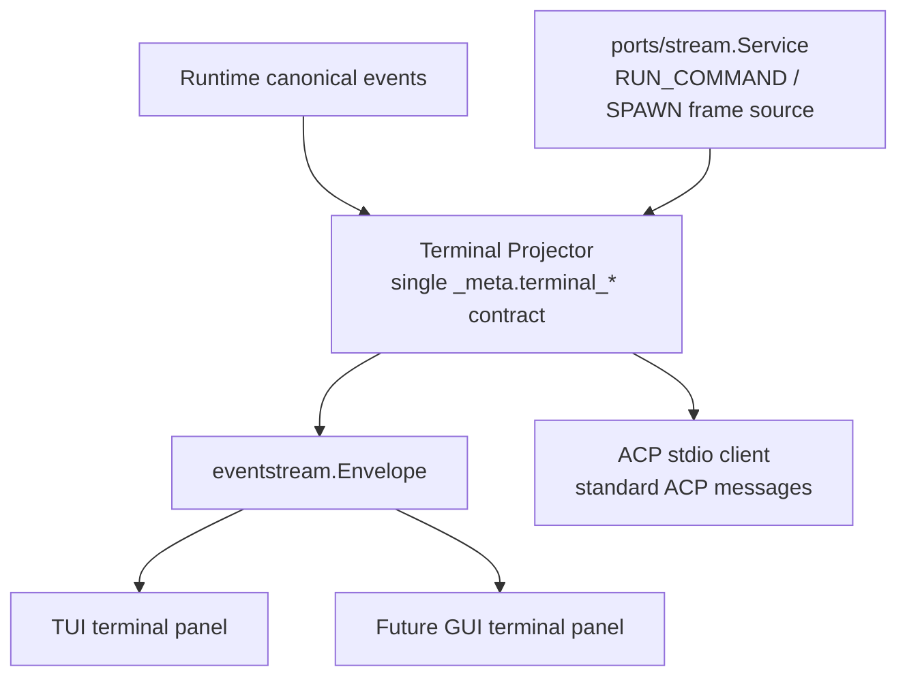
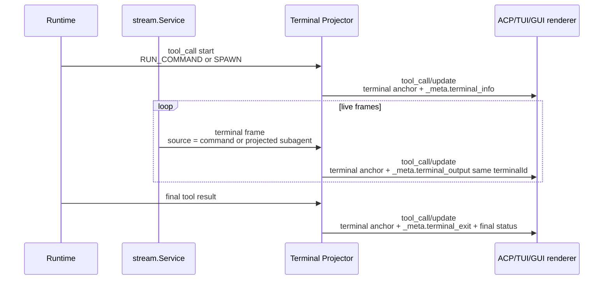
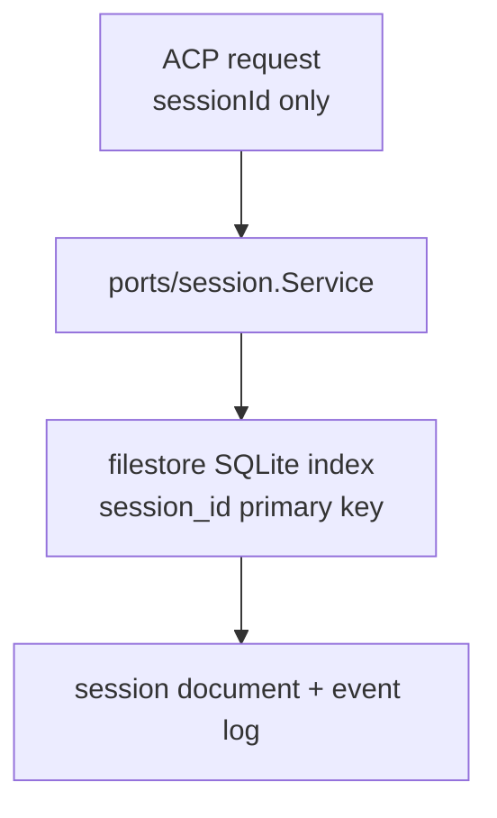

# ACP Projection Architecture

Caelis has one client projection path for ACP, TUI, and future GUI surfaces.
Runtime state is stored as canonical session events. Client renderers consume
ACP-shaped projections and do not own tool, sandbox, stream, or persistence
semantics.

## Terminal Projection

RUN_COMMAND, Bash-compatible command tools, and SPAWN all originate from the
same runtime stream model. The terminal projector owns the local render
lifecycle used by ACP stdio, TUI, and future GUI surfaces:

One local terminal identity is used for the opened tool, live frames, and final
state on every consumer:

The source of text differs before projection only. RUN_COMMAND/Bash frames come
from command execution. SPAWN frames come from projected child-agent output. Once
the frame reaches the projector, both are terminal frames for the local
eventstream render contract.

ACP v1 standard terminals are client-owned shell processes: the agent must call
`terminal/create`, receive the client's `terminalId`, and only then reference
that terminal in standard ACP terminal content. A local runtime terminal id or
tool call id is not a valid ACP stdio terminal id.

Caelis-owned RUN_COMMAND and SPAWN streams therefore use a single Caelis terminal
extension contract for render data:

- `_meta.terminal_info`: declares the local terminal identity for a tool call.
- `_meta.terminal_output`: carries an exact output byte string in `data`.
- `_meta.terminal_exit`: records local terminal termination state when known.
- `content[type="terminal"]`: an empty render anchor with the same terminal id.
  It mounts a client terminal panel, but it is not an output transport and must
  not contain terminal text.

This extension is the only render protocol for Caelis-owned terminal panels.
ACP stdio, TUI, headless, and future GUI surfaces consume the same metadata and
must not maintain surface-private fallbacks. TUI and headless output must ignore
the empty anchor for text rendering and use `_meta.terminal_output` for bytes.
Standard ACP client-created terminals remain reserved for future execution that
is actually delegated to a client-created ACP terminal id.

## Session Identity

`session.SessionID` is globally unique within one filestore root. Workspace key
is creation/listing/display metadata and may participate in policy decisions,
but it is not part of session identity.

The file session store resolves session documents through its SQLite index by
`session_id`. ACP and gateway surfaces must pass the session id they received
and must not keep in-memory `sessionId -> workspace/cwd` caches to repair later
requests.

Before v1.0, unsupported old session/index layouts may fail explicitly. Caelis
prefers the clean identity model over compatibility fallbacks.
