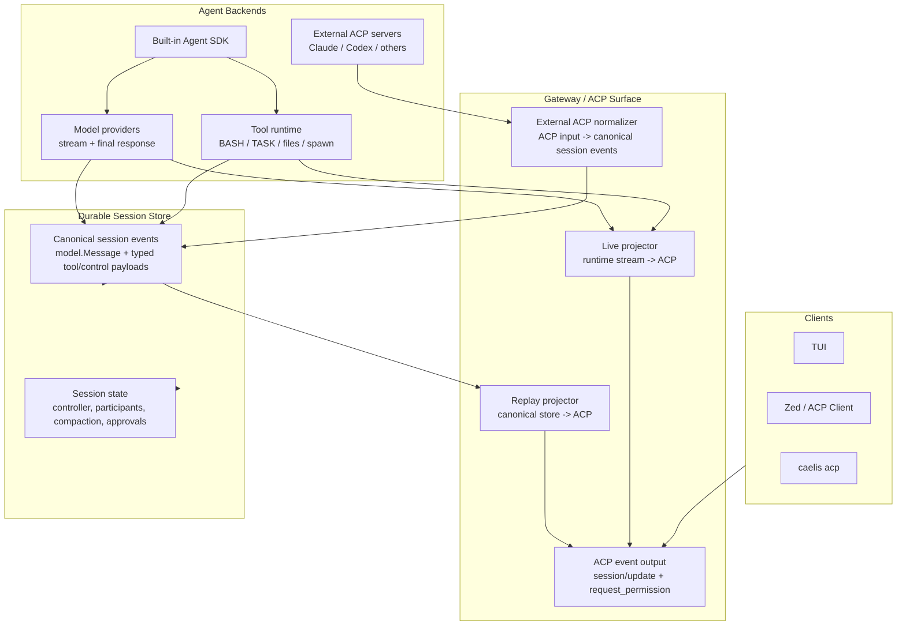

# Agent SDK And ACP Architecture Plan

## Goal

Caelis must keep one durable Agent SDK session model and project that model to
standard ACP for every client surface. The store is the source of truth for LLM
context reconstruction. ACP is the client-facing event protocol emitted by the
Gateway, not the durable replacement for model messages.

This plan intentionally allows incompatible pre-`v1.0.0` session files. The
priority is a clear contract and a small set of tests that lock the core
invariants.

## Layers

## Durable Store Contract

The session store persists canonical Agent SDK semantics:

- User messages: role, text, content parts, media/file references.
- Assistant messages: reasoning parts, text parts, tool-use parts, and provider
  replay metadata such as thinking signatures.
- Tool calls: the assistant `model.Message` tool-use parts plus durable
  `session.Event.Tool` execution anchors containing ids, names, arguments,
  ordering, status, title, kind, and replay/display boundaries.
- Tool results: matching tool ids/names, output payload, content, error state,
  and truncation metadata required for future prompt assembly, stored in
  `session.Event.Tool` and/or model tool-result parts.
- Model metadata needed for auditing or later replay: provider, model, finish
  reason, usage.
- Session state: controller binding, participants, compaction checkpoints,
  approvals, and lifecycle state required to resume orchestration.

The store must not be a transcript cache. Reloading a session and rebuilding
model input must produce the same semantic model message sequence that existed
at runtime before persistence.

## ACP Contract

The Gateway emits standard ACP events:

- `user_message_chunk` from canonical user messages.
- `agent_thought_chunk` from assistant reasoning.
- `agent_message_chunk` from assistant text.
- `tool_call` from assistant tool-use parts.
- `tool_call_update` from tool result/control payloads.
- `plan` and `request_permission` from typed control events.

Caelis display hints live in `_meta`. `_meta` may carry terminal output,
terminal exit status, cwd, display names, and other UI-only annotations. It must
not be the only durable location for model-critical data.

`protocol/acp/eventstream.Envelope` is the v1 client event stream for local
surfaces and app-server transports. SSE uses `cursor` as the event id,
WebSocket transports serialize the envelope directly, and ACP stdio maps
standard messages to `session/update` and `session/request_permission`.
`ports/gateway.Event` is a transitional in-process DTO used by compatibility
bridges; new surfaces must target `eventstream.Envelope` instead.

## ACP Durability Matrix

| Source | Durable canonical event | Client projection |
| --- | --- | --- |
| Built-in or ACP main-controller user input | `session.Event.Message` with role `user` | `user_message_chunk` |
| Built-in or ACP main-controller final assistant response | `session.Event.Message` with assistant reasoning/text/tool-use semantics | `agent_thought_chunk`, `agent_message_chunk`, `tool_call` |
| Built-in tool call/result | `session.Event.Tool` plus model tool-use/result parts when model-visible | `tool_call`, `tool_call_update` |
| Permission request/decision | Durable typed approval/control state; `EventProtocol.Permission` is the ACP client projection source | `request_permission` plus approval review extension events |
| Plan state | `session.Event.PlanPayload` when it is durable semantic plan state | `plan` |
| Participant lifecycle and handoff | Durable session/controller state, not transcript text | participant and lifecycle extension events |
| Subagent structured stream | Not parent model context; `VisibilityUIOnly` live trace only | scoped `eventstream.Envelope` with `ScopeSubagent` |
| Subagent final product | Parent model sees the `SPAWN`/`TASK` tool result, not the child transcript | `tool_call_update` result plus optional scoped trace |

Protocol-only canonical history is invalid for model-visible assistant, tool,
and plan facts. ACP ingress must normalize durable facts into `Event.Message`,
`Event.Tool`, or typed plan/approval/session state before persistence. Live
subagent streams may be mirrored to clients, but they must not masquerade as
`VisibilityCanonical` durable history in the parent session.

## Live Versus Replay

Live streaming produces transient UI updates. `VisibilityUIOnly` chunks may be
sent to clients but are not persisted. The final canonical event must contain
the complete model-visible message.

Replay reads only durable canonical events and projects them to ACP. Replay must
not depend on transient chunks, old wire logs, or heuristic reconstruction of
reasoning from display text.

## External ACP

External ACP servers are peers of the built-in Agent SDK at the Gateway
boundary. Their ACP updates are normalized into canonical session events before
they become durable session history. The Gateway may forward live ACP updates to
clients, but the store remains canonical and model-semantic.

## Previous Divergence

The implementation drifted by making `session.Event.Protocol.Update` carry
durable text while `session.Event.Message` and `Text` were runtime-only.
That avoided writing two complete payloads, but it made ACP projection the
source of truth and dropped non-text model semantics such as reasoning and
provider replay signatures.

This is the wrong ownership boundary. `Protocol.Update` is an ACP projection
contract. It should not be the only durable representation of LLM context.

The corrected ownership boundary is:

- `session.Event.Message`: durable model-visible message payload.
- `session.Event.Tool`: durable tool execution payload for tool call/result
  anchors.
- `session.Event.Protocol`: ACP/control-plane projection payload for client
  surfaces and external ACP events, not the local Agent SDK replay source.

## Refactor Direction

1. Persist `model.Message` for canonical model-visible session events.
2. Stop injecting ACP text content into canonical events that already carry a
   full `model.Message`.
3. For multi-tool assistant turns, persist the full assistant `model.Message` on
   the first tool-call anchor and keep later per-tool anchors only as execution
   and projection boundaries. Rebuilding model context consumes those anchors as
   one assistant message.
4. Keep typed tool/control payloads for execution state, terminal output,
   plans, approvals, and lifecycle data.
5. Make replay projection derive ACP from canonical model/tool semantics.
6. Keep tests focused on:
   - store round-trip preserves model context semantics;
   - ACP replay projects reasoning, text, tool calls, and tool results from
     canonical events;
   - transient stream chunks are not required for reload.
