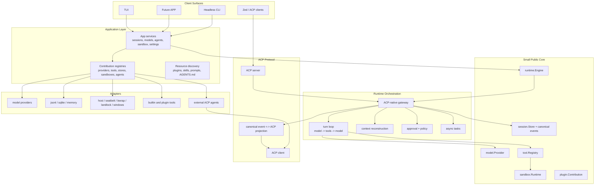

# Caelis Reimplementation Architecture Roadmap

Status: long-term reference and refactor roadmap
Last updated: 2026-05-31
Scope: conceptual redesign, package layout, dependency rules, and migration path

## Purpose

This document records the target architecture for a clean Caelis reimplementation
or deep refactor. It is intentionally written from a near-greenfield viewpoint:
reuse high-cohesion assets from the current repository, but do not preserve
compatibility layers, legacy replay guesses, or stacked adapter logic simply
because they exist today.

The goal is to reduce over-design and package sprawl while preserving the core
product idea: Caelis is an ACP-native agent runtime and gateway. It should be
able to orchestrate external ACP agents, expose itself as an ACP server to
clients such as Zed, and share one kernel and extension ecosystem across the
terminal UI and a future peer APP surface.

## Current Findings

The current codebase already points in the right direction with `kernel`,
`ports`, `impl`, `protocol`, `surfaces`, and `app/gatewayapp`. The problem is
that those layers have grown into mirrored contracts and broad glue packages.

Key issues:

- `kernel/` is mostly a public alias facade over `internal/kernel`, which makes
  the public contract inherit the internal implementation shape.
- `ports/*` is split by many nouns, producing many global interfaces that are
  hard to keep minimal and local to their actual consumers.
- `app/gatewayapp` has become a second kernel: config, model registry, sandbox
  routing, prompt assembly, runtime rebuild, ACP agent management, and app
  services all live together.
- `impl/agent/local` directly knows ACP controller and subagent concrete
  implementations, which weakens the idea that built-in agents and external ACP
  agents meet only at the gateway/runtime boundary.
- `surfaces/tui/app` and `surfaces/tui/gatewaydriver` are large enough that UI
  state, driver API, rendering, and product commands are difficult to evolve
  independently.
- `session.Event`, `kernel.Event`, and ACP updates currently form overlapping
  semantic surfaces. The target design should have one canonical event model and
  deterministic projections.

## Pi Agent Research Notes

Pi Agent is useful as a design reference because its core is deliberately small.
Its documented direction is a lightweight harness plus a resource and extension
system, with behavior added through extensions, packages, skills, templates, or
external tools instead of being built into the core runtime.

Relevant official references:

- [Pi documentation](https://pi.dev/docs/latest)
- [Pi usage and design principles](https://pi.dev/docs/latest/usage)
- [Pi extensions](https://pi.dev/docs/latest/extensions)
- [Pi SDK](https://pi.dev/docs/latest/sdk)

The relevant ideas to borrow:

- Keep the core small and focused.
- Treat extensibility as resource contribution and composition, not as special
  cases inside the runtime loop.
- Prefer explicit packages, extensions, and templates over hidden hard-coded
  workflow features.
- Keep optional workflows outside the core when they can be modeled as tools,
  commands, extensions, or external processes.

The important difference:

- Pi can keep MCP, sub-agents, permission workflows, and plan modes outside its
  core. Caelis cannot keep ACP outside the core contract because ACP-native
  operation is the product identity.

Therefore the Caelis target is not "Pi with ACP as a plugin". The target is:

> small ACP-native core runtime + stable public contracts + plugin and adapter
> ecosystem.

## Product Identity

Caelis should be designed around these first principles:

- ACP is a first-class protocol boundary, not an incidental adapter.
- Canonical session events are the durable source of truth.
- ACP updates are projections from canonical events, except for external ACP
  ingress where ACP input is normalized before storage.
- Built-in model-backed agents and external ACP agents are peers at the runtime
  boundary.
- Model providers, sandbox backends, stores, tools, prompts, skills, and UI
  renderers are replaceable contributions.
- TUI and the future APP are peer surfaces. They share kernel contracts, app
  services, event streams, command definitions, plugin registries, and resource
  discovery, but not presentation implementation.

## Non-Goals

- Do not add compatibility branches for every old event or storage shape.
- Do not make UI transcript cache the source of model replay.
- Do not let TUI-specific metadata become model-critical data.
- Do not make every concept a top-level public `ports/*` package.
- Do not require Go `plugin` dynamic loading; it is not portable enough for this
  product. Prefer manifests, registries, bundled contributions, and subprocess
  or RPC-backed extensions.
- Do not share TUI widgets with a future APP surface. Share app services and
  view-model contracts instead.

## Target Layering



## Target Package Layout

The exact package names can evolve, but the ownership boundaries should remain
stable.

```text
cmd/caelis/
  main.go

core/
  runtime/      # Engine, Turn, EventEnvelope, cancellation, active turn contracts
  session/      # Session, Event, Store, Cursor, Snapshot, state patches
  model/        # Provider, Request, StreamEvent, Message, ToolCall, usage
  tool/         # Tool, Registry, Definition, Call, Result, display metadata
  sandbox/      # Runtime, Backend, FS, Exec, Constraints, setup status
  plugin/       # Manifest, Contribution, Registry, resource descriptors
  config/       # typed config contracts, no file/env side effects

protocol/acp/
  schema/
  jsonrpc/
  transport/
  client/
  server/
  projector/    # canonical event <-> ACP session/update + request_permission

internal/engine/
  gateway/      # sessions, turns, replay, ACP ingress/egress, active runs
  loop/         # model/tool turn execution
  context/      # prompt and model-context reconstruction
  approval/
  compaction/
  tasks/
  control/      # controller, participant, subagent orchestration contracts

internal/app/
  local/        # default composition root
  services/     # service facade consumed by TUI, APP, CLI, ACP server
  settings/     # env/file config loading
  resources/    # plugin, skill, prompt, AGENTS.md discovery
  registry/     # model/tool/sandbox/store/agent registries

internal/adapters/
  model/
    openai/
    anthropic/
    gemini/
    openrouter/
    ollama/
    codefree/
    volcengine/
  store/
    jsonl/
    sqlite/
    memory/
  sandbox/
    host/
    seatbelt/
    bwrap/
    landlock/
    windows/
  tools/
    filesystem/
    shell/
    plan/
    task/
    spawn/
  acpagent/
    external/   # external ACP process as controller, participant, or subagent

internal/surface/
  tui/
    app/
    driver/
    render/
    viewmodel/
    widgets/
  app/
    api/        # future APP-specific adapter over internal/app/services
    viewmodel/
  headless/
  acpserver/

plugins/
  builtin/      # bundled manifests/resources; no hidden engine logic

eval/
scripts/
npm/
docs/
```

## Dependency Rules

- `core/*` must not import `internal/*`, `protocol/*`, `cmd/*`, or UI packages.
- `protocol/acp/schema`, `jsonrpc`, `transport`, `client`, and `server` should
  stay protocol-only. They should not know the local runtime.
- `protocol/acp/projector` may depend on `core/session` and ACP schema.
- `internal/engine/*` depends on `core/*` and local engine sibling packages. It
  must not import concrete model providers, concrete sandbox backends, concrete
  stores, or UI packages.
- `internal/app/*` is allowed to import adapters and wire them together.
- `internal/adapters/*` implements `core/*` contracts. Adapters must not import
  surfaces.
- `internal/surface/*` depends on `internal/app/services`, `core/*`, and
  protocol clients where needed. Surfaces must not import concrete adapters.
- TUI and future APP are peers. Any shared behavior between them belongs in
  `internal/app/services` or shared view-model contracts, not in TUI packages.

## Core Contracts

The public core should be small enough that it is hard to misuse.

### Runtime

```go
type Engine interface {
    StartSession(context.Context, session.StartRequest) (session.Session, error)
    LoadSession(context.Context, session.Ref) (session.Snapshot, error)
    BeginTurn(context.Context, TurnRequest) (Turn, error)
    Interrupt(context.Context, session.Ref) error
    Replay(context.Context, ReplayRequest) (<-chan EventEnvelope, error)
}
```

The engine owns orchestration. It does not own concrete providers, stores,
sandboxes, tools, or UI rendering.

### Session Store

```go
type Store interface {
    Create(context.Context, StartRequest) (Session, error)
    Load(context.Context, Ref) (Snapshot, error)
    Append(context.Context, Ref, []Event) (Cursor, error)
    Events(context.Context, EventQuery) (EventPage, error)
    UpdateState(context.Context, Ref, StatePatch) error
}
```

JSONL and SQLite should both implement this contract. Runtime logic should not
know which one is in use.

### Model Provider

```go
type Provider interface {
    ID() string
    Models(context.Context) ([]ModelInfo, error)
    Stream(context.Context, Request) (Stream, error)
}
```

Provider-specific request details belong in provider config and metadata, not
in the runtime loop.

### Plugin Contribution

```go
type Contribution interface {
    Manifest() Manifest
    Register(context.Context, Registry) error
}
```

Plugins should contribute resources and implementations:

- model providers
- tools
- sandbox backends
- session stores
- ACP agent descriptors
- prompt fragments
- skills
- UI renderer hints

Plugins should not bypass the engine, session store, approval flow, or ACP
projection contract.

## Canonical Event Model

Caelis should keep one durable event model:

- user content
- assistant text and reasoning
- tool calls and tool results
- provider replay metadata
- approval requests and decisions
- compaction checkpoints
- controller and participant lifecycle events
- task lifecycle anchors
- ACP ingress metadata when external ACP agents participate

ACP updates should be deterministic projections from these canonical events.
External ACP input should be normalized into canonical events before persistence.

Rules:

- Model-visible state must live in canonical event fields, not only `_meta`.
- ACP `_meta` may carry display hints and UI-only details.
- `VisibilityUIOnly` stream chunks are transient and not required for replay.
- Replay must rebuild the same semantic model context produced during live
  execution.
- Store round-trip tests are required for any persistence change.

## ACP-Native Runtime Model

Caelis has two ACP directions:

1. Serve ACP: expose Caelis as an ACP server for clients such as Zed.
2. Consume ACP: run external ACP agents as controllers, participants, or
   subagents.

The target architecture should make both directions first-class:

- ACP server ingress turns client requests into engine requests.
- Engine events are projected into standard ACP `session/update` and
  `request_permission`.
- External ACP agent output is normalized into canonical events.
- Built-in agents and external ACP agents use the same session, approval,
  replay, and task contracts.
- Controller handoff, sidecar participants, and delegated subagents are runtime
  concepts, not TUI-only commands.

## Plugin And Ecosystem Model

The ecosystem should look closer to resource assembly than inheritance.

Recommended plugin shape:

```text
plugin.json
prompts/
skills/
tools/
agents/
models/
sandbox/
renderers/
```

Example contribution classes:

- `model.provider`: registers a provider factory.
- `tool.builtin`: registers a local Go tool or subprocess tool descriptor.
- `sandbox.backend`: registers backend selection and runtime factory.
- `store.backend`: registers `jsonl`, `sqlite`, or remote store implementations.
- `acp.agent`: declares an external ACP command and capabilities.
- `prompt.fragment`: contributes prompt text with explicit priority and scope.
- `skill`: contributes discovered skill metadata.
- `ui.renderer`: contributes optional rendering hints for known tool/event
  kinds. These hints must never be the only durable semantic data.

Plugin loading should be deterministic:

1. read manifests
2. validate schema and declared capabilities
3. register contributions
4. compose runtime registries
5. build engine

## TUI And Future APP

The future APP should be a peer to the TUI, not a wrapper around it.

Shared:

- `internal/app/services`
- command definitions and command handlers
- canonical events
- replay and live event subscriptions
- model/provider registry
- sandbox status and setup workflows
- ACP agent registry
- settings and profiles
- view-model contracts for status, transcript, approvals, task panels, model
  selection, and agent management

Separate:

- rendering
- layout
- input handling
- platform-specific notifications
- local persistence for surface-only preferences

Suggested boundary:

```text
internal/app/services
  SessionService
  TurnService
  ModelService
  AgentService
  SandboxService
  SettingsService
  PluginService

internal/surface/tui
  Bubble Tea implementation

internal/surface/app
  Future APP adapter and view models
```

The common service layer should speak in stable DTOs and event streams. It
should not expose Bubble Tea types, terminal color concepts, or desktop UI
types.

## Reuse Versus Rewrite

Good reuse candidates:

- ACP schema, JSON-RPC, client, server, and projection ideas from
  `protocol/acp`.
- Provider implementation details from `impl/model/providers`.
- Sandbox backend implementation details from `impl/sandbox/*`.
- Built-in tool behavior from `impl/tool/builtin/*`.
- Canonical message and event ideas from `ports/model` and `ports/session`.
- Store round-trip tests and replay validation tests.
- TUI rendering components that are already cohesive, after moving them behind
  surface-local boundaries.

Rewrite or heavily reshape:

- `kernel/` and `internal/kernel` mirrored public/internal split.
- `app/gatewayapp` as a giant composition root.
- Global `ports/*` package taxonomy.
- `impl/agent/local` directly coupling to concrete ACP controller/subagent
  implementations.
- `surfaces/tui/gatewaydriver` as a duplicated product API layer.
- Legacy event compatibility fallbacks and heuristic replay reconstruction.

## Migration Strategy

This can be implemented incrementally, but the target should remain a clean
reimplementation.

### Phase 1: Contract Freeze

- Define `core/session`, `core/model`, `core/tool`, `core/sandbox`,
  `core/runtime`, and `core/plugin`.
- Write architecture lint rules for target dependencies.
- Add store round-trip tests for canonical model context reconstruction.
- Add ACP projection tests from canonical events.

### Phase 2: New Engine Skeleton

- Implement `internal/engine/gateway` against the new core contracts.
- Implement a minimal turn loop with one model provider and one tool registry.
- Implement replay from canonical store only.
- Implement approval and permission flow as engine contracts.

### Phase 3: Adapter Migration

- Move model providers behind `core/model.Provider`.
- Move sandbox backends behind `core/sandbox.Runtime`.
- Move JSONL store behind `core/session.Store`.
- Add SQLite store as a parallel adapter without runtime changes.
- Move built-in tools behind `core/tool.Registry`.

### Phase 4: ACP First-Class Runtime

- Rebuild ACP server surface over the new engine.
- Rebuild external ACP controller, participant, and subagent adapters.
- Normalize ACP ingress into canonical events before storage.
- Ensure TUI, APP, CLI, and ACP clients consume the same event stream.

### Phase 5: Surface Split

- Build `internal/app/services` as the only product API consumed by surfaces.
- Port TUI to the service facade.
- Define future APP view-model contracts next to the service facade.
- Remove any TUI-specific assumptions from runtime and app services.

### Phase 6: Remove Old Stack

- Remove the `kernel` alias facade and old `internal/kernel` stack once the new
  engine is feature-complete.
- Remove compatibility replay guesses.
- Retire duplicated gateway-driver APIs.
- Update README and developer docs to the new layout.

## Current Implementation Checkpoint

The first baseline of this roadmap is now represented by new packages that sit
alongside the old stack without importing it:

- `core/*`: stable contracts for runtime, session, model, tool, sandbox, plugin,
  and config.
- `internal/engine/gateway`, `internal/engine/loop`,
  `internal/engine/approval`, and
  `internal/engine/context`: session lifecycle, canonical event append/replay,
  approval/permission policy, model-context reconstruction from durable events,
  and a minimal model/tool turn loop.
- `internal/engine/control`: external participant runner that invokes an ACP
  agent and appends normalized events into the canonical session store. It now
  also has a controller runner for ACP main-controller prompts, normalizing
  responses into controller-scoped canonical events.
- `internal/app/services`: shared service facade for TUI, future APP, CLI, and
  protocol surfaces.
- `internal/app/settings`: shared product settings document for configured
  models and settings-backed custom external ACP agent descriptors, with
  normalized upsert/list/delete operations independent of the old gatewayapp
  config store.
- `internal/app/agents`: small app-level catalog for registerable built-in
  external ACP agent descriptors. The catalog is data-only and stays separate
  from runtime orchestration and package-install side effects.
- `internal/app/resources`: deterministic discovery baseline for enabled
  `plugin.json` manifests, plugin prompt/skill/ACP-agent/renderer descriptors,
  workspace/global `AGENTS.md`, and skill metadata. Plugin-declared ACP agents
  are normalized with plugin-relative working directories and command paths.
  Manifests can also declare provider/store/sandbox/tool factory aliases using
  `name -> uses` bindings.
- `internal/app/registry`: deterministic `core/plugin.Registry`
  implementation for model provider, store, sandbox, tool, ACP agent, prompt,
  skill, and renderer contributions. The local composition root now resolves
  built-in provider/store/sandbox/tool implementations through this registry
  instead of hard-coded construction switches, and applies manifest-declared
  factory aliases before composing the stack.
- `internal/app/prompt`: app-layer prompt assembler that renders discovered
  prompt fragments, `AGENTS.md`, and skill metadata into provider
  instructions without moving filesystem discovery into the engine.
- `internal/app/viewmodel`: surface-neutral session transcript, pending
  approval/action, participant, agent management, model selection, task
  list/output, settings, event stream, and status DTOs shared by the TUI and
  future APP, including runtime store identity needed by read-only
  diagnostics.
- `internal/app/services.EventService`: shared replay/live-turn event stream
  projection for TUI and future APP consumers. It wraps runtime replay and
  active-turn channels into surface-neutral event envelopes with transcript,
  approval, participant, lifecycle, and canonical event projections.
- `internal/app/services.SettingsService`: shared settings contract for
  runtime identity, store, sandbox, sandbox backend, and compaction policy
  mutations. It persists through the app settings manager and updates the
  service runtime view so peer TUI/APP surfaces do not need raw document edits
  or surface-local config state for these core settings.
- `internal/app/local`: local composition root for core provider, store, tools,
  sandbox runtime, and engine wiring. It can now build a configured local stack
  from `core/config` without importing the old `ports` or `kernel` packages.
  It also wires plugin-declared and settings-backed custom ACP agents into the
  shared `AgentService`, and injects the built-in ACP agent catalog for
  service-native registration. The local stack now also contributes a default
  `self` external ACP agent descriptor when a durable store URI is available,
  spawning the current Caelis executable through the core-native ACP stdio
  surface without leaking literal model tokens into process arguments.
- `internal/adapters/model/openai`: core-native OpenAI-compatible Chat
  Completions provider with tool-call, usage, structured-output, reasoning,
  and provider-profile mapping. It now backs OpenAI-compatible, DeepSeek, and
  OpenRouter, Mimo/Xiaomi, Volcengine, and Volcengine Coding Plan factories in
  the app registry.
- `internal/adapters/model/anthropic`: core-native Anthropic Messages API
  provider with text, image, tool-use/tool-result, reasoning replay signature,
  usage, and model-listing mapping. It now backs Anthropic,
  Anthropic-compatible, and MiniMax factories in the app registry.
- `internal/adapters/model/gemini`: core-native Gemini API provider with
  text/image/file content, tool-call/tool-result mapping, thought-signature
  replay metadata, JSON/schema output, reasoning configuration, usage, and
  model-listing mapping.
- `internal/adapters/model/codefree`: core-native CodeFree chat provider with
  clean Caelis credential loading, CodeFree headers, OpenAI-compatible message
  and tool mapping, JSON output mode, usage, version-endpoint model listing,
  and OAuth credential ensure/refresh helpers.
- `internal/adapters/model/ollama`: core-native Ollama `/api/chat`
  provider with model listing, tool-call mapping, reasoning text, JSON output
  mode, and usage mapping.
- `internal/adapters/store/memory`, `internal/adapters/store/jsonl`, and
  `internal/adapters/store/sqlite`: swappable `core/session.Store` adapters
  for ephemeral and durable local composition.
- `internal/adapters/tools/registry`: deterministic in-memory
  `core/tool.Registry`.
- `internal/adapters/sandbox/host`: core-native host sandbox runtime with async
  command session start/open/read/write/wait/cancel support.
- `internal/adapters/tools/shell`: core-native `run_command` tool using
  `core/sandbox.Runtime`, including the public
  `sandbox_permissions=require_escalated` contract for host execution.
- `internal/adapters/tools/task`: core-native wait/write/cancel control for
  yielded sandbox sessions.
- `internal/adapters/acpagent/external`: core-native external ACP client that
  normalizes ACP `session/update` and `session/request_permission` traffic into
  canonical `core/session.Event` values.
- `internal/app/services.AgentService`: shared TUI/APP-facing descriptor,
  registration, removal, and invocation surface for external ACP agents
  contributed by local composition or stored in app settings. Runtime-added
  custom agents are resolved through a narrow invoker factory instead of
  rebuilding service state. Built-in ACP agents are registered by copying their
  catalog descriptors into the same settings-backed external agent contract,
  and invocations can target either participant scope or ACP controller scope.
  Service-native built-in ACP adapter install now runs through a replaceable
  app-service installer, with the default local stack installing supported npm
  adapters into the Caelis store and persisting the installed binary path.
  It also exposes a surface-neutral management view for registered agents,
  built-in catalog entries, installable adapters, and per-agent management
  actions.
- `internal/app/services.ModelService`: shared model settings and catalog
  surface for configured models, provider model presets, capability defaults,
  and reasoning-level choices used by TUI/future APP connect flows.
- `surfaces/tui/gatewaydriver.BindAppServices`: service-native TUI `/agent`
  list and dynamic `/<agent> <prompt>` baseline for configured external ACP
  agents, recording participant attach/user/assistant activity as canonical
  core session events. It also routes settings-backed `/agent add custom` and
  `/agent add <builtin>` and `/agent remove` through shared app services. The
  same gateway now records `/agent use <agent|local>` as canonical handoff
  events, rebuilds active controller state from canonical handoff and
  controller-scoped events, and routes subsequent prompts to the active
  external ACP controller with the latest known remote ACP session id.
- The old `surfaces/tui/gatewaydriver/local` package has been removed. The
  remaining gatewayapp-to-gatewaydriver adapter needed by real ACP controller
  e2e coverage now lives inside `eval` test helpers, so production packages no
  longer expose this old-stack bridge as a reusable surface.
- `internal/app/services.ResourceService`: shared TUI/APP-facing catalog
  surface for discovered plugins, prompt fragments, skills, ACP agents,
  renderer hints, and `AGENTS.md` prompt resources.
- `internal/app/services.ViewService`: shared TUI/APP-facing projection from
  canonical session snapshots to surface-neutral transcript, approval, and
  participant view models.
- `internal/app/services.ApprovalService`: shared TUI/APP-facing pending
  approval list and decision-submission contract that converts surface choices
  into `core/runtime` approval submissions.
- `internal/app/services.SandboxService`: shared sandbox status and lifecycle
  surface. The current migrated baseline exposes core-native sandbox status
  from the composed runtime and treats host setup/fix/reset/clean as explicit
  no-op lifecycle operations instead of routing those commands through the old
  stack. The app-service TUI binding now maps this status/lifecycle surface
  into the existing driver sandbox hooks.
- `protocol/acp/projector/core`: canonical session event projection to ACP
  updates and permission requests.
- `internal/surface/acpserver`: ACP JSON-RPC server over the new runtime engine.
- `internal/e2e`: new-architecture end-to-end harness that exercises local
  composition, ACP stdio serving, plugin resource loading, registry aliases,
  OpenAI-compatible model requests, host-sandboxed shell tools, SQLite
  persistence, canonical reload, and shared view-model projection.

The current verification path covers:

- local stack -> shared services -> engine -> canonical memory store
- configured local stack -> OpenAI-compatible provider -> JSONL store
- configured local stack -> Anthropic/MiniMax, Gemini, CodeFree, and
  DeepSeek/OpenRouter/Mimo/Volcengine provider profiles -> JSONL store
- core-native CodeFree OAuth ensure/model-selection/refresh -> Caelis
  credential store
- configured local stack -> native Ollama provider -> JSONL store
- configured local stack -> SQLite store -> persisted canonical events after
  reload
- model tool call -> shell tool -> host sandbox -> tool result -> model
  continuation
- configured local stack -> built-in shell tool -> host sandbox -> model
  continuation
- approval-aware tool execution -> canonical pending/decision events ->
  `Turn.Submit` resume
- ACP server -> `session/request_permission` -> permission response -> runtime
  approval submission
- external ACP client -> `session/update` notifications -> canonical user,
  assistant, tool, plan, and approval events
- external ACP client -> ACP `session/request_permission` request -> local
  permission handler -> canonical pending/decision approval events
- local stack -> shared `AgentService.Invoke` -> external ACP process ->
  participant runner -> canonical session events
- enabled plugin manifest `acp_agents` -> shared `AgentService` descriptor and
  invoker -> external ACP subprocess -> canonical participant events
- app settings `acp_agents` -> shared `AgentService` descriptor/register/remove
  -> local-stack dynamic invoker factory -> external ACP subprocess ->
  canonical participant events
- built-in ACP agent catalog -> shared `AgentService.RegisterBuiltin` ->
  settings-backed external ACP descriptor -> TUI `/agent add <builtin>`
  catalog and registration path
- TUI `/agent use <agent|local>` -> canonical `EventHandoff` ->
  app-service control-plane state -> ACP controller-scoped prompt routing
- TUI ACP controller response carrying a remote session id -> canonical
  controller-scoped event -> next TUI prompt reuses that remote id through
  app-service controller invocation
- app-service TUI binding -> configured external ACP agent catalog -> dynamic
  participant prompt -> canonical participant/user/assistant events -> TUI
  participant-scoped event projection
- app-service TUI binding -> `/agent add custom` and `/agent remove` for
  settings-backed custom external ACP agents -> shared settings persistence ->
  refreshed agent catalog
- app-service model catalog -> TUI `/connect` model completion and default
  context/output/reasoning values
- local stack -> enabled plugin manifest + workspace `AGENTS.md` ->
  shared `ResourceService` catalog
- CLI `doctor` and `-doctor` -> new local stack -> shared status/sandbox
  services -> redacted text/JSON diagnostics
- CLI `sandbox setup|fix|reset|clean` with host backend -> new local stack ->
  shared sandbox service -> text/JSON sandbox lifecycle status
- app-service TUI binding -> shared sandbox service -> `/doctor fix` /
  driver repair path for host backend with no old-stack dependency
- resource discovery -> home/workspace skills + plugin descriptors ->
  deterministic app resource catalog
- resource catalog -> app prompt assembler -> loop instructions -> provider
  request
- app registry -> provider/store/sandbox/tool factories -> local stack
  composition
- Go `plugin.Contribution` -> app registry -> contributed store factory ->
  local stack composition
- enabled plugin manifest factory alias -> app registry -> local stack
  provider/store/sandbox/tool selection
- canonical session snapshot -> shared view model -> transcript, pending
  approvals, and participants for TUI/future APP
- JSONL store round-trip -> canonical events -> rebuilt model context
- SQLite store round-trip -> canonical events -> rebuilt model context
- local stack -> ACP server -> JSON-RPC `session/new` and `session/prompt` ->
  ACP `session/update` notifications -> canonical stored events
- new architecture e2e -> enabled plugin manifest prompt + store alias ->
  SQLite store -> ACP server -> OpenAI-compatible mock provider ->
  `run_command` through host sandbox -> canonical event reload -> shared
  TUI/APP view model
- architecture lint for the new dependency boundaries

## Migration Status Review

Review date: 2026-05-30
Stage: new architecture skeleton is in place; product behavior migration is not
complete.

### Review Outcome

The implemented skeleton is aligned with the target direction:

- New `core/*`, `internal/engine/*`, `internal/app/*`, `internal/adapters/*`,
  `internal/surface/acpserver`, `protocol/acp/projector/core`, and
  `internal/e2e` packages do not import the old `ports/*`, `kernel/*`,
  `impl/*`, `surfaces/*`, or `app/gatewayapp` stack.
- Runtime orchestration is expressed through small contracts and concrete
  adapters. Model provider, store, sandbox, tool, plugin resource, ACP agent,
  and surface concerns are not piled into one package.
- Canonical session events are the durable replay source for the new stack.
  ACP updates are projected from those events, and external ACP ingress is
  normalized into canonical events before persistence.
- TUI and the future APP are represented as peer consumers of shared app
  services and surface-neutral view models, not as wrappers around each other.
- The new e2e path proves the skeleton can run an ACP-native turn through plugin
  resources, registry aliases, SQLite, model/tool continuation, host sandbox
  execution, canonical reload, and shared view projection.

The important constraint:

> This checkpoint is an architecture baseline, not a product replacement.
> Single-shot headless CLI and ACP stdio now enter the new stack, but
> interactive TUI, doctor/config/sandbox commands, rich provider catalog,
> sandbox policy, compaction, durable task runtime, and most agent workflows
> still run on the old stack.

### Target State

The migration is complete only when:

- `cmd/caelis` enters the new `internal/app/services` stack for interactive TUI,
  headless CLI, doctor/status/config flows, and ACP stdio serving.
- TUI and the future APP consume the same service facade, command handlers,
  event streams, settings/profile APIs, and view-model contracts.
- Built-in agents and external ACP agents meet only at the gateway/runtime
  boundary, with canonical event storage for all model-visible state.
- Model providers, sandbox backends, stores, tools, prompts, skills, renderer
  hints, and ACP agents are selected through registries or plugin manifests.
- Reloaded model input is rebuilt from canonical durable events and validated
  against live runtime context for normal turns, tool turns, approvals,
  compaction, subagents, and ACP participants.
- The old `kernel`, `ports`, `impl`, `app/gatewayapp`, and old `surfaces/*`
  runtime paths can be deleted rather than bridged by compatibility layers.

### Completed In This Checkpoint

The completed work is intentionally limited to the reusable skeleton:

- Public core contracts: runtime, session, model, tool, sandbox, plugin, and
  typed config.
- Canonical session stores: memory, JSONL, and SQLite.
- Core-native session listing contract across `core/session.Store`,
  `core/runtime.Engine`, memory/JSONL/SQLite stores, and shared app services,
  with app/user/workspace/CWD/search filters, pagination, event counts, and
  last-event timestamps for future TUI/APP resume views.
- Runtime engine skeleton: session start/load/replay, turn execution,
  cancellation, record-events ingress, approval wait/resume, and model/tool
  continuation.
- Model context reconstruction from canonical events.
- OpenAI-compatible provider adapter sufficient for Chat Completions, tool
  calls, structured output, reasoning content, DeepSeek reasoning defaults, and
  OpenRouter attribution headers. It also covers Mimo/Xiaomi and Volcengine
  thinking payload profiles and provider default endpoints.
- Anthropic Messages API provider adapter sufficient for text/image content,
  tool-use/tool-result mapping, thinking signature replay metadata, usage,
  model listing, and Anthropic-compatible MiniMax auth/default endpoint
  behavior.
- Gemini API provider adapter sufficient for text/image/file content,
  tool-call/tool-result mapping, thought-signature replay metadata, usage,
  model listing, JSON/schema output, and Gemini 2.x budget-based reasoning
  configuration.
- CodeFree provider adapter sufficient for non-stream chat completions,
  CodeFree header/auth semantics, clean Caelis credential loading,
  OpenAI-compatible message/tool mapping, JSON output mode, usage, model
  listing, OAuth credential ensure/refresh, and headless CLI selection.
- Native Ollama provider adapter sufficient for `/api/chat`, model listing,
  tool calls, reasoning text, JSON output mode, and usage mapping.
- Host sandbox adapter, core-native async command sessions, core-native
  `run_command` tool, core-native `task` wait/write/cancel control, and
  core-native filesystem tools: `read_file`, `list_directory`, `glob_files`,
  `search_files`, `write_file`, and `patch_file`.
- Core-native `update_plan` tool with runtime conversion into canonical
  `session.EventPlan` events.
- App composition root, registry, plugin manifest discovery, prompt assembly,
  resource catalog, external ACP agent descriptors, and shared services.
- App settings and model-selection baseline: clean `internal/app/settings`
  document/store/manager, token redaction by default, provider profiles,
  generated model aliases/ids, default model selection, model delete, session
  model override state, runtime model-profile projection, and request-time model
  routing through app registries.
- App model catalog baseline: shared `ModelService` exposes configured
  provider models, built-in provider model presets, capability defaults, and
  reasoning levels so TUI and future APP connect/setup flows do not need to own
  provider capability tables.
- App model selection baseline: `ModelService.Selection` now projects current
  configured model, provider options, plugin provider aliases, discovered
  remote models, built-in catalog candidates, and capability/reasoning metadata
  into a single surface-neutral view model for TUI and future APP setup flows.
- App session mode baseline: shared app services persist a per-session approval
  preset, ACP exposes it through `session/set_mode` and the `mode` config
  option, and the core approval policy receives the selected mode for each tool
  review. Headless CLI now applies the requested permission/session mode before
  beginning a one-shot turn, so `-permission-mode manual` and `auto-review`
  enter the same shared app-service mode path used by TUI and ACP.
- Headless surface baseline: `internal/surface/headless` runs one-shot prompts
  over shared app services, starts or resumes canonical sessions through the
  engine, resolves approvals with explicit policy hooks, renders text/JSON
  results, and is covered by a new local-stack e2e path using settings model
  routing, the OpenAI-compatible adapter, host sandbox tools, and canonical
  persistence.
- Production CLI baseline for headless and ACP stdio: `internal/cli` now routes
  single-shot prompts and the `caelis acp` subcommand through the new
  `internal/app/local` service stack and core-native surfaces.
- Shared TUI/APP view-model projection for transcript, current plan, pending
  approvals, participants, and runtime/session/model/mode/agent/resource status,
  including store identity for read-only diagnostic displays.
- Core-native ACP server for initialize, session/new, session/prompt,
  session/list, session/load, session/resume, session/close, cancel,
  `session/update`, and permission request bridging. It also exposes configured
  model metadata and model/reasoning selection through ACP session model/config
  methods when the shared app settings service is available, and applies those
  session overrides to subsequent ACP prompts through the shared app turn
  service. It also exposes core-native session modes and the non-model `mode`
  config option through shared app services. `session/load` replays canonical
  stored events through the same ACP projection path used for live updates, and
  `session/close` interrupts any active turn while remaining idempotent when no
  turn is running.
- Core-native external ACP process adapter for participant-style invocation and
  normalized canonical event recording.
- Service-native TUI `/agent list` and dynamic `/<agent> <prompt>` baseline
  for configured external ACP agents, with participant attach/user/assistant
  activity recorded as canonical session events and projected back through the
  existing TUI driver event stream.
- Service-native settings-backed custom external ACP agent registration and
  removal, including TUI `/agent add custom` and `/agent remove` for custom
  agents without rebuilding the app-service stack.
- Service-native built-in ACP agent catalog and non-install registration,
  including TUI `/agent add <builtin>` completion/registration backed by the
  same settings document used for external ACP descriptors.
- Service-native `/agent use <agent|local>` baseline for registered external
  ACP agents, using canonical handoff events and controller-scoped ACP prompt
  execution through shared app services.
- Service-native ACP controller config-intent baseline: active controller
  model/reasoning/mode choices are persisted in shared session state, exposed
  through `internal/app/services.ControllerService`, injected into
  controller invocations, and projected through the existing TUI status/model
  hooks without TUI-owned controller state.
- Architecture lint rules for the new package boundaries.
- End-to-end skeleton test covering plugin resources, SQLite, ACP server,
  OpenAI-compatible provider mock, shell tool execution, canonical reload, and
  shared view projection.

### Not Yet Migrated

These are product capabilities still owned by the old implementation and must
be migrated before retiring the old stack:

1. CLI and process entrypoints
   - Migrated baseline: single-shot headless prompts and `caelis acp` now build
     the new `internal/app/local` stack directly and use core-native headless
     and ACP server surfaces.
   - Migrated baseline: the production interactive TUI entrypoint now builds
     the same `internal/app/local` stack and injects `internal/app/services`
     into the existing TUI driver through `BindAppServices`, so normal TUI
     prompts, status/model/mode state, and core turn streaming no longer
     construct `app/gatewayapp`.
   - Migrated baseline: the production interactive TUI `/doctor` read-only
     status path can now render provider/model, session, store, sandbox, and
     active-job diagnostics from `internal/app/services.Status().View()`
     through the shared app status view, instead of requiring
     `app/gatewayapp` doctor state.
   - Migrated baseline: standalone CLI `doctor`/`-doctor` and
     `sandbox setup|fix|reset|clean` now build the new
     `internal/app/local` stack and use shared app status/sandbox services.
     Host sandbox lifecycle commands are explicit no-ops with status output,
     not old-stack fallbacks.
   - Migrated baseline: one-shot headless CLI now applies the normalized
     `-permission-mode` value through `internal/app/services.Modes()` before
     beginning the turn, so approval policy selection is no longer only a
     display/config flag.
   - Migrated baseline: production CLI flag normalization now uses a
     lightweight `internal/cli` config contract instead of `gatewayapp.Config`,
     then maps directly into `internal/app/local`. This removes the production
     CLI entrypoint's compile-time dependency on the old gatewayapp config
     types.
   - Migrated baseline: production CLI startup now hydrates runtime identity,
     workspace, store backend/URI, sandbox backend/roots/network/helper, plugin
     declarations, and permission mode from the new `app/settings` document.
     Explicit flags or environment variables still win for the same field.
   - Migrated baseline: the old `kernel.TurnHandle` streaming helper has been
     removed from `internal/cli`; production CLI code no longer imports the old
     public `kernel` facade.
   - Still pending: default home layout, rich setup diagnostics, non-host
     sandbox repair/setup flows, and several command dispatch paths still
     depend on old TUI/gateway compatibility packages or `kernel.Service`.

2. TUI surface
   - Migrated baseline: `surfaces/tui/gatewaydriver` can now project
     `internal/app/viewmodel.StatusView` into the existing TUI
     `StatusSnapshot` through an injected app-status view function. This
     creates a narrow service-native status path for the current TUI shell
     without importing `gatewayapp` into the status projection.
   - Migrated baseline: `surfaces/tui/gatewaydriver.BindAppServices` can bind
     the existing TUI driver control points for session start, status,
     model listing, model selection, and session mode set/cycle directly to
     `internal/app/services`. This gives `/status`, `/model`, and `/approval`
     a service-native driver path before the full interactive TUI entrypoint
     moves off the old stack.
   - Migrated baseline: the same binding now supplies a thin core-runtime
     `GatewayService` adapter for TUI submit, active-turn submission,
     interrupt, replay, session list/resume, and minimal control-plane state.
     Basic interactive prompts can therefore enter `internal/app/services`
     without constructing `app/gatewayapp`, while unsupported advanced
     participant operations fail explicitly at the adapter boundary.
   - Migrated baseline: `internal/cli` now wires the production interactive
     TUI to this app-service binding for the core-native host runtime path,
     and the binding includes app settings backed model connect/delete/use
     operations.
   - Migrated baseline: `/compact` now has an app-service binding that records
     a core-native `session.EventCompact` checkpoint and the new engine rebuilds
     provider-visible context from the latest checkpoint forward.
   - Migrated baseline: `/new` and `/resume` now use the app-service TUI
     binding for core-native session start/list/load/replay, and resume lists
     can derive a display prompt from canonical user events when a session has
     no generated title yet.
   - Migrated baseline: `/agent list` and dynamic `/<agent> <prompt>` now have
     a service-native path for configured external ACP agents. The TUI binding
     records participant attachment, the user prompt to the participant, and
     the participant response as canonical core session events, then projects
     participant scope/origin back into the existing TUI event stream.
   - Migrated baseline: `/agent add custom <name> -- <command> [args...]` and
     `/agent remove <custom-agent>` now route through
     `internal/app/services.AgentService` and persist settings-backed external
     ACP agent descriptors in the shared app settings document.
   - Migrated baseline: `/agent add <builtin>` now reads a service-native
     built-in ACP catalog and persists the selected descriptor through
     `AgentService.RegisterBuiltin`, so non-install built-in registration no
     longer requires the old gatewayapp agent registry.
   - Migrated baseline: `/agent install <builtin>` and
     `/agent update <builtin>` now use the same shared `AgentService` contract
     with a local-stack npm installer for supported built-in adapters such as
     Codex and Claude. Installable options are exposed through the app-service
     TUI binding, and successful installs or updates persist the managed
     adapter binary path in shared settings instead of routing through
     `gatewayapp`.
   - Migrated baseline: `/agent use <agent|local>` now records canonical
     controller handoff events through the app-service TUI gateway. When an ACP
     controller is active, normal TUI submissions are routed to the registered
     external ACP agent and recorded as controller-scoped canonical events. The
     app-service TUI gateway now derives the active controller from canonical
     events after each load, including the latest controller remote ACP session
     id, so follow-up prompts can reuse that id without storing controller state
     in TUI-only memory.
   - Migrated baseline: when an app-service ACP controller is active, TUI
     `/model use <model> [reasoning]`, `/approval <mode>`, and session mode
     cycling now route through `internal/app/services.ControllerService`
     instead of mutating local model/session state. The selected controller
     model, reasoning effort, and mode are stored as controller-scoped session
     state, projected into `/status`, and injected into subsequent controller
     invocations as a surface-neutral config intent.
   - Migrated baseline: `/doctor` without repair now reads the same app-service
     status view as `/status`, including configured store URI, so the diagnostic
     display no longer needs the old gatewayapp doctor path for basic readiness
     checks.
   - Migrated baseline: the app-service TUI binding now exposes shared sandbox
     status and host sandbox lifecycle hooks to the existing driver, so
     `/doctor fix` can reach `internal/app/services.SandboxService` instead of
     requiring the old gatewayapp sandbox repair dependency for the host
     backend.
   - Migrated baseline: TUI sandbox backend selection now routes through
     `internal/app/services.SettingsService.SetSandboxBackend`, persists the
     normalized backend in shared app settings, and reflects the requested
     backend through the shared sandbox status view instead of returning a
     not-migrated gatewaydriver branch.
   - Migrated baseline: `/connect` model completion and default
     context/output/reasoning values now come from
     `internal/app/services.Models()` through `BindAppServices`, including
     configured provider models and shared provider capability presets.
   - Migrated baseline: the old formal `surfaces/tui/gatewaydriver/local`
     adapter package has been deleted. Remaining gatewayapp driver coverage is
     test-local under `eval`, which keeps old-stack validation available
     without preserving the bridge as production architecture.
   - `surfaces/tui/app`, `surfaces/tui/gatewaydriver`, command registry,
     completion, connect wizard, status bar, renderer, transcript reducer,
     tool panels, approval UI, theme system, and attachment handling are not
     ported to `internal/app/services`.
   - Slash commands such as the `/connect` wizard shell, live remote ACP config
     RPC/reconnect behavior, remote-declared controller option discovery, and
     non-host `/doctor fix` repair flows still have old driver/app assumptions
     or missing service-native feature parity, so the old TUI stack cannot be
     removed yet.

3. Future APP surface
   - Migrated baseline: `internal/app/viewmodel.StatusView` and
     `internal/app/services.Status().View()` provide a service-native,
     surface-neutral status contract for runtime identity, current session
     summary, model selection, session mode, agents, resource counts, and store
     identity. This gives TUI and the future APP a shared status/diagnostics
     panel input without importing `gatewayapp` or any TUI package.
   - Migrated baseline: `internal/app/services.ControllerService` gives both
     TUI and the future APP the same controller config-intent contract for an
     active ACP controller, keeping controller model/reasoning/mode state out
     of surface-specific UI state.
   - Migrated baseline: `internal/app/services.SettingsService` now exposes a
     surface-neutral settings view plus typed runtime, store, sandbox,
     sandbox-backend, and compaction mutation paths, so TUI and the future APP
     do not need to edit raw settings documents for core runtime
     configuration. Runtime/store/sandbox changes update the shared service
     runtime view after persistence.
   - Migrated baseline: `internal/app/services.TaskService` now exposes a
     surface-neutral task panel contract for sandbox async session list, tail,
     wait, stdin write, and cancel operations, backed by `core/sandbox`
     session contracts instead of old TUI task state.
   - Migrated baseline: `TaskService.List(IncludeHistory)` can rebuild durable
     task-panel history from canonical tool/subagent events and merge it with
     live sandbox status. The shared task DTO now carries command/subagent
     kind, source, action, terminal, cursor, agent, remote session, event, and
     turn metadata for TUI and future APP consumers.
   - Migrated baseline: `internal/app/services.ApprovalService` now exposes
     pending approval actions and a shared decision-submission contract for TUI
     and the future APP. The app-service TUI turn bridge uses this contract
     instead of hand-writing runtime approval submissions in gatewaydriver.
   - Migrated baseline: `internal/app/services.ModelService.Selection` now
     exposes a surface-neutral model/provider selection view with configured
     models, provider options, plugin aliases, remote/catalog candidates,
     capabilities, and reasoning-level metadata.
   - Migrated baseline: `internal/app/services.AgentService.Management` now
     exposes a surface-neutral agent management view for registered agents,
     built-in catalog entries, installable adapters, and actions such as
     invoke, use as controller, register, install/update, remove, and custom
     registration.
   - Migrated baseline: `internal/app/services.EventService` now exposes
     APP-ready replay and active-turn live event streams using shared
     `internal/app/viewmodel.SessionEventEnvelope` DTOs. The app-service TUI
     gateway replay and local-turn forwarding path consume this service-level
     projection before adapting to the existing kernel envelope shape.
   - Still pending: transcript actions and richer settings-panel composition
     still need APP-ready service/view-model contracts. Durable async task
     control and output storage remain kernel/runtime work rather than APP-only
     view-model work.

4. Headless CLI and ACP serving
   - Migrated baseline: a new service-native `internal/surface/headless`
     one-shot runner exists with text/JSON output and approval policy hooks.
   - Migrated baseline: production single-shot CLI execution and `caelis acp`
     stdio serving now enter the new local service stack instead of old
     `surfaces/headless` or `surfaces/acpserver`.
   - Migrated baseline: production CLI configuration is no longer shaped as
     `gatewayapp.Config`; CLI flags normalize into a local CLI config contract
     and are projected into `internal/app/local` plus shared app settings.
   - Migrated baseline: the unused old `surfaces/headless` package has been
     removed. Remaining gatewayapp/e2e tests that still exercise the old kernel
     use local test helpers instead of importing a product surface.
   - Migrated baseline: the unused old `surfaces/acpserver` wrapper around
     `gatewayapp.Stack.ACPAgent()` has been removed; the remaining ACP stdio
     path is the core-native `internal/surface/acpserver` entrypoint.
   - Still pending: production settings/config parity and richer ACP surface
     behavior.
   - The new ACP server now exposes session list/load/resume over the
     core-native session store and canonical ACP projector.
   - The new ACP server now exposes session model metadata, `session/set_model`,
     and model/reasoning `session/set_config_option` through
     `internal/app/services.Models()` rather than owning config semantics in
     the ACP surface. ACP prompts now enter through the shared app turn service
     when services are available, so selected model and reasoning overrides are
     part of the actual runtime model request instead of display-only state.
   - The new ACP server now handles `session/close` by cancelling active core
     runtime turns and treating already-idle sessions as successfully closed.
   - The new ACP server now exposes `session/set_mode`, session mode metadata,
     and the non-model `mode` config option through `internal/app/services.Modes()`.
   - Still pending: terminal integration, client mode flows, additional
     non-model config providers, and the full behavior covered by current
     public ACP e2e tests.

5. Settings, config, and model catalog
   - Migrated baseline: new app settings store, token redaction by default,
     provider profile/model config normalization, generated aliases/ids, model
     connect/delete/default/use service methods, session model override state,
     context window/output token fields, reasoning effort fields, auth/header
     fields, request-time model router, session reasoning override propagation,
     session mode service, compaction prompt policy, and ACP stdio
     model/config/mode projection backed by shared app services. The TUI
     gateway driver also has a service-native binding for model
     connect/list/use/delete and session mode set/cycle.
   - Migrated baseline: shared model catalog data now provides configured
     provider models, built-in provider model presets, capability defaults, and
     reasoning levels to TUI/future APP setup flows through `ModelService`.
   - Migrated baseline: CodeFree OAuth login/model-selection ensure and refresh
     are now exposed through a replaceable `ModelService` auth contract, wired
     by the local app stack to the core-native CodeFree adapter and consumed by
     the TUI `/connect` binding.
   - Migrated baseline: remote provider model discovery for `/connect` now
     flows through `ModelService.ProviderModels`, with the local app stack
     injecting registry-backed provider factories and the TUI passing the
     current provider/base URL/token candidate as UI data rather than creating
     provider adapters itself.
   - Migrated baseline: richer model/provider setup is now available through
     `ModelService.Selection`, which merges configured choices, provider
     options, plugin provider aliases, built-in catalog candidates, remote
     provider discovery, and model capability/reasoning metadata into one
     surface-neutral view.
   - Migrated baseline: the new CLI/local stack now hydrates models and ACP
     agents from the default app settings file under the configured store
     directory, so normal TUI `/connect` changes persist through the shared
     `app/settings` store. Explicit CLI model flags remain session-local and
     override the settings file instead of rewriting it.
   - Migrated baseline: the same settings document now hydrates runtime and
     sandbox configuration into `internal/app/local`, including store backend
     selection (`jsonl`, `sqlite`, or `memory`) and sandbox roots/network/helper
     fields, while preserving explicit CLI/env overrides.
   - Migrated baseline: standalone CLI doctor and host sandbox lifecycle
     subcommands now use the new local stack and shared app services instead
     of constructing `app/gatewayapp`.
   - Still pending: remaining TUI command integration, additional non-model ACP
     config providers, non-host sandbox setup/repair config, and removal of the
     old `app/gatewayapp` config/model services once compatibility entrypoints
     are gone.

6. Model providers
   - Migrated baseline: OpenAI-compatible Chat Completions, Anthropic,
     Anthropic-compatible, MiniMax, Gemini, CodeFree, DeepSeek, OpenRouter,
     Mimo/Xiaomi, Volcengine, Volcengine Coding Plan, and native Ollama
     `/api/chat` now implement `core/model.Provider` and can be selected by
     the new local stack and headless CLI.
   - Anthropic/MiniMax now have a core-native Messages API adapter with default
     endpoints, token lookup, API-version headers, text/image content mapping,
     tool-use/tool-result mapping, thinking signature replay metadata, usage
     mapping, and model listing.
   - Gemini now has a core-native API adapter with default endpoint, API-key
     header auth, text/image/file content mapping, tool-call/tool-result
     mapping, thought-signature replay metadata, JSON/schema output,
     reasoning config mapping, usage mapping, model listing, and settings
     endpoint normalization.
   - CodeFree now has a core-native chat adapter with default endpoint, clean
     Caelis credential loading, CodeFree request headers, OpenAI-compatible
     message/tool mapping, JSON output mode, usage mapping, model listing,
     OAuth login/model-selection ensure, credential refresh, and production
     headless CLI routing.
   - DeepSeek now has a core-native provider profile with default endpoint,
     token lookup, structured JSON output, reasoning content parsing, and
     thinking-mode request defaults for current reasoning models.
   - OpenRouter now has a core-native provider profile with default endpoint,
     token lookup, structured JSON-schema output, reasoning parsing, and Caelis
     attribution headers.
   - Mimo/Xiaomi and Volcengine now have core-native provider profiles with
     default endpoints, token lookup, structured JSON output, reasoning-content
     parsing, thinking payload mapping, and settings endpoint normalization.
   - Migrated baseline: app-service model discovery now caches remote
     `core/model.ModelInfo` results per normalized provider endpoint and token
     fingerprint, and model-selection candidates hydrate context window,
     output, tool-call, image, JSON, and reasoning-level capabilities from
     discovered remote metadata before falling back to static catalog defaults.
   - Migrated baseline: the core-native OpenAI-compatible adapter now honors
     provider streaming requests, parses SSE text/reasoning/tool-call deltas,
     carries streamed usage and origin metadata into the final
     provider-neutral response, and falls back to JSON decoding when a mock or
     compatible backend answers a streaming request with non-SSE JSON.
   - Still pending: detailed error mapping, provider-specific tool/argument
     behavior beyond the migrated profiles, SSE parity for every non-OpenAI
     adapter, and removal of the corresponding old `impl/model/providers` code
     once no old-stack entrypoint requires it.

7. Sandbox backends and policy
   - The new stack only has a host sandbox adapter.
   - Migrated baseline: shared app sandbox status now projects the composed
     core sandbox runtime, and standalone CLI host
     `sandbox setup|fix|reset|clean` commands use that service as explicit
     no-op lifecycle operations.
   - Migrated baseline: the core-native host sandbox can persist async command
     session snapshots and bounded stdout/stderr buffers under a sandbox
     `StateDir`. The local app stack derives that state directory from the
     configured session store URI, so completed shell tasks can be reopened,
     listed, tailed, and waited after a runtime restart.
   - Migrated baseline: the app-service TUI driver binding now maps the same
     sandbox status/lifecycle service into existing TUI sandbox hooks, covering
     host `/doctor fix` repair flow without gatewayapp.
   - Migrated baseline: sandbox backend selection now has a service-native
     settings mutation path. The TUI binding persists requested backends
     through `SettingsService.SetSandboxBackend` and reads the resulting
     requested/resolved backend projection from the shared sandbox status view.
   - macOS seatbelt, Linux bubblewrap/Landlock, Windows sandbox/helper/ACL
     repair, non-host sandbox setup/fix/reset/clean, network policy,
     writable/readable root policy, skill sandbox roots, rich route
     diagnostics, and production doctor repair reporting remain old-stack
     capabilities.

8. Built-in tools
   - Migrated baseline: `run_command`, `task`, filesystem tools `read_file`,
     `list_directory`, `glob_files`, `search_files`, `write_file`,
     `patch_file`, and `update_plan` now implement `core/tool.Tool` directly
     and are registered as builtin local stack tools through the new app
     registry.
   - `write_file` and `patch_file` are intentionally small exact-text tools
     built on the `core/sandbox.FileSystem` contract, so future sandbox
     backends can replace host execution without changing tool semantics.
   - `run_command` can now yield an async sandbox session through the
     `core/sandbox.Runtime.Start/Open` contract, and `task` can wait, write
     stdin, tail output from returned cursors, list runtime sessions, or cancel
     that yielded session without importing old task/runtime code.
   - Migrated baseline: `run_command` now exposes
     `sandbox_permissions=require_escalated` plus mandatory `justification`,
     maps that request to `core/sandbox.HostExecutionConstraints`, and records
     the escalation metadata in the tool result instead of relying on old
     policy-preset command parsing.
   - Migrated baseline: `task list/tail/wait` can operate on host async command
     sessions restored from the sandbox journal after a runtime restart, giving
     shell tasks a durable output-buffer baseline without reintroducing the old
     `ports/task` runtime.
   - Plan updates are no longer only display metadata in the new runtime:
     `update_plan` results are converted into canonical `session.EventPlan`
     records for ACP/TUI/APP projection.
   - Migrated baseline: mutating filesystem tools now emit bounded structured
     unified diff hunks in `_meta.caelis.runtime.tool` while their JSON results
     retain canonical mutation facts; the turn loop promotes JSON tool results
     into canonical `session.ToolEvent.Output` for ACP/TUI/APP raw-output
     projection.
   - Migrated baseline: task list/tail control is now part of the core-native
     `task` tool and backed by a public sandbox session listing contract for
     runtimes that support async sessions.
   - Migrated baseline: task metadata emitted by `run_command`, `task`, and
     `SPAWN` is now recoverable through shared app-service history projection
     from canonical `session.ToolEvent` / subagent participant events, so
     task-panel reload does not depend on TUI-only caches.
   - Migrated baseline: `SPAWN` now has a core-native tool declaration and is
     executed by the runtime loop through an explicit spawner interface. The
     default local stack can expose registered external ACP agents as SPAWN
     targets, invoke them without old runtime wrappers, normalize their output
     into canonical delegated participant events, and return a model-visible
     `task_id` / `final_message` payload.
   - Migrated baseline: `SPAWN` now supports `yield_time_ms` and can return a
     running subagent `task_id`. The core-native `task` tool can resolve those
     runtime subagent tasks alongside sandbox sessions and use the same
     wait/write/cancel entrypoint. Async subagent completion records canonical
     participant events into the owning session instead of relying on a
     surface-only side channel.
   - Migrated baseline: async SPAWN tasks now write a core-native local journal
     containing the task snapshot, output cursor data, agent identity, and
     remote ACP session id. A restarted local stack can list/tail/wait completed
     SPAWN task output through the same task resolver path used by active
     subagent tasks.
   - Still pending: live remote controller reconnect/continuation for restored
     child processes, richer task lifecycle stores beyond local journals, and
     compact/rich tool-panel display metadata still need core-native adapters.

9. Approval and permission policy
   - The new approval path supports allow/deny/ask, ACP permission response
     bridging, model-backed auto-review, and a default local-stack auto-review
     policy for mutating filesystem tools. It now also supports a core-native
     per-session `manual` approval preset that forces approval prompts for every
     tool call while `auto-review` uses the configured model provider.
   - Migrated baseline: pending approval projection now includes
     surface-neutral approval actions, and `ApprovalService` owns decision
     normalization plus active-turn submission for TUI and future APP
     consumers.
   - Migrated baseline: `allow_always` and `reject_always` are now durable
     runtime policy decisions stored in session state. The gateway records those
     choices through the shared approval submission path, and later turns read
     the same state before asking again, without a TUI-owned cache or old-stack
     compatibility branch.
   - Migrated baseline: model-backed auto-review now lives in
     `internal/engine/approval` and uses the core `model.Provider` contract,
     canonical session events, and exact planned tool-call JSON. The local stack
     wraps the default mutating-filesystem approval policy with this reviewer,
     so auto-review can approve or deny without routing through old
     `gatewayapp`/`kernel` reviewer adapters.
   - Migrated baseline: sandbox-aware escalation now lives in the new approval
     chain. Requests with `sandbox_permissions=require_escalated` require a
     justification, force a user approval prompt with one-shot allow/reject
     choices even when a normal tool decision was remembered, and only execute
     after approval through the shared core turn loop.
   - Migrated baseline: model-backed auto-review decisions now carry
     surface-neutral approval metadata (`outcome`, `risk_level`,
     `user_authorization`, rationale) and provider usage as canonical approval
     event metadata, categorized as `auto_review` for shared status usage
     accounting.
   - Migrated baseline: the default core-native built-in policy now covers more
     than mutating filesystem tools. It blocks known dangerous shell commands,
     asks for one-shot approval on destructive recursive removals, keeps
     mutating filesystem calls on the model-backed review path, and leaves
     unknown plugin tools to explicit extension policy instead of importing the
     old `ports/policy` preset registry.
   - Migrated baseline: approval review prompts now persist a cumulative
     validated reusable prefix and event cursor in canonical approval metadata.
     Later review calls replay the prior approved review messages, then submit
     only the transcript delta and next planned action when the model and policy
     prompt are unchanged.

10. Agents, subagents, and controller handoff
    - Migrated baseline: the new external ACP path covers participant
      invocation through shared app services, plugin-declared agent descriptors,
      local-stack invokers, and the app-service TUI dynamic `/<agent> <prompt>`
      path. Participant attachment, user prompts to participants, and external
      ACP responses are now canonical session events with participant
      scope/origin instead of TUI-only side effects.
    - Migrated baseline: custom external ACP agents now have app-service
      settings mutation, startup loading, dynamic invocation, and TUI
      add/remove/list coverage for settings-backed descriptors.
    - Migrated baseline: built-in ACP agent descriptors now live in a
      service-native app catalog and `/agent add <builtin>` registers them into
      the same settings-backed external ACP descriptor contract as custom
      agents.
    - Migrated baseline: ACP main-controller handoff now has an app-service
      path for registered external ACP agents. Handoffs are durable
      `EventHandoff` records, control-plane state is rebuilt from canonical
      events, and subsequent prompts can execute through the external ACP agent
      as controller-scoped session events. Controller-scoped response events
      now also feed the derived controller binding, so the latest remote ACP
      session id is carried forward into the next controller prompt.
    - Migrated baseline: ACP controller model/reasoning/mode intent now has a
      shared app-service contract. `ControllerService` derives the active ACP
      controller from canonical session state/events, persists controller
      config intent under a controller identity, exposes it to the TUI driver,
      and injects it into controller invocations without putting config
      semantics in TUI-only memory.
    - Migrated baseline: CLI-declared external ACP agents, including the
      `CAELIS_ACP_SELF_AGENT_*` self-agent override path, are now projected into
      the new local app stack as external ACP agent descriptors instead of being
      stranded in the old gatewayapp agent registry shape. `internal/cli` no
      longer imports the old `ports/assembly` contract for this path.
    - Migrated baseline: supported built-in ACP adapter install now belongs to
      shared app services and the default local composition root. The local
      installer runs npm into the managed Caelis store, verifies the installed
      adapter binary, and persists the installed command through shared
      settings for both TUI and future APP consumers.
    - Migrated baseline: agent management now has a shared view contract through
      `AgentService.Management`, covering registered agents, built-in catalog
      entries, installable adapters, and surface-neutral actions for TUI and
      future APP panels.
    - Migrated baseline: built-in ACP adapter update now reuses the same
      shared app-service install contract as registration. The TUI exposes
      `/agent update <adapter>` with installable adapter completion and routes
      it through `RegisterBuiltinWithOptions(Install: true)`, so updates refresh
      the managed adapter command in shared settings without a separate surface
      or old-stack branch.
    - Migrated baseline: plugin/static external ACP agent removal now has a
      service-native settings tombstone. `/agent remove <agent>` can hide an
      agent supplied by plugin discovery or static local composition, while
      later explicit registration clears the tombstone and restores the shared
      descriptor path for TUI and future APP consumers.
    - Migrated baseline: durable sidecar continuation across driver restarts is
      covered by canonical participant events. Participant remote ACP session
      ids are rebuilt from stored event scope on reload, and follow-up
      `@handle` prompts reuse that remote session id through the shared
      app-service gateway instead of TUI-only memory.
    - Migrated baseline: default self-agent spawning now belongs to
      `internal/app/local`. When no explicit `self` descriptor is configured and
      the runtime has a durable store URI, the local stack exposes a service
      native `self` ACP agent that launches the current Caelis executable with
      ACP stdio flags, workspace/store/model settings, and token-env
      indirection.
    - Migrated baseline: synchronous delegated subagent invocation is now
      available through the core-native `SPAWN` path. Child ACP output is stored
      as canonical participant/subagent events with delegation ids tied to the
      SPAWN tool call, so TUI and future APP surfaces can replay the same child
      work without a surface-only side channel.
    - Migrated baseline: async delegated subagent tasks now have a core-native
      local runtime path. `SPAWN` can yield a running task, `task wait` can join
      that child ACP prompt, `task cancel` can stop it, and `task write` can
      continue a completed child ACP session while preserving canonical
      participant events.
    - Migrated baseline: completed async delegated subagent tasks are now
      restored after local process restart from the SPAWN task journal, so task
      lists and task output do not depend on a still-live in-memory manager.
    - Still pending: live remote ACP controller reconnect for active child
      processes, durable remote controller process/session lifecycle beyond
      canonical remote session id reuse, live controller config RPC/reconnect
      application, remote-declared controller option discovery, and terminal
      previews remain old-stack or unmigrated.

11. Task runtime and async work
    - Migrated baseline: host async command sessions now implement the
      `core/sandbox.Session` contract, expose session listing through
      `core/sandbox.SessionLister`, and the core-native `task` tool can wait,
      tail from output cursors, list, write stdin, and cancel yielded shell
      work.
    - Migrated baseline: shared app services now expose the same sandbox task
      list/tail/wait/write/cancel controls through
      `internal/app/services.TaskService` and `internal/app/viewmodel` task
      DTOs, giving TUI and the future APP a common task-panel API.
    - Migrated baseline: synchronous SPAWN invocations now create canonical
      subagent participant events and return a stable `task_id` matching the
      parent tool call, establishing the new event-level association point for
      future async task control.
    - Migrated baseline: shared task history projection now rebuilds durable
      command and SPAWN task rows from canonical tool result metadata plus
      participant delegation events, preserves output cursors recorded in tool
      results, and overlays live sandbox snapshots when a task is still known to
      the active runtime.
    - Migrated baseline: host async command tasks now have a core-native
      sandbox journal for completed session snapshots and bounded output
      buffers. A restarted host runtime can reopen archived command sessions,
      and the core-native `task` tool can list/tail/wait those restored
      sessions through the same `core/sandbox` interface.
    - Migrated baseline: the core-native `task` tool now has a resolver hook
      for non-sandbox runtime tasks. The local stack uses it for async SPAWN
      subagent tasks, so model-driven TASK wait/write/cancel no longer depends
      on the old `ports/task` runtime.
    - Migrated baseline: shared app services now also accept the same
      non-sandbox task resolver used by the model-facing `task` tool. TUI and
      future APP task panels can list/tail/wait/cancel resolver-backed SPAWN
      tasks without importing the old task runtime or assuming every task is a
      sandbox process.
    - Migrated baseline: async SPAWN subagent tasks now have a durable local
      journal for completed/recovered snapshots and output buffers. A restarted
      stack can reopen the archived SPAWN task through the shared task service
      and through the model-facing TASK tool.
    - Still pending: a durable live process store capable of reconnecting active
      subprocesses/subagents across restarts, terminal previews, and full
      production TUI/APP task-panel wiring remain incomplete.

12. Compaction and replay validation
    - Migrated baseline: manual TUI compaction through `internal/app/services`
      now records a canonical compact checkpoint event, and runtime model
      context reconstruction starts from the latest compact checkpoint.
    - Migrated baseline: shared app-service compaction can now use the current
      configured model provider to generate the checkpoint summary, preserving
      the deterministic source-summary fallback when no model settings/provider
      are configured. Provider usage returned by the compaction call is stored
      in compact metadata for later surface/status projection.
    - Migrated baseline: compact events now also carry standard message and
      top-level usage metadata, and shared app status view-models aggregate
      canonical event usage across main, subagent, auto-review, and compaction
      buckets for TUI and future APP consumers.
    - Migrated baseline: compaction prompt policy is now part of shared app
      settings and `CompactionService`, with configurable checkpoint
      instructions for model-backed summaries and source-character budget
      metadata applied by both model-backed and deterministic fallback paths.
    - Migrated baseline: core gateway reload validation now exercises both
      JSONL and SQLite stores end-to-end, proving that a reloaded provider
      request is rebuilt from the canonical compact checkpoint, post-compact
      user/assistant/tool messages, reasoning replay signatures, provider
      metadata, and usage state.
    - Migrated baseline: shared app services now expose post-compaction context
      budget estimation from canonical model-visible messages, prompt/tool
      prefix estimates, and current model context/output limits. Status
      view-models surface the same estimate for TUI and future APP consumers.
    - Migrated baseline: `TurnService.Begin` now performs shared app-layer
      automatic pre-turn compaction when the estimated current context plus the
      pending user input crosses the configured watermark. The compact event is
      recorded through the core engine and prefixed onto the returned turn event
      stream, so TUI and future APP consumers see the same ACP-native flow.

13. Prompt, skills, and resources
    - The new discovery path reads plugin prompts, `AGENTS.md`, and skill
      metadata.
    - Migrated baseline: core-native prompt assembly now owns the stable
      system rules, main-session role guidance, capability guidance,
      permission guidance, session `-system-prompt` override, AGENTS.md
      precedence (`session > workspace > global`), plugin prompt fragments,
      skill metadata, and workspace environment context. The local stack and
      production CLI route through this shared app prompt assembler instead of
      the old gateway prompt path.
    - Still pending: skill content expansion/loading policy, skill sandbox
      roots, prompt policy controls, prompt budget handling, and richer
      resource diagnostics still need migration.

14. Rendering and display semantics
    - The new view model is intentionally small.
    - Shared app status now has a surface-neutral usage view, but rich
      transcript rendering, reasoning/narrative smoothing, ACP tool content
      formatting, diff panels, mutation panels, exploration compaction,
      terminal-specific usage rendering, and UI-only live chunk handling remain
      surface-local old-stack work.

15. Session listing and resume workflows
    - Migrated baseline: `core/session.Store` and `core/runtime.Engine` now
      expose session listing as a durable contract, and memory, JSONL, and
      SQLite stores implement app/user/workspace/CWD/search filters, offset
      pagination, event counts, and last-event timestamps. `internal/app/services`
      exposes the same list path with runtime workspace defaults so TUI and
      future APP surfaces can share the same resume data source.
    - Migrated baseline: the new ACP stdio server now serves `session/list`,
      `session/load`, and `session/resume` from the same core-native session
      contract, and `session/load` replays canonical events as ACP
      `session/update` notifications.
    - Migrated baseline: TUI `/new` and `/resume` now use the app-service
      driver binding over the same core session list/load/replay contract, with
      canonical user-event prompt fallback for untitled sessions.
    - Migrated baseline: session list search now includes canonical session
      metadata, with memory, JSONL, SQLite, and engine test stores covered by
      the same `core/session` matching contract.
    - Migrated baseline: shared app session listing can now explicitly request
      all workspaces without defaulting to the current runtime workspace, and
      the app-service TUI gateway preserves the old user-namespace list
      contract when a caller omits the workspace key.
    - Migrated baseline: shared app session listing now derives missing titles
      from canonical durable events, preferring the first user message and
      reusing the same generated summary for TUI, ACP, and future APP list
      consumers instead of keeping a TUI-only resume fallback.
    - Migrated baseline: TUI resume/reload replay now restores canonical plan
      updates alongside durable user and final assistant messages, while still
      filtering transient chunks and process-level tool trace events.
    - Still pending: current on-disk legacy session layout migration and
      remaining reload UX polish are not implemented.

### Next Migration Milestones

Recommended sequence:

1. Finish wiring settings/model services into product entrypoints and TUI
   commands.
2. Port provider catalog and at least the current configured providers behind
   `core/model.Provider`.
3. Port sandbox router/backends and permission policy before moving mutating
   tools.
4. Finish durable async SPAWN task control and durable task runtime behavior
   behind `core/tool.Registry` and `internal/engine/tasks`; the shared
   app-service history projection is now a baseline, so this milestone should
   focus on real async process/subagent lifecycle and durable output storage.
5. Port TUI driver commands, including the remaining built-in agent management
   actions, to `internal/app/services`, preserving existing rendering as
   surface-local code.
6. Expand shared APP view models for settings, agent management, richer model
   selection, approvals, tasks, and transcript actions.
7. Migrate compaction, task runtime, subagent lifecycle, and controller handoff
   to canonical events.
8. Add full store round-trip and ACP projection parity tests for product flows.
9. Delete the old runtime stack once the new entrypoints satisfy current CLI,
    TUI, ACP, and eval behavior.

## Validation Gates

Every phase should keep these gates:

- `go test` for affected packages.
- Architecture lint for dependency direction.
- Store round-trip tests comparing rebuilt model context with runtime-produced
  context.
- ACP replay projection tests.
- TUI and future APP contract tests against the same app service fixtures.
- `git diff --check`.

## Decision Summary

The long-term target is:

> Caelis as a small ACP-native runtime kernel with stable core contracts,
> deterministic canonical events, and a plugin/adapter ecosystem that can swap
> model providers, stores, sandbox backends, tools, external ACP agents, and
> surfaces without rewriting the orchestration layer.

This keeps the spirit of Pi Agent's small core and flexible extensions, while
making the necessary Caelis-specific choice: ACP is not just an extension. ACP is
the native protocol boundary around which the runtime and ecosystem are built.
