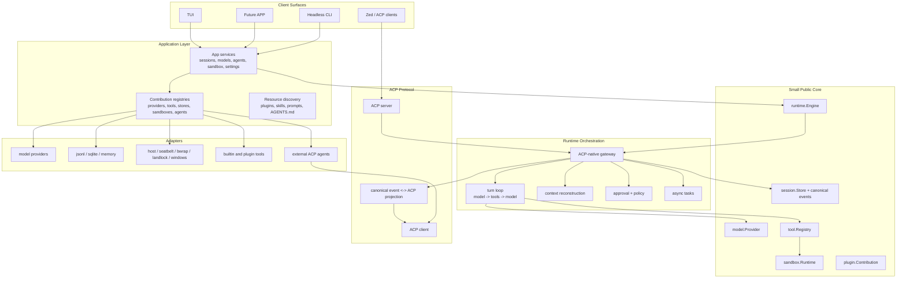

# Caelis Reimplementation Architecture Roadmap

Status: long-term reference and refactor roadmap
Last updated: 2026-06-01
Scope: conceptual redesign, package layout, dependency rules, and migration path

## Purpose

This document records the target architecture for a clean Caelis reimplementation
or deep refactor. It is intentionally written from a near-greenfield viewpoint:
reuse high-cohesion assets from the current repository, but do not preserve
compatibility layers, legacy replay guesses, or stacked adapter logic simply
because they exist today.

The goal is to reduce over-design and package sprawl while preserving the core
product idea: Caelis is an ACP-native agent runtime and gateway. It should be
able to orchestrate external ACP agents, expose itself as an ACP server to
clients such as Zed, and share one kernel and extension ecosystem across the
terminal UI and a future peer APP surface.

## Current Findings

The codebase now points in the target direction with `core`, `internal/app`,
`internal/engine`, `protocol`, `surfaces`, and replaceable adapters. The former
`app/gatewayapp`, top-level `kernel`, broad `ports`, and old `impl` taxonomy
have been retired where they duplicated newer contracts. Remaining cleanup
should keep that shape from reappearing inside large surface or service files.

Key issues:

- Historical: `kernel/` was a public alias facade over `internal/kernel`, and
  broad `ports/*` packages produced global interfaces that were hard to keep
  minimal. Those packages have been deleted; new public contracts should stay
  in focused `core/*` packages or local app/engine interfaces.
- The old `app/gatewayapp` composition root had become a second kernel: config,
  model registry, sandbox routing, prompt assembly, runtime rebuild, ACP agent
  management, and app services all lived together. That package is now deleted;
  remaining cleanup should prevent the same shape from reappearing elsewhere.
- `surfaces/tui/app` and `surfaces/tui/gatewaydriver` are large enough that UI
  state, driver API, rendering, and product commands are difficult to evolve
  independently.
- `session.Event`, `kernel.Event`, and ACP updates currently form overlapping
  semantic surfaces. The target design should have one canonical event model and
  deterministic projections.

## Pi Agent Research Notes

Pi Agent is useful as a design reference because its core is deliberately small.
Its documented direction is a lightweight harness plus a resource and extension
system, with behavior added through extensions, packages, skills, templates, or
external tools instead of being built into the core runtime.

Relevant official references:

- [Pi documentation](https://pi.dev/docs/latest)
- [Pi usage and design principles](https://pi.dev/docs/latest/usage)
- [Pi extensions](https://pi.dev/docs/latest/extensions)
- [Pi SDK](https://pi.dev/docs/latest/sdk)

The relevant ideas to borrow:

- Keep the core small and focused.
- Treat extensibility as resource contribution and composition, not as special
  cases inside the runtime loop.
- Prefer explicit packages, extensions, and templates over hidden hard-coded
  workflow features.
- Keep optional workflows outside the core when they can be modeled as tools,
  commands, extensions, or external processes.

The important difference:

- Pi can keep MCP, sub-agents, permission workflows, and plan modes outside its
  core. Caelis cannot keep ACP outside the core contract because ACP-native
  operation is the product identity.

Therefore the Caelis target is not "Pi with ACP as a plugin". The target is:

> small ACP-native core runtime + stable public contracts + plugin and adapter
> ecosystem.

## Product Identity

Caelis should be designed around these first principles:

- ACP is a first-class protocol boundary, not an incidental adapter.
- Canonical session events are the durable source of truth.
- ACP updates are projections from canonical events, except for external ACP
  ingress where ACP input is normalized before storage.
- Built-in model-backed agents and external ACP agents are peers at the runtime
  boundary.
- Model providers, sandbox backends, stores, tools, prompts, skills, and UI
  renderers are replaceable contributions.
- TUI and the future APP are peer surfaces. They share kernel contracts, app
  services, event streams, command definitions, plugin registries, and resource
  discovery, but not presentation implementation.

## Non-Goals

- Do not add compatibility branches for every old event or storage shape.
- Do not make UI transcript cache the source of model replay.
- Do not let TUI-specific metadata become model-critical data.
- Do not make every concept a top-level public `ports/*` package.
- Do not require Go `plugin` dynamic loading; it is not portable enough for this
  product. Prefer manifests, registries, bundled contributions, and subprocess
  or RPC-backed extensions.
- Do not share TUI widgets with a future APP surface. Share app services and
  view-model contracts instead.

## Target Layering



## Target Package Layout

The exact package names can evolve, but the ownership boundaries should remain
stable.

```text
cmd/caelis/
  main.go

core/
  runtime/      # Engine, Turn, EventEnvelope, cancellation, active turn contracts
  session/      # Session, Event, Store, Cursor, Snapshot, state patches
  model/        # Provider, Request, StreamEvent, Message, ToolCall, usage
  tool/         # Tool, Registry, Definition, Call, Result, display metadata
  sandbox/      # Runtime, Backend, FS, Exec, Constraints, setup status
  plugin/       # Manifest, Contribution, Registry, resource descriptors
  config/       # typed config contracts, no file/env side effects

protocol/acp/
  schema/
  jsonrpc/
  transport/
  client/
  server/
  projector/    # canonical event <-> ACP session/update + request_permission

internal/engine/
  gateway/      # sessions, turns, replay, ACP ingress/egress, active runs
  loop/         # model/tool turn execution
  context/      # prompt and model-context reconstruction
  approval/
  compaction/
  tasks/
  control/      # controller, participant, subagent orchestration contracts

internal/app/
  local/        # default composition root
  services/     # service facade consumed by TUI, APP, CLI, ACP server
  settings/     # env/file config loading
  resources/    # plugin, skill, prompt, AGENTS.md discovery
  registry/     # model/tool/sandbox/store/agent registries

internal/adapters/
  model/
    openai/
    anthropic/
    gemini/
    openrouter/
    ollama/
    codefree/
    volcengine/
  store/
    jsonl/
    sqlite/
    memory/
  sandbox/
    host/
    seatbelt/
    bwrap/
    landlock/
    windows/
  tools/
    filesystem/
    shell/
    plan/
    task/
    spawn/
  acpagent/
    external/   # external ACP process as controller, participant, or subagent

internal/surface/
  tui/
    app/
    driver/
    render/
    viewmodel/
    widgets/
  app/
    api/        # future APP-specific adapter over internal/app/services
    viewmodel/
  headless/
  acpserver/

plugins/
  builtin/      # bundled manifests/resources; no hidden engine logic

eval/
scripts/
npm/
docs/
```

## Dependency Rules

- `core/*` must not import `internal/*`, `protocol/*`, `cmd/*`, or UI packages.
- `protocol/acp/schema`, `jsonrpc`, `transport`, `client`, and `server` should
  stay protocol-only. They should not know the local runtime.
- `protocol/acp/projector` may depend on `core/session` and ACP schema.
- `internal/engine/*` depends on `core/*` and local engine sibling packages. It
  must not import concrete model providers, concrete sandbox backends, concrete
  stores, or UI packages.
- `internal/app/*` is allowed to import adapters and wire them together.
- `internal/adapters/*` implements `core/*` contracts. Adapters must not import
  surfaces.
- `internal/surface/*` depends on `internal/app/services`, `core/*`, and
  protocol clients where needed. Surfaces must not import concrete adapters.
- TUI and future APP are peers. Any shared behavior between them belongs in
  `internal/app/services` or shared view-model contracts, not in TUI packages.

## Core Contracts

The public core should be small enough that it is hard to misuse.

### Runtime

```go
type Engine interface {
    StartSession(context.Context, session.StartRequest) (session.Session, error)
    LoadSession(context.Context, session.Ref) (session.Snapshot, error)
    BeginTurn(context.Context, TurnRequest) (Turn, error)
    Interrupt(context.Context, session.Ref) error
    Replay(context.Context, ReplayRequest) (<-chan EventEnvelope, error)
}
```

The engine owns orchestration. It does not own concrete providers, stores,
sandboxes, tools, or UI rendering.

### Session Store

```go
type Store interface {
    Create(context.Context, StartRequest) (Session, error)
    Load(context.Context, Ref) (Snapshot, error)
    Append(context.Context, Ref, []Event) (Cursor, error)
    Events(context.Context, EventQuery) (EventPage, error)
    UpdateState(context.Context, Ref, StatePatch) error
}
```

JSONL and SQLite should both implement this contract. Runtime logic should not
know which one is in use.

### Model Provider

```go
type Provider interface {
    ID() string
    Models(context.Context) ([]ModelInfo, error)
    Stream(context.Context, Request) (Stream, error)
}
```

Provider-specific request details belong in provider config and metadata, not
in the runtime loop.

### Plugin Contribution

```go
type Contribution interface {
    Manifest() Manifest
    Register(context.Context, Registry) error
}
```

Plugins should contribute resources and implementations:

- model providers
- tools
- sandbox backends
- session stores
- ACP agent descriptors
- prompt fragments
- skills
- UI renderer hints

Plugins should not bypass the engine, session store, approval flow, or ACP
projection contract.

## Canonical Event Model

Caelis should keep one durable event model:

- user content
- assistant text and reasoning
- tool calls and tool results
- provider replay metadata
- approval requests and decisions
- compaction checkpoints
- controller and participant lifecycle events
- task lifecycle anchors
- ACP ingress metadata when external ACP agents participate

ACP updates should be deterministic projections from these canonical events.
External ACP input should be normalized into canonical events before persistence.

Rules:

- Model-visible state must live in canonical event fields, not only `_meta`.
- ACP `_meta` may carry display hints and UI-only details.
- `VisibilityUIOnly` stream chunks are transient and not required for replay.
- Replay must rebuild the same semantic model context produced during live
  execution.
- Store round-trip tests are required for any persistence change.

## ACP-Native Runtime Model

Caelis has two ACP directions:

1. Serve ACP: expose Caelis as an ACP server for clients such as Zed.
2. Consume ACP: run external ACP agents as controllers, participants, or
   subagents.

The target architecture should make both directions first-class:

- ACP server ingress turns client requests into engine requests.
- Engine events are projected into standard ACP `session/update` and
  `request_permission`.
- External ACP agent output is normalized into canonical events.
- Built-in agents and external ACP agents use the same session, approval,
  replay, and task contracts.
- Controller handoff, sidecar participants, and delegated subagents are runtime
  concepts, not TUI-only commands.

## Plugin And Ecosystem Model

The ecosystem should look closer to resource assembly than inheritance.

Recommended plugin shape:

```text
plugin.json
prompts/
skills/
tools/
agents/
models/
sandbox/
renderers/
```

Example contribution classes:

- `model.provider`: registers a provider factory.
- `tool.builtin`: registers a local Go tool or subprocess tool descriptor.
- `sandbox.backend`: registers backend selection and runtime factory.
- `store.backend`: registers `jsonl`, `sqlite`, or remote store implementations.
- `acp.agent`: declares an external ACP command and capabilities.
- `prompt.fragment`: contributes prompt text with explicit priority and scope.
- `skill`: contributes discovered skill metadata.
- `ui.renderer`: contributes optional rendering hints for known tool/event
  kinds. These hints must never be the only durable semantic data.

Plugin loading should be deterministic:

1. read manifests
2. validate schema and declared capabilities
3. register contributions
4. compose runtime registries
5. build engine

## TUI And Future APP

The future APP should be a peer to the TUI, not a wrapper around it.

Shared:

- `internal/app/services`
- command definitions and command handlers
- canonical events
- replay and live event subscriptions
- model/provider registry
- sandbox status and setup workflows
- ACP agent registry
- settings and profiles
- view-model contracts for status, transcript, approvals, task panels, model
  selection, and agent management

Separate:

- rendering
- layout
- input handling
- platform-specific notifications
- local persistence for surface-only preferences

Suggested boundary:

```text
internal/app/services
  SessionService
  TurnService
  ModelService
  AgentService
  SandboxService
  SettingsService
  PluginService

internal/surface/tui
  Bubble Tea implementation

internal/surface/app
  Future APP adapter and view models
```

The common service layer should speak in stable DTOs and event streams. It
should not expose Bubble Tea types, terminal color concepts, or desktop UI
types.

## Reuse Versus Rewrite

Good reuse candidates:

- ACP schema, JSON-RPC, client, server, and projection ideas from
  `protocol/acp`.
- Provider behavior already ported into `internal/adapters/model/*`.
- Sandbox backend implementation details from `internal/adapters/sandbox/*`.
- Built-in tool behavior now owned by the core-native
  `internal/adapters/tools/*` packages.
- Canonical message and event ideas from `ports/model` and `ports/session`.
- Store round-trip tests and replay validation tests.
- TUI rendering components that are already cohesive, after moving them behind
  surface-local boundaries.

Rewrite, heavily reshape, or remove:

- `kernel/` and `internal/kernel` mirrored public/internal split.
- The old giant `app/gatewayapp` composition root has been removed; do not
  recreate it as another broad facade.
- Global `ports/*` package taxonomy.
- `surfaces/tui/gatewaydriver` as a duplicated product API layer.
- Legacy event compatibility fallbacks and heuristic replay reconstruction.

## Migration Strategy

This can be implemented incrementally, but the target should remain a clean
reimplementation.

### Phase 1: Contract Freeze

- Define `core/session`, `core/model`, `core/tool`, `core/sandbox`,
  `core/runtime`, and `core/plugin`.
- Write architecture lint rules for target dependencies.
- Add store round-trip tests for canonical model context reconstruction.
- Add ACP projection tests from canonical events.

### Phase 2: New Engine Skeleton

- Implement `internal/engine/gateway` against the new core contracts.
- Implement a minimal turn loop with one model provider and one tool registry.
- Implement replay from canonical store only.
- Implement approval and permission flow as engine contracts.

### Phase 3: Adapter Migration

- Move model providers behind `core/model.Provider`.
- Move sandbox backends behind `core/sandbox.Runtime`.
- Move JSONL store behind `core/session.Store`.
- Add SQLite store as a parallel adapter without runtime changes.
- Move built-in tools behind `core/tool.Registry`.

### Phase 4: ACP First-Class Runtime

- Rebuild ACP server surface over the new engine.
- Rebuild external ACP controller, participant, and subagent adapters.
- Normalize ACP ingress into canonical events before storage.
- Ensure TUI, APP, CLI, and ACP clients consume the same event stream.

### Phase 5: Surface Split

- Build `internal/app/services` as the only product API consumed by surfaces.
- Port TUI to the service facade.
- Define future APP view-model contracts next to the service facade.
- Remove any TUI-specific assumptions from runtime and app services.

### Phase 6: Remove Old Stack

- Remove the `kernel` alias facade and old `internal/kernel` stack once the new
  engine is feature-complete.
- Remove compatibility replay guesses.
- Retire duplicated gateway-driver APIs.
- Update README and developer docs to the new layout.

## Current Implementation Checkpoint

The first baseline of this roadmap is now represented by new packages that have
replaced the old `app/gatewayapp` stack for current entrypoints:

- `core/*`: stable contracts for runtime, session, model, tool, sandbox, plugin,
  and config.
- `internal/engine/gateway`, `internal/engine/loop`,
  `internal/engine/approval`, and
  `internal/engine/context`: session lifecycle, canonical event append/replay,
  approval/permission policy, model-context reconstruction from durable events,
  and a minimal model/tool turn loop.
- `internal/engine/control`: external participant runner that invokes an ACP
  agent and appends normalized events into the canonical session store. It now
  also has a controller runner for ACP main-controller prompts, normalizing
  responses into controller-scoped canonical events.
- `internal/app/services`: shared service facade for TUI, future APP, CLI, and
  protocol surfaces, including the narrow controller-run lifecycle source used
  to project remote ACP controller diagnostics without leaking local journal
  details into surfaces.
- `internal/app/settings`: shared product settings document for configured
  models and settings-backed custom external ACP agent descriptors, with
  normalized upsert/list/delete operations independent of the deleted gatewayapp
  config store.
- `internal/app/agents`: small app-level catalog for registerable built-in
  external ACP agent descriptors. The catalog is data-only and stays separate
  from runtime orchestration and package-install side effects.
- `internal/app/resources`: deterministic discovery baseline for enabled
  `plugin.json` manifests, plugin prompt/skill/ACP-agent/renderer descriptors,
  workspace/global `AGENTS.md`, and skill metadata. Plugin-declared ACP agents
  are normalized with plugin-relative working directories and command paths.
  It also materializes bundled system skills into the managed Caelis system
  skill root with symlink/reparse-point safety checks. Manifests can also
  declare provider/store/sandbox/tool factory aliases using `name -> uses`
  bindings.
- `internal/app/registry`: deterministic `core/plugin.Registry`
  implementation for model provider, store, sandbox, tool, ACP agent, prompt,
  skill, and renderer contributions. The local composition root now resolves
  built-in provider/store/sandbox/tool implementations through this registry
  instead of hard-coded construction switches, and applies manifest-declared
  factory aliases before composing the stack.
- `internal/app/prompt`: app-layer prompt assembler that renders discovered
  prompt fragments, `AGENTS.md`, and skill metadata into provider
  instructions without moving filesystem discovery into the engine.
- `internal/app/viewmodel`: surface-neutral session transcript, pending
  approval/action, participant, controller lifecycle/diagnostics, agent
  management, model selection, task list/output, settings, event stream, and
  status DTOs shared by the TUI and future APP, including runtime store
  identity needed by read-only diagnostics.
- `internal/app/services.EventService`: shared replay/live-turn event stream
  projection for TUI and future APP consumers. It wraps runtime replay and
  active-turn channels into surface-neutral event envelopes with transcript,
  approval, participant, lifecycle, and canonical event projections.
- `surfaces/tui/eventbridge`: deleted. The old core/session ->
  `kernel.EventEnvelope` reverse bridge no longer exists in production or
  tests; live and replaying app-service TUI paths project app view-model/core
  session events directly.
- `internal/app/services.SettingsService`: shared settings contract for
  runtime identity, store, sandbox, sandbox backend, and compaction policy
  mutations. It persists through the app settings manager and updates the
  service runtime view so peer TUI/APP surfaces do not need raw document edits
  or surface-local config state for these core settings.
- `internal/app/local`: local composition root for core provider, store, tools,
  sandbox runtime, and engine wiring. It can now build a configured local stack
  from `core/config` without importing the old `ports` or `kernel` packages.
  It also wires plugin-declared and settings-backed custom ACP agents into the
  shared `AgentService`, and injects the built-in ACP agent catalog for
  service-native registration. The local stack now also contributes a default
  `self` external ACP agent descriptor when a durable store URI is available,
  spawning the current Caelis executable through the core-native ACP stdio
  surface without leaking literal model tokens into process arguments.
- `internal/adapters/model/openai`: core-native OpenAI-compatible Chat
  Completions provider with tool-call, usage, structured-output, reasoning,
  and provider-profile mapping. It now backs OpenAI-compatible, DeepSeek, and
  OpenRouter, Mimo/Xiaomi, Volcengine, and Volcengine Coding Plan factories in
  the app registry.
- `internal/adapters/model/anthropic`: core-native Anthropic Messages API
  provider with text, image, tool-use/tool-result, reasoning replay signature,
  usage, and model-listing mapping. It now backs Anthropic,
  Anthropic-compatible, and MiniMax factories in the app registry.
- `internal/adapters/model/gemini`: core-native Gemini API provider with
  text/image/file content, tool-call/tool-result mapping, thought-signature
  replay metadata, JSON/schema output, reasoning configuration, usage, and
  model-listing mapping.
- `internal/adapters/model/codefree`: core-native CodeFree chat provider with
  clean Caelis credential loading, CodeFree headers, OpenAI-compatible message
  and tool mapping, JSON output mode, usage, version-endpoint model listing,
  and OAuth credential ensure/refresh helpers.
- `internal/adapters/model/ollama`: core-native Ollama `/api/chat`
  provider with model listing, tool-call mapping, reasoning text, JSON output
  mode, and usage mapping.
- `internal/adapters/store/memory`, `internal/adapters/store/jsonl`, and
  `internal/adapters/store/sqlite`: swappable `core/session.Store` adapters
  for ephemeral and durable local composition.
- `internal/adapters/tools/registry`: deterministic in-memory
  `core/tool.Registry`.
- `internal/adapters/sandbox/host`: core-native host sandbox runtime with async
  command session start/open/read/write/wait/cancel support.
- `internal/adapters/tools/shell`: core-native `run_command` tool using
  `core/sandbox.Runtime`, including the public
  `sandbox_permissions=require_escalated` contract for host execution.
- `internal/adapters/tools/task`: core-native wait/write/cancel control for
  yielded sandbox sessions.
- `core/sandbox.SessionSnapshot` and `core/tool`: shared bounded terminal
  preview and `caelis.runtime.task` metadata contracts used by shell/TASK/SPAWN
  tools, ACP projection, and app-service task view models without TUI-only
  transcript caches.
- `internal/adapters/tools/filesystem`: core-native file read/list/glob/search,
  exact write, and patch tools built on `core/sandbox.FileSystem`.
- `internal/adapters/tools/plan`: core-native `update_plan` tool that feeds
  canonical plan events rather than surface-only display state.
- `internal/adapters/tools/spawn`: core-native delegated participant tool that
  invokes registered external ACP agents through runtime-provided spawner
  interfaces.
- `internal/adapters/acpagent/external`: core-native external ACP client that
  normalizes ACP `session/update` and `session/request_permission` traffic into
  canonical `core/session.Event` values, and can service external agent
  client-side terminal requests through a pluggable terminal handler.
- `internal/app/services.AgentService`: shared TUI/APP-facing descriptor,
  registration, removal, and invocation surface for external ACP agents
  contributed by local composition or stored in app settings. Runtime-added
  custom agents are resolved through a narrow invoker factory instead of
  rebuilding service state. Built-in ACP agents are registered by copying their
  catalog descriptors into the same settings-backed external agent contract,
  and invocations can target either participant scope or ACP controller scope.
  Service-native built-in ACP adapter install now runs through a replaceable
  app-service installer, with the default local stack installing supported npm
  adapters into the Caelis store and persisting the installed binary path.
  It also exposes a surface-neutral management view for registered agents,
  built-in catalog entries, installable adapters, and per-agent management
  actions.
- `internal/app/services.ModelService`: shared model settings and catalog
  surface for configured models, provider model presets, capability defaults,
  and reasoning-level choices used by TUI/future APP connect flows.
- `core/model`: shared model-facing contracts now also own provider endpoint
  API/auth configuration enums. `ports/model` only re-exports those config
  enums for remaining bridge code while production CLI, app services, and the
  TUI app-service connect shell consume the core contract directly.
- `surfaces/tui/gatewaydriver.BindAppServices`: service-native TUI `/agent`
  list and dynamic `/<agent> <prompt>` baseline for configured external ACP
  agents, recording participant attach/user/assistant activity as canonical
  core session events. It also routes settings-backed `/agent add custom` and
  `/agent add <builtin>` and `/agent remove` through shared app services. The
  same gateway now records `/agent use <agent|local>` as canonical handoff
  events, rebuilds active controller state from canonical handoff and
  controller-scoped events, and routes subsequent prompts to the active
  external ACP controller with the latest known remote ACP session id.
- The old `surfaces/tui/gatewaydriver/local` package and the later
  gatewayapp-backed gatewaydriver test adapter have been removed. Production,
  eval, and broad driver regression coverage now bind through `internal/app/local`
  and `BindAppServices`.
- `internal/app/services.ResourceService`: shared TUI/APP-facing catalog
  surface for discovered plugins, prompt fragments, skills, ACP agents,
  renderer hints, and `AGENTS.md` prompt resources.
- `internal/app/services.ViewService`: shared TUI/APP-facing projection from
  canonical session snapshots to surface-neutral transcript, approval, and
  participant view models.
- `internal/app/services.ApprovalService`: shared TUI/APP-facing pending
  approval list and decision-submission contract that converts surface choices
  into `core/runtime` approval submissions.
- `internal/app/services.CommandService`: shared command catalog plus
  service-native command execution contract. The current execution baseline
  handles `/agent` management/handoff, dynamic `/<agent> <prompt>`
  participant invocation, direct `/connect` configuration, and non-wizard
  `/status`, `/settings`, `/compact`, `/model`, `/approval`, and `/resume`, so
  ACP clients, TUI, and the future APP can share command semantics instead of
  reimplementing agent registry/controller handoff, provider setup, status,
  settings diagnostics, model selection, approval mode, compaction, and resume
  behavior in each surface.
- `internal/app/viewmodel.CommandExecutionView`: command execution keeps text
  `Output` for CLI/ACP fallback rendering, while settings, task, controller,
  connect, and agent management commands also return typed panel payloads from
  the same shared app-service DTOs consumed by TUI and the future APP.
- `internal/app/services.SandboxService`: shared sandbox status and lifecycle
  surface. The current migrated baseline exposes core-native sandbox status
  from the composed runtime, treats host setup/fix/reset/clean as explicit
  no-op lifecycle operations, and invokes non-host backend lifecycle hooks when
  the currently constructed runtime supports them instead of routing those
  commands through the old stack. Lifecycle calls now return a shared
  action/backend/support/attempt/no-op/error report on `SandboxStatus`, so CLI,
  `/doctor fix`, TUI bindings, and the future APP can render repair/setup
  outcomes without surface-local sandbox logic. The app-service TUI binding now
  maps this status/lifecycle surface into the existing driver sandbox hooks.
- `protocol/acp/projector`: canonical session event projection to ACP
  updates and permission requests. It now also projects core-native
  sandbox/task terminal markers plus `_meta.terminal_info`,
  `_meta.terminal_output`, and `_meta.terminal_exit` from canonical tool
  events and runtime task previews, so the ACP server no longer depends on the
  deleted old ACP runtime projector for terminal display hints.
- `internal/surface/acpserver`: ACP JSON-RPC server over the new runtime engine.
- `internal/e2e`: new-architecture end-to-end harness that exercises local
  composition, ACP stdio serving, plugin resource loading, registry aliases,
  OpenAI-compatible model requests, host-sandboxed shell tools, SQLite
  persistence, canonical reload, and shared view-model projection.

The current verification path covers:

- local stack -> shared services -> engine -> canonical memory store
- configured local stack -> OpenAI-compatible provider -> JSONL store
- configured local stack -> Anthropic/MiniMax, Gemini, CodeFree, and
  DeepSeek/OpenRouter/Mimo/Volcengine provider profiles -> JSONL store
- core-native CodeFree OAuth ensure/model-selection/refresh -> Caelis
  credential store
- configured local stack -> native Ollama provider -> JSONL store
- configured local stack -> SQLite store -> persisted canonical events after
  reload
- model tool call -> shell tool -> host sandbox -> tool result -> model
  continuation
- host/SPAWN async task snapshot -> bounded terminal preview -> shell/TASK
  runtime metadata -> shared task view model and ACP terminal projection
- configured local stack -> built-in shell tool -> host sandbox -> model
  continuation
- approval-aware tool execution -> canonical pending/decision events ->
  `Turn.Submit` resume
- ACP server -> `session/request_permission` -> permission response -> runtime
  approval submission
- external ACP client -> `session/update` notifications -> canonical user,
  assistant, tool, plan, and approval events
- external ACP client -> ACP `session/request_permission` request -> local
  permission handler -> canonical pending/decision approval events
- external ACP client -> ACP `terminal/create|output|wait_for_exit|kill|release`
  callbacks -> core sandbox async session lifecycle through the local stack
- local stack -> shared `AgentService.Invoke` -> external ACP process ->
  participant runner -> canonical session events
- enabled plugin manifest `acp_agents` -> shared `AgentService` descriptor and
  invoker -> external ACP subprocess -> canonical participant events
- app settings `acp_agents` -> shared `AgentService` descriptor/register/remove
  -> local-stack dynamic invoker factory -> external ACP subprocess ->
  canonical participant events
- built-in ACP agent catalog -> shared `AgentService.RegisterBuiltin` ->
  settings-backed external ACP descriptor -> TUI `/agent add <builtin>`
  catalog and registration path
- TUI `/agent use <agent|local>` -> canonical `EventHandoff` ->
  app-service control-plane state -> ACP controller-scoped prompt routing
- TUI ACP controller response carrying a remote session id -> canonical
  controller-scoped event -> next TUI prompt reuses that remote id through
  app-service controller invocation
- app-service TUI binding -> configured external ACP agent catalog -> dynamic
  participant prompt -> canonical participant/user/assistant events -> TUI
  participant-scoped event projection
- app-service TUI binding -> `/agent add custom` and `/agent remove` for
  settings-backed custom external ACP agents -> shared settings persistence ->
  refreshed agent catalog
- app-service model catalog -> TUI `/connect` model completion and default
  context/output/reasoning values
- local stack -> enabled plugin manifest + workspace `AGENTS.md` ->
  shared `ResourceService` catalog
- CLI `doctor` and `-doctor` -> new local stack -> shared status/sandbox
  services -> redacted text/JSON diagnostics
- CLI `sandbox setup|fix|reset|clean` with host backend -> new local stack ->
  shared sandbox service -> text/JSON sandbox lifecycle status and lifecycle
  action reports
- app-service TUI binding -> shared sandbox service -> `/doctor fix` /
  driver repair path for host backend with no old-stack dependency and shared
  repair reporting
- resource discovery -> home/workspace skills + plugin descriptors ->
  deterministic app resource catalog
- resource catalog -> app prompt assembler -> loop instructions -> provider
  request
- app registry -> provider/store/sandbox/tool factories -> local stack
  composition
- Go `plugin.Contribution` -> app registry -> contributed store factory ->
  local stack composition
- enabled plugin manifest factory alias -> app registry -> local stack
  provider/store/sandbox/tool selection
- canonical session snapshot -> shared view model -> transcript, pending
  approvals, and participants for TUI/future APP
- JSONL store round-trip -> canonical events -> rebuilt model context
- SQLite store round-trip -> canonical events -> rebuilt model context
- local stack -> ACP server -> JSON-RPC `session/new` and `session/prompt` ->
  ACP `session/update` notifications -> canonical stored events
- public ACP client lifecycle/load, permission/terminal, and mode/config e2e
  coverage now runs through `internal/app/local`, the core-native ACP server,
  and a core-native `internal/acpe2eagent` helper instead of the deleted old
  `impl/agent/acp` runtime adapter
- new architecture e2e -> enabled plugin manifest prompt + store alias ->
  SQLite store -> ACP server -> OpenAI-compatible mock provider ->
  `run_command` through host sandbox -> canonical event reload -> shared
  TUI/APP view model
- architecture lint for the new dependency boundaries

## Migration Status Review

Review date: 2026-05-30
Stage: new architecture skeleton is in place; product behavior migration is not
complete.

### Review Outcome

The implemented skeleton is aligned with the target direction:

- New `core/*`, `internal/engine/*`, `internal/app/*`, `internal/adapters/*`,
  `internal/surface/acpserver`, `protocol/acp/projector`, and
  `internal/e2e` packages do not import the old `ports/*`, `kernel/*`,
  `impl/*`, `surfaces/*`, or `app/gatewayapp` stack.
- Runtime orchestration is expressed through small contracts and concrete
  adapters. Model provider, store, sandbox, tool, plugin resource, ACP agent,
  and surface concerns are not piled into one package.
- Canonical session events are the durable replay source for the new stack.
  ACP updates are projected from those events, and external ACP ingress is
  normalized into canonical events before persistence.
- TUI and the future APP are represented as peer consumers of shared app
  services and surface-neutral view models, not as wrappers around each other.
- The new e2e path proves the skeleton can run an ACP-native turn through plugin
  resources, registry aliases, SQLite, model/tool continuation, host sandbox
  execution, canonical reload, and shared view projection.

The important constraint:

> This checkpoint is an architecture baseline, not a product replacement.
> Single-shot headless CLI and ACP stdio now enter the new stack, but
> interactive TUI, doctor/config/sandbox commands, rich provider catalog,
> sandbox policy, compaction, durable task runtime, and most agent workflows
> still run on the old stack.

### Target State

The migration is complete only when:

- `cmd/caelis` enters the new `internal/app/services` stack for interactive TUI,
  headless CLI, doctor/status/config flows, and ACP stdio serving.
- TUI and the future APP consume the same service facade, command handlers,
  event streams, settings/profile APIs, and view-model contracts.
- Built-in agents and external ACP agents meet only at the gateway/runtime
  boundary, with canonical event storage for all model-visible state.
- Model providers, sandbox backends, stores, tools, prompts, skills, renderer
  hints, and ACP agents are selected through registries or plugin manifests.
- Reloaded model input is rebuilt from canonical durable events and validated
  against live runtime context for normal turns, tool turns, approvals,
  compaction, subagents, and ACP participants.
- The old `kernel`, broad `ports`, old `impl` wiring, and old `surfaces/*`
  runtime paths can be deleted rather than bridged by compatibility layers.
  The old `app/gatewayapp` runtime stack has already been removed.

### Completed In This Checkpoint

The completed work is intentionally limited to the reusable skeleton:

- Public core contracts: runtime, session, model, tool, sandbox, plugin, and
  typed config.
- Canonical session stores: memory, JSONL, and SQLite.
- Core-native session listing contract across `core/session.Store`,
  `core/runtime.Engine`, memory/JSONL/SQLite stores, and shared app services,
  with app/user/workspace/CWD/search filters, pagination, event counts, and
  last-event timestamps for future TUI/APP resume views.
- Runtime engine skeleton: session start/load/replay, turn execution,
  cancellation, record-events ingress, approval wait/resume, and model/tool
  continuation.
- Model context reconstruction from canonical events.
- OpenAI-compatible provider adapter sufficient for Chat Completions, tool
  calls, structured output, reasoning content, DeepSeek reasoning defaults, and
  OpenRouter attribution headers. It also covers Mimo/Xiaomi and Volcengine
  thinking payload profiles and provider default endpoints.
- Anthropic Messages API provider adapter sufficient for text/image content,
  tool-use/tool-result mapping, thinking signature replay metadata, usage,
  model listing, and Anthropic-compatible MiniMax auth/default endpoint
  behavior.
- Gemini API provider adapter sufficient for text/image/file content,
  tool-call/tool-result mapping, thought-signature replay metadata, usage,
  model listing, JSON/schema output, and Gemini 2.x budget-based reasoning
  configuration.
- CodeFree provider adapter sufficient for non-stream chat completions,
  CodeFree header/auth semantics, clean Caelis credential loading,
  OpenAI-compatible message/tool mapping, JSON output mode, usage, model
  listing, OAuth credential ensure/refresh, and headless CLI selection.
- Native Ollama provider adapter sufficient for `/api/chat`, model listing,
  tool calls, reasoning text, JSON output mode, and usage mapping.
- Host sandbox adapter, core-native async command sessions, core-native
  `run_command` tool, core-native `task` wait/write/cancel control, and
  core-native filesystem tools: `read_file`, `list_directory`, `glob_files`,
  `search_files`, `write_file`, and `patch_file`.
- Core-native `update_plan` tool with runtime conversion into canonical
  `session.EventPlan` events.
- App composition root, registry, plugin manifest discovery, prompt assembly,
  resource catalog, external ACP agent descriptors, and shared services.
- App settings and model-selection baseline: clean `internal/app/settings`
  document/store/manager, token redaction by default, provider profiles,
  generated model aliases/ids, default model selection, model delete, session
  model override state, runtime model-profile projection, and request-time model
  routing through app registries.
- App model catalog baseline: shared `ModelService` exposes configured
  provider models, built-in provider model presets, capability defaults, and
  reasoning levels so TUI and future APP connect/setup flows do not need to own
  provider capability tables.
- Shared task command baseline: `TaskService` is now reachable from both
  app-level command execution and the production TUI driver path for
  list/tail/wait/write/cancel/release/start task operations.
- Shared session command baseline: `CommandService` now exposes `/new`, starts
  sessions through the shared session service, and returns the canonical session
  ref so TUI, ACP, CLI, and the future APP can adopt the same active session
  transition without surface-local session-start semantics.
- Shared doctor command baseline: `CommandService` now exposes `/doctor` and
  `/doctor fix` on top of shared status and sandbox lifecycle services, so APP,
  ACP, and CLI command surfaces can reuse diagnostics without importing TUI
  doctor formatting or backend-specific sandbox methods.
- App provider configuration baseline: provider endpoint API/auth semantics now
  live in `core/model`; `internal/cli`, `internal/app/services`, and the
  service-bound TUI connect/model config path no longer import
  the old provider stack or `ports/model` for those settings contracts.
- Prompt content input baseline: `core/model.ContentPart` is now the canonical
  user-input contract for text/image/file prompt parts. The old `ports/model`
  package only re-exports that type for residual bridge code, while kernel turn
  requests, agent/controller run requests, app-service submissions, and the TUI
  attachment parser all pass core content parts directly.
- Legacy provider/catalog stack removal: the old provider factory, old layered
  model catalog, embedded models.dev snapshot, and the generator that wrote
  that snapshot have been deleted. Provider implementation now lives only in
  core-native adapters plus the shared app model catalog.
- App model selection baseline: `ModelService.Selection` now projects current
  configured model, provider options, plugin provider aliases, discovered
  remote models, built-in catalog candidates, and capability/reasoning metadata
  into a single surface-neutral view model for TUI and future APP setup flows.
- App session mode baseline: shared app services persist a per-session approval
  preset, ACP exposes it through `session/set_mode` and the `mode` config
  option, and the core approval policy receives the selected mode for each tool
  review. Headless CLI now applies the requested permission/session mode before
  beginning a one-shot turn, so `-permission-mode manual` and `auto-review`
  enter the same shared app-service mode path used by TUI and ACP.
- Headless surface baseline: `internal/surface/headless` runs one-shot prompts
  over shared app services, starts or resumes canonical sessions through the
  engine, resolves approvals with explicit policy hooks, renders text/JSON
  results, and is covered by a new local-stack e2e path using settings model
  routing, the OpenAI-compatible adapter, host sandbox tools, and canonical
  persistence.
- Production CLI baseline for headless and ACP stdio: `internal/cli` now routes
  single-shot prompts and the `caelis acp` subcommand through the new
  `internal/app/local` service stack and core-native surfaces.
- Shared TUI/APP view-model projection for transcript, current plan, pending
  approvals, participants, and runtime/session/model/mode/agent/resource status,
  including store identity for read-only diagnostic displays.
- TUI app-service event bridge cleanup: Bubble Tea live-turn, dynamic
  participant command, shared-command event, and `/resume` paths now consume
  `internal/app/viewmodel.SessionEventEnvelope` or canonical
  `core/session.Event` directly. Core `session.ToolEvent.Content` is preserved
  for existing transcript/tool-panel rendering without routing through
  gatewaydriver-local projection details.
- Core-native ACP server for initialize, session/new, session/prompt,
  session/list, session/load, session/resume, session/close, cancel,
  `session/update`, and permission request bridging. It also exposes configured
  model metadata and model/reasoning selection through ACP session model/config
  methods when the shared app settings service is available, and applies those
  session overrides to subsequent ACP prompts through the shared app turn
  service. It also exposes core-native session modes and the non-model `mode`
  config option through shared app services. `session/load` replays canonical
  stored events through the same ACP projection path used for live updates, and
  `session/close` interrupts any active turn while remaining idempotent when no
  turn is running.
- ACP slash command execution baseline: ACP `session/prompt` now recognizes
  service-native command execution, publishes standard `agent_message_chunk`
  output for command responses, and records compact checkpoints through the
  shared compaction service instead of starting a model turn.
- Core-native external ACP process adapter for participant-style invocation and
  normalized canonical event recording.
- Service-native TUI `/agent list` and dynamic `/<agent> <prompt>` baseline
  for configured external ACP agents, with participant attach/user/assistant
  activity recorded as canonical session events and projected back through the
  existing TUI driver event stream.
- Service-native dynamic `/<agent> <prompt>` command execution through
  `internal/app/services.CommandService`, including command catalog exposure
  for registered external ACP agents, canonical sidecar participant attach/user
  events, shared `AgentService.Invoke`, and ACP projection of the resulting
  canonical participant events.
- Gatewaydriver agent direct-API retirement baseline: TUI driver tests and ACP
  eval paths now invoke agent management and dynamic agent prompts through
  `ExecuteCommand`; the old gatewaydriver concrete methods for add/remove,
  install/update, controller handoff, and dynamic slash-start have been removed.
  Dynamic agent command execution now defers `AgentService` auto-recording so
  participant attach, user prompt, and assistant response persist as one
  atomic canonical event batch, and failed external invocation leaves no
  partial participant preface behind.
- Service-native settings-backed custom external ACP agent registration and
  removal, including TUI `/agent add custom` and `/agent remove` for custom
  agents without rebuilding the app-service stack.
- Service-native built-in ACP agent catalog and non-install registration,
  including TUI `/agent add <builtin>` completion/registration backed by the
  same settings document used for external ACP descriptors.
- Service-native `/agent use <agent|local>` baseline for registered external
  ACP agents, using canonical handoff events and controller-scoped ACP prompt
  execution through shared app services.
- Service-native ACP controller config-intent baseline: active controller
  model/reasoning/mode choices are persisted in shared session state, exposed
  through `internal/app/services.ControllerService`, injected into
  controller invocations, and projected through the existing TUI status/model
  hooks without TUI-owned controller state.
- Shared controller status view-model baseline: remote ACP controller status,
  config choices, declared modes, and slash-command metadata now use
  `internal/app/viewmodel.ControllerStatus` in the gatewaydriver stack instead
  of the old `ports/controller` DTOs. The architecture lint now rejects
  reintroducing `ports/controller` into `surfaces/tui/gatewaydriver`.
- Core-native remote ACP controller config baseline: controller invocations
  now resume an existing remote ACP session before prompting, discover
  remote-declared config options from `session/new` or `session/resume`, apply
  stored model/reasoning/mode intent through `session/set_config_option`, and
  persist the resulting option state for shared status/model projection.
- Shared turn-controller routing baseline: `internal/app/services.TurnService`
  now derives the active ACP controller from canonical handoff/session events
  and routes ordinary surface turns through `AgentService.Invoke` before
  falling back to the local model loop. Headless, ACP, TUI adapters, and the
  future APP can therefore share controller prompt semantics instead of each
  surface reinventing controller dispatch.
- Shared controller-turn contract cleanup: controller-routed turns now persist
  the controller-scoped user prompt and remote response with one shared turn id
  in app services, and the TUI app-service gateway no longer owns a separate
  ACP-controller prompt handle. TUI, headless, ACP, and the future APP therefore
  consume the same completed-turn stream for active external controllers.
- Shared controller-handoff cleanup: the TUI app-service gateway now delegates
  ACP/local controller handoff to `ControllerService.Handoff` instead of
  constructing controller bindings and `EventHandoff` records itself. Handoff
  event shape, epoch allocation, agent lookup, and local-controller fallback now
  have one app-service implementation for TUI, ACP commands, headless, and the
  future APP.
- Gatewaydriver eval adapter cleanup: the real `codex-acp` model/effort E2E now
  constructs `internal/app/local` directly and binds the TUI driver through
  `BindAppServices`, allowing the old `eval/gatewaydriver_gatewayapp_test.go`
  adapter layer to be deleted.
- Eval live-path cleanup: the Claude ACP sidecar/main-controller E2E and the
  live provider reasoning-boundary E2E now construct `internal/app/local`
  directly with shared services, settings-backed model config, `BindAppServices`,
  and `internal/surface/headless`. The eval package no longer imports the old
  `app/gatewayapp`, `kernel`, or `ports/session` product contracts.
- Gatewaydriver regression-stack cleanup: the broad TUI driver regression suite
  now constructs `internal/app/local` with shared app services and binds the
  driver through `BindAppServices`, instead of using a gatewayapp-backed test
  stack. Model connect/delete/status, token usage, ACP agent registry, controller
  handoff, participant mentions, resume metadata, sandbox mutation, and
  provider catalog regressions now exercise the same service-native contracts
  intended for the future APP surface.
- Legacy gatewayapp package removal: after CLI, ACP, eval, and gatewaydriver
  regression paths moved to `internal/app/local` plus shared services, the
  orphaned `app/gatewayapp` package and its private config/model/sandbox
  registries were deleted instead of kept as a compatibility layer.
- Legacy server-side ACP runtime adapter removal: `internal/acpe2eagent` now
  serves ACP through `internal/app/local` and `internal/surface/acpserver` with
  a small core-native scripted provider, allowing the old
  `impl/agent/acp` root runtime adapter plus its assembly, loader, and terminal
  helper packages to be deleted.
- Legacy ports/session ACP projector removal: the unused SDK/ports-session ACP
  projector has been replaced by the core-native `protocol/acp/projector`
  package, so ACP projection no longer has a dormant old event-model
  implementation path.
- Legacy agent runtime/client removal: after participant invocation,
  controller handoff, SPAWN, async subagent tasks, terminal callbacks,
  compaction, approval policy, and app-service turn routing all moved onto
  `internal/app/local`, `internal/engine/*`, and
  `internal/adapters/acpagent/external`, the orphaned `impl/agent/local` stack
  and the remaining old `impl/agent/acp/{controller,subagent}` client packages
  were deleted instead of being kept as a parallel agent runtime.
- Legacy built-in tool stack removal: after `run_command`, `task`,
  filesystem tools, `update_plan`, and `SPAWN` moved onto
  `internal/adapters/tools/*` plus `core/tool` and `core/sandbox` contracts, the
  orphaned old `impl/tool/builtin`, `impl/tool/registry`, and
  `impl/tool/internal/argparse` packages were deleted instead of being kept as a
  parallel tool runtime.
- Legacy orphaned implementation removal: after settings, prompt assembly,
  canonical stores, task journals, approval review, and built-in permission
  policy moved onto the new app/engine/adapter stack, the unused old
  `impl/config/file`, `impl/prompt/static`, `impl/session/{file,memory}`,
  `impl/task/file`, `impl/stream/memory`, `impl/approval/*`, and
  `impl/policy/*` implementations were deleted. The later TUI/gatewaydriver
  cleanup removed the final broad `ports/*` and `kernel` compatibility packages
  instead of keeping them as dormant extension points.
- Legacy skill discovery removal: bundled system skills, skill root discovery,
  and `$skill` completion now run through `internal/app/resources` and
  `core/plugin.SkillDescriptor`, allowing the old `impl/skill` implementation
  packages and the unused `ports/skill` / `ports/prompt` contracts to be
  deleted.
- Legacy orphaned port contract removal: `ports/config`, `ports/policy`, and
  `ports/task` no longer have production or test ownership after settings,
  approval policy, sandbox task control, and durable task history moved onto
  `core/*`, `internal/app/services`, and `internal/adapters/tools/*`, so those
  old public contracts were deleted instead of kept as extension points.
- Legacy controller/subagent port removal: `ports/controller` and
  `ports/subagent` no longer have independent production ownership. Controller
  config/handoff semantics live in `internal/engine/control`,
  `internal/app/services`, and view models; the only residual old subagent
  runner shape needed by `ports/agent` is now folded into that package instead
  of kept as a separate port taxonomy.
- Legacy sandbox router removal: the unused `internal/sandboxrouter` package
  was deleted. Sandbox backend selection now stays in the shared app registry
  and local composition root instead of a second routing layer.
- Core-native contract cleanup: prompt token estimation now consumes
  `core/tool` declarations, `protocol/acp` no longer exposes unused
  provider interfaces tied to the old session port, and reusable sandbox
  setup clone/check helpers live in `core/sandbox`. The current TUI driver and
  gateway status DTOs now use that core sandbox setup contract instead of
  importing the old sandbox port for display-only state.
- Legacy compact port removal: manual compaction now enters the shared
  `internal/app/services.Compaction()` path from TUI, headless, and ACP
  command handling. The old `ports/compact` package and the unused TUI
  `SessionUsageSnapshot` hook were deleted instead of kept as a second
  compaction/event replay contract.
- Architecture lint rules for the new package boundaries.
- End-to-end skeleton test covering plugin resources, SQLite, ACP server,
  OpenAI-compatible provider mock, shell tool execution, canonical reload, and
  shared view projection.

### Not Yet Migrated

These are product capabilities still owned by the old implementation and must
be migrated before retiring the old stack:

1. CLI and process entrypoints
   - Migrated baseline: single-shot headless prompts and `caelis acp` now build
     the new `internal/app/local` stack directly and use core-native headless
     and ACP server surfaces.
   - Migrated baseline: the production interactive TUI entrypoint now builds
     the same `internal/app/local` stack and injects `internal/app/services`
     into the existing TUI driver through `BindAppServices`, so normal TUI
     prompts, status/model/mode state, and core turn streaming no longer
     construct `app/gatewayapp`.
   - Migrated baseline: the production interactive TUI `/doctor` read-only
     status path can now render provider/model, session, store, sandbox, and
     active-job diagnostics from `internal/app/services.Status().View()`
     through the shared app status view, instead of requiring
     `app/gatewayapp` doctor state.
   - Migrated baseline: standalone CLI `doctor`/`-doctor` and
     `sandbox setup|fix|reset|clean` now build the new
     `internal/app/local` stack and use shared app status/sandbox services.
     Host sandbox lifecycle commands are explicit no-ops with status output,
     not old-stack fallbacks.
   - Migrated baseline: the core sandbox contract now includes explicit
     prepare/repair/preflight/reset lifecycle hooks plus setup progress
     reporting. The new local stack can register and construct the existing
     seatbelt, bubblewrap, Landlock, and Windows sandbox assets through a thin
     internal adapter, so CLI sandbox lifecycle commands can reach the
     currently constructed non-host backend instead of being host-only service
     stubs.
   - Migrated baseline: settings-backed runtime changes now flow through a
     local-stack runtime applier. Sandbox backend changes rebuild the concrete
     sandbox runtime and hot-swap the shared live runtime used by tools,
     `SandboxService`, TUI, ACP, and CLI; failed rebuilds roll settings and
     service runtime state back instead of leaving display/config ahead of the
     actual tool runtime.
   - Migrated baseline: one-shot headless CLI now applies the normalized
     `-permission-mode` value through `internal/app/services.Modes()` before
     beginning the turn, so approval policy selection is no longer only a
     display/config flag.
   - Migrated baseline: production CLI flag normalization now uses a
     lightweight `internal/cli` config contract instead of `gatewayapp.Config`,
     then maps directly into `internal/app/local`. This removes the production
     CLI entrypoint's compile-time dependency on the old gatewayapp config
     types.
   - Migrated baseline: production CLI startup now hydrates runtime identity,
     workspace, store backend/URI, sandbox backend/roots/network/helper, plugin
     declarations, and permission mode from the new `app/settings` document.
     Explicit flags or environment variables still win for the same field.
   - Migrated baseline: the old `kernel.TurnHandle` streaming helper has been
     removed from `internal/cli`; production CLI code no longer imports the old
     public `kernel` facade.
   - Still pending: default home layout, rich setup diagnostics, and several
     command dispatch paths still depend on old TUI/gateway compatibility
     packages or `kernel.Service`.

2. TUI surface
   - Migrated baseline: `surfaces/tui/gatewaydriver` can now project
     `internal/app/viewmodel.StatusView` into the existing TUI
     `StatusSnapshot` through an injected app-status view function. This
     creates a narrow service-native status path for the current TUI shell
     without importing `gatewayapp` into the status projection.
   - Migrated baseline: `surfaces/tui/gatewaydriver.BindAppServices` can bind
     the existing TUI driver control points for session start, status,
     model listing, model selection, and session mode set/cycle directly to
     `internal/app/services`. This gives `/status`, `/model`, and `/approval`
     a service-native driver path before the full interactive TUI entrypoint
     moves off the old stack.
   - Migrated baseline: the same binding now supplies core-native driver hooks
     for TUI submit, active-turn submission, interrupt, replay,
     session list/resume, and minimal control-plane state. Basic interactive
     prompts can therefore enter `internal/app/services` without constructing
     `app/gatewayapp` or routing through the old gateway facade.
   - Migrated baseline: `internal/cli` now wires the production interactive
     TUI to this app-service binding for the core-native host runtime path,
     and the binding includes app settings backed model connect/delete/use
     operations.
   - Migrated baseline: `/compact` now has an app-service binding that records
     a core-native `session.EventCompact` checkpoint and the new engine rebuilds
     provider-visible context from the latest checkpoint forward.
   - Migrated baseline: `/new` and `/resume` now use the app-service TUI
     binding for core-native session start/list/load/replay, and resume lists
     can derive a display prompt from canonical user events when a session has
     no generated title yet.
   - Migrated baseline: `/agent list` and dynamic `/<agent> <prompt>` now have
     a service-native path for configured external ACP agents. The TUI binding
     records participant attachment, the user prompt to the participant, and
     the participant response as canonical core session events, then projects
     participant scope/origin back into the existing TUI event stream.
   - Migrated baseline: `/agent add custom <name> -- <command> [args...]` and
     `/agent remove <custom-agent>` now route through
     `internal/app/services.AgentService` and persist settings-backed external
     ACP agent descriptors in the shared app settings document.
   - Migrated baseline: `/agent add <builtin>` now reads a service-native
     built-in ACP catalog and persists the selected descriptor through
     `AgentService.RegisterBuiltin`, so non-install built-in registration no
     longer requires the old gatewayapp agent registry.
   - Migrated baseline: `/agent install <builtin>` and
     `/agent update <builtin>` now use the same shared `AgentService` contract
     with a local-stack npm installer for supported built-in adapters such as
     Codex and Claude. Installable options are exposed through the app-service
     TUI binding, and successful installs or updates persist the managed
     adapter binary path in shared settings instead of routing through
     `gatewayapp`.
   - Migrated baseline: TUI `$skill` completion now has a service-native path
     through the shared app resource catalog. The app-service binding projects
     discovered skill descriptors into the existing completion DTO instead of
     calling the old gateway skill discovery service.
   - Migrated baseline: `/agent use <agent|local>` now records canonical
     controller handoff events through the app-service TUI gateway. When an ACP
     controller is active, normal TUI submissions are routed to the registered
     external ACP agent and recorded as controller-scoped canonical events. The
     app-service TUI gateway now derives the active controller from canonical
     events after each load, including the latest controller remote ACP session
     id, so follow-up prompts can reuse that id without storing controller state
     in TUI-only memory.
   - Migrated baseline: when an app-service ACP controller is active, TUI
     `/model use <model> [reasoning]`, `/approval <mode>`, and session mode
     cycling now route through `internal/app/services.ControllerService`
     instead of mutating local model/session state. The selected controller
     model, reasoning effort, and mode are stored as controller-scoped session
     state, projected into `/status`, and injected into subsequent controller
     invocations as a surface-neutral config intent.
   - Migrated baseline: gatewaydriver no longer imports `ports/controller` for
     active ACP controller status, model/effort completion, mode cycling, or
     status projection. Those flows now use shared app view-model DTOs, and the
     old `ports/controller` package has been removed, so TUI and future APP
     surfaces do not depend on that port taxonomy.
   - Migrated baseline: `/doctor` without repair now reads the same app-service
     status view as `/status`, including configured store URI, so the diagnostic
     display no longer needs the old gatewayapp doctor path for basic readiness
     checks.
   - Migrated baseline: the app-service TUI binding now exposes shared sandbox
     status and sandbox lifecycle hooks to the existing driver, so
     `/doctor fix` can reach `internal/app/services.SandboxService` for the
     currently constructed backend instead of requiring the old gatewayapp
     sandbox repair dependency.
   - Migrated baseline: TUI sandbox backend selection now routes through
     `internal/app/services.SettingsService.SetSandboxBackend`, persists the
     normalized backend in shared app settings, and reflects the requested
     backend through the shared sandbox status view. In the local stack this
     now also rebuilds and hot-swaps the live sandbox runtime, so subsequent
     tool execution and `/doctor fix` use the selected backend rather than a
     display-only setting.
   - Migrated baseline: `/connect` model completion and default
     context/output/reasoning values now come from
     `internal/app/services.Models()` through `BindAppServices`, including
     configured provider models and shared provider capability presets.
   - Migrated baseline: `/connect` provider catalog, endpoint candidates,
     token/env hints, default config preparation, and reusable profile-auth
     checks now live in `internal/app/services.ModelService`. The TUI
     gatewaydriver maps these service candidates into slash-arg DTOs and
     delegates app-service-bound `/connect` submissions through the shared
     prepare/connect contract, so a future APP can reuse the same provider
     setup semantics without importing TUI wizard code.
   - Migrated baseline: `/connect` wizard state, shared flow/step definition,
     completion payload encoding, final command-line shape, default timeout,
     provider step rules, token-env hint logic, skip rules, and step-confirm
     state mutation have moved into `internal/app/services` and shared
     `internal/app/viewmodel` contracts. TUI now adapts that service flow into
     its Bubble Tea wizard runtime; future APP surfaces can reuse the same
     provider setup shell contract without copying TUI step tables.
   - Migrated baseline: model connection setup now has a shared
     `ModelConnectView` panel contract with current/configured model state,
     provider defaults, endpoint/auth hints, reusable-auth status, wizard flow,
     and diagnostics. `/connect` without arguments and
     `/settings run model.connect` render this service-native panel for TUI,
     ACP command clients, CLI, and future APP consumers.
   - Migrated baseline: the old formal `surfaces/tui/gatewaydriver/local`
     adapter package has been deleted, and the remaining broad gatewaydriver
     regression coverage now uses a test-local `internal/app/local` stack plus
     `BindAppServices` instead of importing `app/gatewayapp`.
   - Migrated baseline: the app-service TUI binding now preserves reusable
     endpoint auth as a model-profile contract, keeps settings JSON compact by
     omitting inferred auth/default fields, projects missing API-key diagnostics
     and context-budget status from shared app view models, and keeps removable
     agent candidates separate from the built-in `self` ACP participant path.
   - Migrated baseline: TUI image attachment parsing now emits
     `core/model.ContentPart` values, and the app-service gateway forwards
     those parts without converting through `ports/model`. Attachment UI and
     rendering remain surface-local, but the model-visible prompt content
     contract is no longer owned by the old port package.
   - Migrated baseline: core/app session event projection for the app-service
     TUI binding now lives in the app view-model/core-session transcript
     projector instead of inside `surfaces/tui/gatewaydriver`. Service-native
     shell/task/filesystem, participant, and approval-review results no longer
     depend on gatewaydriver-local projection details.
   - Migrated baseline: TUI sandbox setup display state now uses
     `core/sandbox.SetupStatus` through the driver and gatewaydriver status
     path. This removes a display-only dependency on the old sandbox port while
     keeping setup diagnostics, `/status`, and `/doctor` rendering behavior
     unchanged.
   - Migrated baseline: the app-service TUI gateway and event bridge no longer
     import the old agent or approval ports directly for cancel and approval
     DTOs; they consume the public kernel aliases while the remaining old
     ownership stays contained in the legacy kernel bridge.
   - Migrated baseline: `/new`, `/settings`, `/doctor`, and `/task` now run
     through the same service-backed TUI command executor instead of TUI-owned
     command logic. The gatewaydriver converts TUI command submissions into core
     content parts, calls `internal/app/services.CommandService`, adopts any
     returned canonical session ref, and leaves task-id completion on the
     shared live/durable task list instead of surface-local task state.
   - Migrated baseline: TUI `/connect`, `/model`, `/approval`, and `/compact`
     direct command shells now also enter `CommandService`. The service owns
     non-interactive model configuration, model selection/deletion, approval
     mode changes, and compaction command semantics for TUI, ACP command
     clients, and future APP surfaces. ACP-controller `/model use` and
     `/approval` update controller-scoped config intent in shared session state
     instead of local model/session state, and local `/model del` clears a
     deleted current session model through the shared service path.
   - Migrated baseline: the app-service TUI binding now exposes
     `CommandService.Available()` as a shared command catalog. The TUI slash
     command refresh path prefers that catalog for service-owned and dynamic
     external-ACP commands, while keeping help/exit/quit and ACP-controller
     filtering as surface-local behavior.
   - Migrated baseline: TUI approval-mode keyboard toggling now executes the
     shared `/approval toggle` command instead of calling gatewaydriver session
     mode methods directly. Local mode toggle and ACP-controller mode cycling
     live in `ModeService` / `ControllerService`, and the Bubble Tea driver
     contract no longer declares migrated direct config methods such as
     connect/model/delete/compact/session-mode/sandbox lifecycle controls.
   - Migrated baseline: TUI `/agent` management and dynamic `/<agent>` slash
     invocation now execute through `CommandService`. The TUI surface keeps
     help text, command refresh, `@handle` continuation, and transcript
     rendering, while agent register/install/update/remove/controller handoff
     and dynamic participant invocation live behind the shared app-service
     command contract. `CommandExecutionView.Events` are projected back into
     the existing TUI event stream during the transition, and the Bubble Tea
     driver contract no longer exposes agent mutation or dynamic slash-start
     methods.
   - Migrated baseline: the concrete gatewaydriver agent mutation and
     dynamic-start APIs have been deleted, and gatewaydriver/eval regression
     coverage now drives `/agent add|install|update|remove|use` plus
     `/<agent> <prompt>` through `ExecuteCommand`. Command execution is also
     interruptible, preserving cancellation for long-running shared commands
     such as built-in ACP adapter install. `/agent use` returns a canonical
     handoff projection so the driver updates its current controller from the
     same event stream consumed by TUI and future APP surfaces.
   - Migrated baseline: TUI session-usage status DTOs now use
     `internal/app/viewmodel.TokenUsage` plus shared normalization and
     aggregation helpers instead of exposing `kernel.UsageSnapshot` through the
     driver status contract. The remaining legacy session-event usage parser is
     contained at the gatewaydriver bridge boundary while status rendering and
     tests consume the shared app view model used by future APP surfaces.
   - Migrated baseline: app-service-bound TUI `/resume` now replays history
     from `internal/app/viewmodel.SessionEventEnvelope` through a
     service-native gatewaydriver hook before adapting to the existing
     transcript renderer. The old `kernel.EventEnvelope` replay fallback has
     been removed from the Bubble Tea bridge, so TUI resume now depends on the
     same app view-model event contract that the future APP will consume.
   - Migrated baseline: app-service TUI live turns now expose
     `internal/app/viewmodel.SessionEventEnvelope` streams for both local model
     turns and dynamic external-ACP participant turns. The Bubble Tea bridge
     projects canonical `core/session.Event` values directly into
     `TranscriptEventsMsg`, with transcript-level batching for UI-only
     reasoning/assistant deltas. App-service live errors, manual approval
     prompts, tool events, participant events, and automatic approval-review
     results are now handled from the app view-model/core-session contract
     without converting back through old gateway envelopes.
   - Migrated baseline: TUI render throttling now batches
     `TranscriptEventsMsg` directly for assistant/reasoning deltas and running
     terminal tool output. The old gateway-envelope narrative/terminal
     batchers and the `surfaces/tui/eventbridge` reverse bridge have been
     deleted, so production render scheduling no longer depends on
     `kernel.EventEnvelope`.
   - Migrated baseline: the Bubble Tea render dispatch path no longer accepts
     `kernel.EventEnvelope`, and the old gateway-event transcript projector has
     been moved out of production code into residual test fixtures. Production
     TUI transcript rendering now enters through `TranscriptEventsMsg` projected
     from app view-model/core-session events.
   - Migrated baseline: the production app-service TUI submit and side-agent
     continuation paths now bypass the old `GatewayService` turn envelope and
     return core-native `tuidriver.Turn` handles directly. These handles keep
     only app view-model session events and core runtime submissions/cancel
     results, without maintaining parallel `kernel.EventEnvelope`
     channel/history state.
   - Migrated baseline: app-service-bound TUI `/resume` replay now uses the
     same core-session transcript projector as live app turns, including
     participant prompt restoration, instead of first adapting replayed app
     events into `kernel.EventEnvelope`. TUI tool-content formatting also
     consumes the ACP schema content shape, with old protocol content converted
     only at the legacy gateway boundary.
   - Migrated baseline: TUI active-turn submission now uses
     `core/runtime.Submission` through an explicit core hook. The old
     `GatewayService` turn/active-submit/participant-prompt compatibility
     surface and `kernel.SubmitRequest` conversion have been removed from
     `surfaces/tui/gatewaydriver`.
   - Migrated baseline: the TUI driver session contract now returns
     `core/session` session/ref values, and the production gatewaydriver keeps
     its current session state as `core/session.Session`. Session-bound status,
     command, model, mode, compaction, replay, task, and control-plane hooks no
     longer convert through old `ports/session` structs.
   - Migrated baseline: TUI `/resume` and resume completion now use
     core-native driver hooks backed by `internal/app/services.Sessions()`.
     Session list candidates are built from `core/session.SessionPage` and
     canonical session state instead of routing through
     `GatewayService.ListSessions` or `GatewayService.ResumeSession`.
   - Migrated baseline: TUI agent status, mention completion,
     participant resolution, active-turn detection, and interrupt now consume
     core-native driver hooks. The old `GatewayService` facade has been
     removed from the production TUI driver stack.
   - Migrated baseline: the public TUI driver contract no longer exposes old
     `kernel.EventEnvelope` live/replay streams or `kernel.CancelResult`.
     App-service turns use core submissions, core sessions, and core cancel
     results; the Bubble Tea bridge no longer falls back to old live/replay
     gateway streams.
   - Migrated baseline: app-service TUI approval prompts now consume
     `internal/app/viewmodel.ApprovalItem` directly and submit
     `core/runtime` approval decisions. The shared approval view model carries
     command, sandbox-permission, justification, risk, and option data so TUI
     and the future APP can render the same prompt without `kernel.ApprovalPayload`.
   - Migrated baseline: production TUI app and gatewaydriver packages, plus
     their test fixtures, no longer import the old public `kernel` facade or
     broad `ports/*` contracts. The old `kernel`, `internal/kernel`, and
     remaining broad `ports/{agent,approval,assembly,delegation,model,session,tool}`
     packages have been deleted. TUI transcript and gatewaydriver tests now
     enter through core-session/app-viewmodel events directly.
   - Migrated baseline: TUI status no longer has a parallel legacy
     `ports/session` usage replay parser in gatewaydriver. Session usage shown
     by the app-service path comes from the shared core-session status
     aggregation in `internal/app/services`.
   - Migrated baseline: the unused legacy terminal-stream compatibility path
     has been removed from TUI and the old kernel bridge. `ports/stream`, the
     old kernel stream projection helpers, and `GatewayDriver.SubscribeStream`
     are gone; terminal/task output now belongs to core sandbox sessions,
     `TaskService`, canonical task events, and the ACP terminal lifecycle.
   - Migrated baseline: shared command execution now returns typed panel
     payloads for `/settings`, `/task list`, `/controller`, `/connect`, and
     `/agent list`. The TUI renders those payloads through a surface-local
     `CommandPanelBlock` instead of relying only on plain command-output
     notices, while CLI/ACP fallback text remains available from the same
     command result.
   - Migrated baseline: TUI command panels now attach lightweight click tokens
     that fill the corresponding shared slash command for editable settings
     fields, settings actions, task tailing, connect provider setup, and agent
     management. Execution still goes through `CommandService`; the panel click
     layer only prepares input and does not own product semantics.
   - Migrated baseline: TUI command panel clicks now promote core settings,
     task, and controller viewmodel fields/actions into prompt-assisted local
     widgets. Select/text settings fields, guarded settings actions, task
     start/write/cancel controls, and controller model/mode choices all return
     to the same `ExecuteLine` shared command entry point instead of calling
     app services directly.
   - Surface-local rendering, connect wizard Bubble Tea runtime, status bar,
     transcript reducer, tool panels, approval UI, theme system, and attachment
     UI/rendering remain TUI-owned presentation code by design.
   - Still pending: transcript actions, future APP visual panel rendering, and
     deeper surface-specific panel interactions need to build on the shared
     panel payloads instead of growing new surface-local product semantics.

3. Future APP surface
   - Migrated baseline: `internal/app/viewmodel.StatusView` and
     `internal/app/services.Status().View()` provide a service-native,
     surface-neutral status contract for runtime identity, current session
     summary, model selection, session mode, agents, resource counts, resource
     diagnostics, and store identity. This gives TUI and the future APP a
     shared status/diagnostics panel input without importing `gatewayapp` or
     any TUI package.
   - Migrated baseline: `internal/app/services.ControllerService` gives both
     TUI and the future APP the same controller config-intent contract for an
     active ACP controller, including persisted remote-declared option state,
     keeping controller model/reasoning/mode state out of surface-specific UI
     state.
   - Migrated baseline: `internal/app/services.SettingsService` now exposes a
     surface-neutral settings view plus typed runtime, store, sandbox,
     sandbox-backend, and compaction mutation paths, so TUI and the future APP
     do not need to edit raw settings documents for core runtime
     configuration. Runtime/store/sandbox changes update the shared service
     runtime view after persistence.
   - Migrated baseline: `internal/app/services.TaskService` now exposes a
     surface-neutral task panel contract for sandbox async session list, tail,
     wait, stdin write, and cancel operations, backed by `core/sandbox`
     session contracts instead of old TUI task state.
   - Migrated baseline: `TaskService.List(IncludeHistory)` can rebuild durable
     task-panel history from canonical tool/subagent events and merge it with
     live sandbox status. The shared task DTO now carries command/subagent
     kind, source, action, terminal, cursor, agent, remote session, event, and
     turn metadata for TUI and future APP consumers.
   - Migrated baseline: `internal/app/services.ApprovalService` now exposes
     pending approval actions and a shared decision-submission contract for TUI
     and the future APP. The app-service TUI turn bridge uses this contract
     instead of hand-writing runtime approval submissions in gatewaydriver.
   - Migrated baseline: `internal/app/services.ModelService.Selection` now
     exposes a surface-neutral model/provider selection view with configured
     models, provider options, plugin aliases, remote/catalog candidates,
     capabilities, and reasoning-level metadata.
   - Migrated baseline: `internal/app/services.AgentService.Management` now
     exposes a surface-neutral agent management view for registered agents,
     built-in catalog entries, installable adapters, and actions such as
     invoke, use as controller, register, install/update, remove, and custom
     registration.
   - Migrated baseline: `internal/app/services.EventService` now exposes
     APP-ready replay and active-turn live event streams using shared
     `internal/app/viewmodel.SessionEventEnvelope` DTOs. The app-service TUI
     gateway replay and local-turn forwarding path consume this service-level
     projection directly for transcript rendering, adapting to the existing
     kernel envelope shape only for transitional terminal and approval
     boundaries.
   - Migrated baseline: `internal/app/services.CommandService` now exposes a
     surface-neutral command catalog and non-interactive execution contract for
     ACP clients, TUI, and the future APP. `/agent` management/handoff, direct
     `/connect`, `/status`, `/doctor`, `/compact`, `/model`, `/approval`,
     `/settings`, `/new`, `/resume`, `/task`, and dynamic
     `/<agent> <prompt>` participant invocation now share app-service behavior;
     remaining interactive commands can be added without making ACP, TUI, or
     APP surfaces own command
     semantics.
   - Migrated baseline: `SettingsService.Panel` now provides an APP-ready
     settings composition contract that combines normalized settings, runtime
     status, model/agent counts, sandbox lifecycle status/actions, resource
     diagnostics, and actionable diagnostic hints. `RunPanelAction` executes
     shared sandbox prepare/repair/preflight/reset actions without surfaces
     calling backend-specific methods directly. The shared `/settings` command
     now renders this panel and can run guarded panel actions through
     `CommandService`, so TUI/ACP command surfaces can inspect the same
     diagnostics without owning settings-panel composition.
   - Migrated baseline: `SettingsService.SetPanelField` now provides a
     surface-neutral editable settings contract for runtime workspace/default
     model, store backend/URI, sandbox backend/network/roots/helper,
     compaction policy, and skill policy fields. `CommandService` exposes the
     same path as `/settings set <field-id> <value>`, so TUI, ACP, and future
     APP surfaces can mutate panel fields without editing raw settings
     documents.
   - Migrated baseline: `SettingsService.Panel` now also exposes shared
     settings config-option view models linked back to editable field ids. ACP
     config projection and future APP settings editors can render prompt,
     context, and sandbox controls from the same field metadata instead of
     maintaining surface-local option catalogs.
   - Migrated baseline: shared `/settings` command output now renders
     field-level section details, including field ids, values, input kinds,
     editability, select options, and linked config option ids. TUI and ACP
     command surfaces therefore expose the same settings editor contract
     without embedding field catalogs in surface code.
   - Migrated baseline: the app-service TUI completion path now uses the
     shared settings panel for `/settings set` field ids, select values,
     `/settings run` action ids, and confirm prompts for guarded actions.
     The command registry and completion shell no longer need a TUI-local
     settings field catalog.
   - Migrated baseline: `CommandExecutionView` now carries structured settings,
     task, controller, model-connect, and agent-management panel payloads in
     addition to text output. This gives the future APP a direct render input
     for command-driven panels without scraping CLI-style output, and lets TUI
     keep its panel chrome surface-local.
   - Migrated baseline: `TaskService` now also exposes a surface-neutral async
     command start contract in addition to list/tail/wait/write/cancel/release,
     so ACP terminal lifecycle and future APP task panels can create sandbox
     terminal sessions without reaching into sandbox runtimes directly.
   - Migrated baseline: TUI settings/task/controller command panels now use
     the shared app viewmodels as input-widget descriptors and submit the
     resulting mutations/actions through shared slash commands. This is the
     reference interaction pattern for a future APP surface: UI owns widgets,
     app services own semantics.
   - Still pending: transcript actions and concrete future APP settings/task/
     controller rendering remain unmigrated. Durable async task control and
     output storage remain kernel/runtime work rather than APP-only view-model
     work.

4. Headless CLI and ACP serving
   - Migrated baseline: a new service-native `internal/surface/headless`
     one-shot runner exists with text/JSON output and approval policy hooks.
   - Migrated baseline: production single-shot CLI execution and `caelis acp`
     stdio serving now enter the new local service stack instead of old
     `surfaces/headless` or `surfaces/acpserver`.
   - Migrated baseline: production CLI configuration is no longer shaped as
     `gatewayapp.Config`; CLI flags normalize into a local CLI config contract
     and are projected into `internal/app/local` plus shared app settings.
   - Migrated baseline: the unused old `surfaces/headless` package has been
     removed. Eval coverage that previously exercised gateway/headless behavior
     now uses the new local stack, shared app services, or local protocol
     helpers instead of importing an old product surface.
   - Migrated baseline: the ACP main-controller E2E formerly backed by
     `app/gatewayapp` now runs against `internal/app/local`,
     `ControllerService`, and `internal/surface/headless`, using a protocol-only
     ACP helper process instead of the old gateway stack.
   - Migrated baseline: the real `codex-acp` TUI driver model/effort E2E now
     builds the new `internal/app/local` stack with settings-backed model config
     and external ACP agent descriptors, then binds through `BindAppServices`.
     The old gatewaydriver-to-gatewayapp eval adapter has been removed.
   - Migrated baseline: the Claude ACP sidecar and main-controller live E2E
     now use `internal/app/local`, `AgentService`, `ControllerService`,
     `BindAppServices`, and `internal/surface/headless`; the old
     gatewayapp-backed Claude e2e has been replaced by `eval/local_claude_acp`.
   - Migrated baseline: the live provider reasoning-boundary E2E now reads the
     new app settings document, runs through `internal/app/local` and
     `TurnService`, and verifies canonical core model events directly instead
     of old kernel gateway envelopes.
   - Migrated baseline: the unused old `surfaces/acpserver` wrapper around
     `gatewayapp.Stack.ACPAgent()` has been removed; the remaining ACP stdio
     path is the core-native `internal/surface/acpserver` entrypoint.
   - Still pending: richer ACP surface behavior plus any future store/runtime
     config providers whose hot-swap semantics are not yet finalized.
   - The new ACP server now exposes session list/load/resume over the
     core-native session store and canonical ACP projector.
   - The new ACP server now exposes session model metadata, `session/set_model`,
     and model/reasoning `session/set_config_option` through
     `internal/app/services.Models()` rather than owning config semantics in
     the ACP surface. ACP prompts now enter through the shared app turn service
     when services are available, so selected model and reasoning overrides are
     part of the actual runtime model request instead of display-only state.
   - The new ACP server now handles `session/close` by cancelling active core
     runtime turns and treating already-idle sessions as successfully closed.
   - The new ACP server now exposes `session/set_mode`, session mode metadata,
     and the non-model `mode` config option through `internal/app/services.Modes()`.
   - Migrated baseline: the new ACP server now exposes settings-backed
     non-model config options for skill loading mode, skill expansion budget,
     automatic compaction mode, compaction watermark/source limit, compaction
     task/controller retention limits, requested sandbox backend, and sandbox
     network policy. ACP derives these options from the shared
     `SettingsService` config-option contract and mutates the linked
     `SettingsService.SetPanelField` fields, so clients such as Zed see the
     same prompt policy, context policy, and sandbox request state as TUI and
     the future APP.
   - Migrated baseline: ACP initialize prompt capabilities now come from the
     shared model catalog and configured model set, and the new ACP server
     publishes standard `available_commands_update` notifications after
     session new/load/resume using the shared command catalog.
   - Migrated baseline: ACP `session/prompt` now executes service-native
     `/agent`, `/connect`, `/status`, `/doctor`, `/compact`, `/model`,
     `/approval`, `/settings`, `/new`, `/resume`, `/task`, and dynamic
     `/<agent> <prompt>` commands through
     `CommandService`; handled commands return `end_turn`, publish standard
     `agent_message_chunk` output or canonical event projections, mutate
     settings/agent/model/mode/session state through shared app services, and
     do not enter the model turn loop. `/agent use <agent|local>` records
     canonical controller handoff events through `ControllerService`, and
     `/agent add/remove/install/update` uses the shared `AgentService`
     registry/settings contract. Dynamic agent commands expose registered ACP
     agents in the command catalog, record sidecar participant attach/user
     events, invoke the agent through `AgentService`, and project the resulting
     canonical participant response events over ACP. `/connect` parses
     provider/model/base URL/token/limit/reasoning arguments into the shared
     model settings contract and switches the active session to the new model.
     `/resume` command execution can also replay the targeted canonical
     snapshot through the same ACP projection path as `session/load`.
   - Migrated baseline: ACP terminal lifecycle requests now route through the
     shared task/sandbox contract. `terminal/create` starts a core sandbox
     async session, `terminal/output` tails its buffered output with truncation
     status, `terminal/wait_for_exit` waits for the shared session result, and
     `terminal/kill` / `terminal/release` use the same task cancellation and
     release paths as TUI/APP task controls.
   - Migrated baseline: core canonical tool events now project terminal task
     markers and terminal info/output/exit `_meta` over ACP, preserving the
     public client terminal display contract without the old server-side
     `impl/agent/acp` runtime adapter.
   - Migrated baseline: consumed external ACP agents now also receive a
     client-side terminal capability when the local stack has a sandbox runtime.
     `terminal/create`, output, wait, kill, and release callbacks from an
     external participant, controller, or delegated SPAWN child are backed by
     the same `core/sandbox.Session` lifecycle instead of a protocol-only stub
     or old runtime terminal path.
   - Still pending: richer ACP surface behavior and surface-specific rendering
     for controller diagnostics.

5. Settings, config, and model catalog
   - Migrated baseline: new app settings store, token redaction by default,
     provider profile/model config normalization, generated aliases/ids, model
     connect/delete/default/use service methods, session model override state,
     context window/output token fields, reasoning effort fields, auth/header
     fields, request-time model router, session reasoning override propagation,
     session mode service, compaction prompt policy, and ACP stdio
     model/config/mode projection backed by shared app services. Direct
     `/connect` command execution, guided wizard flow, and connection setup
     panel now land in shared model setup contracts for ACP clients, TUI, and
     future APP consumers. The TUI still owns Bubble Tea rendering/input
     mechanics, but its final model connect/list/use/delete operations use the
     same shared app services.
   - Migrated baseline: shared model catalog data now provides configured
     provider models, built-in provider model presets, capability defaults, and
     reasoning levels to TUI/future APP setup flows through `ModelService`.
   - Migrated baseline: CodeFree OAuth login/model-selection ensure and refresh
     are now exposed through a replaceable `ModelService` auth contract, wired
     by the local app stack to the core-native CodeFree adapter and consumed by
     the TUI `/connect` binding.
   - Migrated baseline: remote provider model discovery for `/connect` now
     flows through `ModelService.ProviderModels`, with the local app stack
     injecting registry-backed provider factories and the TUI passing the
     current provider/base URL/token candidate as UI data rather than creating
     provider adapters itself.
   - Migrated baseline: richer model/provider setup is now available through
     `ModelService.Selection`, which merges configured choices, provider
     options, plugin provider aliases, built-in catalog candidates, remote
     provider discovery, and model capability/reasoning metadata into one
     surface-neutral view.
   - Migrated baseline: built-in provider model presets, provider counts,
     capability matching, remote `core/model.ModelInfo` capability normalization,
     and reasoning-level derivation now live in the pure app-domain
     `internal/app/modelcatalog` package. `ModelService` composes that catalog
     with settings and `core/model.Provider` discovery instead of owning
     catalog tables and matching rules inline.
   - Migrated baseline: the new CLI/local stack now hydrates models and ACP
     agents from the default app settings file under the configured store
     directory, so normal TUI `/connect` changes persist through the shared
     `app/settings` store. Explicit CLI model flags remain session-local and
     override the settings file instead of rewriting it.
   - Migrated baseline: the same settings document now hydrates runtime and
     sandbox configuration into `internal/app/local`, including store backend
     selection (`jsonl`, `sqlite`, or `memory`) and sandbox roots/network/helper
     fields, while preserving explicit CLI/env overrides.
   - Migrated baseline: standalone CLI doctor and sandbox lifecycle
     subcommands now use the new local stack and shared app services for the
     currently constructed backend instead of constructing `app/gatewayapp`.
   - Migrated baseline: ACP `session/set_config_option` now reaches shared
     settings for skill loading, skill expansion budget, auto-compaction
     mode/watermark/source limit, compaction task/controller retention limits,
     sandbox backend, and sandbox network selection instead of limiting ACP
     clients to model/mode controls.
   - Migrated baseline: ACP prompt capability projection now uses
     `ModelService.PromptCapabilities`, so configured multimodal model support
     is reported through the same model catalog used by TUI and APP setup.
   - Migrated baseline: provider endpoint API/auth config enums have moved into
     `core/model`, and `ports/model` only re-exports them for residual bridge
     code. Production CLI config normalization, shared connect catalog data,
     and the app-service-bound TUI connect/model shell now depend on the core
     contract instead of the old provider stack or broad model ports for
     provider setup semantics.
   - Migrated baseline: prompt content parts for multimodal input now also live
     in `core/model`, so TUI/APP/ACP-facing turn and participant prompt
     requests can share one input contract instead of converting image/file
     attachments through `ports/model`.
   - Still pending: remaining TUI command integration and any future
     store/runtime ACP config providers whose hot-swap semantics are not yet
     ready for safe exposure.

6. Model providers
   - Migrated baseline: OpenAI-compatible Chat Completions, Anthropic,
     Anthropic-compatible, MiniMax, Gemini, CodeFree, DeepSeek, OpenRouter,
     Mimo/Xiaomi, Volcengine, Volcengine Coding Plan, and native Ollama
     `/api/chat` now implement `core/model.Provider` and can be selected by
     the new local stack and headless CLI.
   - Anthropic/MiniMax now have a core-native Messages API adapter with default
     endpoints, token lookup, API-version headers, text/image content mapping,
     tool-use/tool-result mapping, thinking signature replay metadata, usage
     mapping, and model listing.
   - Gemini now has a core-native API adapter with default endpoint, API-key
     header auth, text/image/file content mapping, tool-call/tool-result
     mapping, thought-signature replay metadata, JSON/schema output,
     reasoning config mapping, usage mapping, model listing, and settings
     endpoint normalization.
   - CodeFree now has a core-native chat adapter with default endpoint, clean
     Caelis credential loading, CodeFree request headers, OpenAI-compatible
     message/tool mapping, JSON output mode, usage mapping, model listing,
     OAuth login/model-selection ensure, credential refresh, and production
     headless CLI routing.
   - DeepSeek now has a core-native provider profile with default endpoint,
     token lookup, structured JSON output, reasoning content parsing, and
     thinking-mode request defaults for current reasoning models.
   - OpenRouter now has a core-native provider profile with default endpoint,
     token lookup, structured JSON-schema output, reasoning parsing, and Caelis
     attribution headers.
   - Mimo/Xiaomi and Volcengine now have core-native provider profiles with
     default endpoints, token lookup, structured JSON output, reasoning-content
     parsing, thinking payload mapping, and settings endpoint normalization.
   - Migrated baseline: app-service model discovery now caches remote
     `core/model.ModelInfo` results per normalized provider endpoint and token
     fingerprint, and model-selection candidates hydrate context window,
     output, tool-call, image, JSON, and reasoning-level capabilities from
     discovered remote metadata before falling back to static catalog defaults.
   - Migrated baseline: the core-native OpenAI-compatible adapter now honors
     provider streaming requests, parses SSE text/reasoning/tool-call deltas,
     carries streamed usage and origin metadata into the final
     provider-neutral response, and falls back to JSON decoding when a mock or
     compatible backend answers a streaming request with non-SSE JSON.
   - Migrated baseline: `core/model.ProviderError` is now the shared
     provider-neutral error contract for HTTP/model control-plane failures,
     including provider, operation, HTTP status, provider code/type/message,
     retryability, backpressure, and context-overflow classification. The
     core-native OpenAI-compatible, Anthropic, Gemini, Ollama, and CodeFree
     adapters map their HTTP/provider error payloads into that contract.
   - Migrated baseline: the core-native Ollama adapter now honors streaming
     chat requests, parses native consecutive JSON stream frames, emits
     provider-neutral text/reasoning deltas, accumulates streamed tool calls,
     and returns a final canonical response with streamed usage metadata.
   - Migrated baseline: the core-native CodeFree adapter now sends streaming
     chat requests with usage-inclusive stream options, parses
     OpenAI-compatible SSE text/reasoning/tool-call deltas, carries streamed
     usage and origin metadata into the final canonical response, and keeps a
     JSON fallback for compatible mocks or non-SSE CodeFree responses.
   - Migrated baseline: the core-native Anthropic and Gemini adapters now honor
     provider streaming requests, parse their native SSE event streams,
     preserve streamed text/reasoning/tool-call state in canonical model
     messages, carry usage and raw finish metadata into the final response, and
     keep JSON fallbacks for compatible mocks or non-SSE responses.
   - Migrated baseline: the old provider factory package, old model catalog
     package, embedded dynamic catalog snapshot, and old snapshot generator
     have been removed now that production provider setup and runtime requests
     use `core/model`, core-native adapters, and the shared app model catalog.
   - Migrated baseline: tool-call argument normalization now lives in
     `core/model` and is reused by the OpenAI-compatible, CodeFree, Anthropic,
     Gemini, and Ollama adapters. Provider-emitted quoted, fenced, empty,
     null, and invalid tool arguments normalize into the canonical JSON object
     consumed by `core/tool` execution instead of each adapter carrying its own
     partial parser.
   - Migrated baseline: provider-defined, provider-executed, and MCP tool
     declarations now have a provider-neutral `core/model.ToolSpec` payload
     contract. The runtime loop can carry non-local model tools alongside
     local executable function tools, and the OpenAI-compatible, CodeFree,
     Anthropic, Gemini, and Ollama adapters pass through provider-native
     declarations without per-tool compatibility branches.
   - Migrated baseline: provider-native model tool specs can now be enabled
     through plugin manifests, Go contributions, app settings, or explicit
     local stack composition. The local stack merges those sources into the
     same runtime loop contract, and shared resource/status views expose
     plugin/catalog-provided model tool counts.

7. Sandbox backends and policy
   - The new stack has a core-native host sandbox adapter plus a thin internal
     adapter for the existing non-host sandbox assets.
   - Migrated baseline: shared app sandbox status now projects the composed
     core sandbox runtime, and standalone CLI host
     `sandbox setup|fix|reset|clean` commands use that service as explicit
     no-op lifecycle operations.
   - Migrated baseline: the core-native host sandbox can persist async command
     session snapshots and bounded stdout/stderr buffers under a sandbox
     `StateDir`. The local app stack derives that state directory from the
     configured session store URI, so completed shell tasks can be reopened,
     listed, tailed, and waited after a runtime restart.
   - Migrated baseline: the app-service TUI driver binding now maps the same
     sandbox status/lifecycle service into existing TUI sandbox hooks, covering
     host `/doctor fix` repair flow without gatewayapp.
   - Migrated baseline: sandbox backend selection now has a service-native
     settings mutation path. The TUI binding persists requested backends
     through `SettingsService.SetSandboxBackend` and reads the resulting
     requested/resolved backend projection from the shared sandbox status view.
   - Migrated baseline: sandbox backend construction now receives effective
     skill writable roots from the local composition root, so future sandbox
     backends can allow skill install/edit workflows without importing surface
     or old gateway policy code.
   - Migrated baseline: `core/sandbox` now owns backend lifecycle interfaces
     and progress reporting, and the default app registry exposes seatbelt,
     bubblewrap, Landlock, Windows restricted-token, and Windows alias
     factories through the same `sandbox.BackendFactory` contract as host.
     `internal/app/services.SandboxService` now invokes prepare, repair,
     preflight, and reset when the runtime supports them, preserving Windows
     setup/ACL repair behavior through the service-native TUI/CLI paths.
   - Migrated baseline: the local stack now wraps the concrete sandbox runtime
     in a live runtime proxy and wires `SettingsService` runtime mutations to a
     sandbox rebuild path. Backend setting changes therefore affect subsequent
     tool calls and sandbox lifecycle commands, while failed rebuilds roll back
     the persisted setting.
   - Migrated baseline: the reused seatbelt, bubblewrap, Landlock, Windows, and
     shared sandbox helper assets have moved out of the retired `impl/*`
     taxonomy into `internal/adapters/sandbox/*`. Production code no longer
     imports `impl/*`, and architecture lint now rejects reintroducing that
     package family.
   - Migrated baseline: non-host sandbox adapters now implement
     `core/sandbox` directly. The transitional `portadapter` wrapper and the
     retired `ports/sandbox` package have been deleted, the default registry
     registers backend factories directly, and architecture lint rejects any
     production import of the removed sandbox port.
   - Migrated baseline: settings-backed sandbox network policy now flows
     through `core/sandbox.Config` into the shared backend policy. Local stack
     rebuilds and backend runtime policy therefore receive enabled, disabled,
     or inherit explicitly instead of keeping network as surface-only settings.
   - Migrated baseline: host sandbox file-tool access now also uses the shared
     sandbox path policy. `ReadableRoots`, `WritableRoots`, `ReadOnlySubpaths`,
     hidden path rules, scratch roots, and explicit readable-root narrowing are
     enforced by the same `policyfs` adapter used by other core-native file
     tool paths, so settings-backed roots affect host `FileSystem()` operations
     instead of only non-host backends or skill install roots.
   - Migrated baseline: shared app sandbox status now carries policy and route
     diagnostics for TUI, CLI, and future APP consumers. The service projects
     resolved route, isolation, default permission, configured/effective
     network policy, root counts, backend network/path-policy capabilities, and
     normalized diagnostics for host fallback, setup, host execution, network
     policy gaps, and root-policy gaps. Settings-panel diagnostics and CLI
     `/doctor`/`sandbox` output now consume that single service contract instead
     of recomputing sandbox warnings per surface.
   - Migrated baseline: sandbox lifecycle calls now return a shared
     action/backend/support/attempt/no-op/error report on `SandboxStatus`.
     `/doctor fix` preserves and renders the repair result, while CLI
     `sandbox setup|fix|reset|clean` text/JSON output exposes the same report
     without a surface-specific repair path.
   - Still pending: cross-platform validation of the Windows restricted-token
     async session API after the core-native session contract migration.

8. Built-in tools
   - Migrated baseline: `run_command`, `task`, filesystem tools `read_file`,
     `list_directory`, `glob_files`, `search_files`, `write_file`,
     `patch_file`, and `update_plan` now implement `core/tool.Tool` directly
     and are registered as builtin local stack tools through the new app
     registry.
   - `write_file` and `patch_file` are intentionally small exact-text tools
     built on the `core/sandbox.FileSystem` contract, so future sandbox
     backends can replace host execution without changing tool semantics.
   - `run_command` can now yield an async sandbox session through the
     `core/sandbox.Runtime.Start/Open` contract, and `task` can wait, write
     stdin, tail output from returned cursors, list runtime sessions, or cancel
     that yielded session without importing old task/runtime code.
   - Migrated baseline: `run_command` now exposes
     `sandbox_permissions=require_escalated` plus mandatory `justification`,
     maps that request to `core/sandbox.HostExecutionConstraints`, and records
     the escalation metadata in the tool result instead of relying on old
     policy-preset command parsing.
   - Migrated baseline: `run_command` and async task session results now carry
     command-level sandbox policy metadata under `caelis.runtime.sandbox` and
     session snapshot metadata. Results include route, backend, permission,
     isolation, network, backend network/path-policy capabilities, requested
     path-rule counts, and normalized diagnostics for host execution, network
     control gaps, and path-policy gaps. The `task` tool receives that metadata
     through restored host session snapshots instead of recomputing policy
     details in the surface.
   - Migrated baseline: `task list/tail/wait` can operate on host async command
     sessions restored from the sandbox journal after a runtime restart, giving
     shell tasks a durable output-buffer baseline without reintroducing the old
     `ports/task` runtime.
   - Plan updates are no longer only display metadata in the new runtime:
     `update_plan` results are converted into canonical `session.EventPlan`
     records for ACP/TUI/APP projection.
   - Migrated baseline: mutating filesystem tools now emit bounded structured
     unified diff hunks in `_meta.caelis.runtime.tool` while their JSON results
     retain canonical mutation facts; the turn loop promotes JSON tool results
     into canonical `session.ToolEvent.Output` for ACP/TUI/APP raw-output
     projection.
   - Migrated baseline: task list/tail control is now part of the core-native
     `task` tool and backed by a public sandbox session listing contract for
     runtimes that support async sessions.
   - Migrated baseline: task metadata emitted by `run_command`, `task`, and
     `SPAWN` is now recoverable through shared app-service history projection
     from canonical `session.ToolEvent` / subagent participant events, so
     task-panel reload does not depend on TUI-only caches.
   - Migrated baseline: app-command `/task start|wait|write|cancel` now records
     canonical `session.EventLifecycle` snapshots with
     `caelis.runtime.task` metadata. `TaskService` can restore command task
     history from these events, while TUI transcript replay filters these
     lifecycle-only task events out of chat rendering.
   - Migrated baseline: bounded terminal previews are now part of the shared
     runtime contracts. Host async sessions and SPAWN journals persist
     `SessionSnapshot.OutputPreview`; shell/TASK results emit the canonical
     `caelis.runtime.task` preview metadata; task lists, app view models, and
     ACP projection consume that same contract instead of guessing from
     stdout/stderr payloads.
   - Migrated baseline: `SPAWN` now has a core-native tool declaration and is
     executed by the runtime loop through an explicit spawner interface. The
     default local stack can expose registered external ACP agents as SPAWN
     targets, invoke them without old runtime wrappers, normalize their output
     into canonical delegated participant events, and return a model-visible
     `task_id` / `final_message` payload.
   - Migrated baseline: `SPAWN` now supports `yield_time_ms` and can return a
     running subagent `task_id`. The core-native `task` tool can resolve those
     runtime subagent tasks alongside sandbox sessions and use the same
     wait/write/cancel entrypoint. Async subagent completion records canonical
     participant events into the owning session instead of relying on a
     surface-only side channel.
   - Migrated baseline: async delegated SPAWN tasks now persist canonical
     `session.EventLifecycle` task snapshots with `caelis.runtime.task`
     metadata for start, write/cancel, and terminal completion/failure states.
     Shared `TaskService` history can rebuild subagent lifecycle state from the
     session store instead of the local SPAWN journal alone.
   - Migrated baseline: async SPAWN tasks now write a core-native local journal
     containing the task snapshot, output cursor data, agent identity, and
     remote ACP session id. A restarted local stack can list/tail/wait completed
     SPAWN task output through the same task resolver path used by active
     subagent tasks.
   - Migrated baseline: recovered SPAWN subagent tasks with a durable remote
     ACP session id can be reopened as reconnectable `core/sandbox.Session`
     handles. `task write` restarts the configured ACP agent process, calls
     `session/resume`, continues the same remote child session, and persists the
     resulting child output as canonical participant events.
   - Migrated baseline: the old `impl/tool` implementation, registry, and
     argument parsing packages have been removed; built-in tool execution now
     has a single core-native implementation path through
     `internal/adapters/tools/*`.
   - Migrated baseline: compact/rich tool-panel display metadata now has a
     public `core/tool` runtime metadata contract for `caelis.runtime.tool`.
     Filesystem adapters attach structured path/diff metadata through that
     helper, and TUI transcript projection reads tool/task metadata through the
     same core contract instead of private nested-map parsing.

9. Approval and permission policy
   - The new approval path supports allow/deny/ask, ACP permission response
     bridging, model-backed auto-review, and a default local-stack auto-review
     policy for mutating filesystem tools. It now also supports a core-native
     per-session `manual` approval preset that forces approval prompts for every
     tool call while `auto-review` uses the configured model provider.
   - Migrated baseline: pending approval projection now includes
     surface-neutral approval actions, and `ApprovalService` owns decision
     normalization plus active-turn submission for TUI and future APP
     consumers.
   - Migrated baseline: `allow_always` and `reject_always` are now durable
     runtime policy decisions stored in session state. The gateway records those
     choices through the shared approval submission path, and later turns read
     the same state before asking again, without a TUI-owned cache or old-stack
     compatibility branch.
   - Migrated baseline: model-backed auto-review now lives in
     `internal/engine/approval` and uses the core `model.Provider` contract,
     canonical session events, and exact planned tool-call JSON. The local stack
     wraps the default mutating-filesystem approval policy with this reviewer,
     so auto-review can approve or deny without routing through old
     `gatewayapp`/`kernel` reviewer adapters.
   - Migrated baseline: sandbox-aware escalation now lives in the new approval
     chain. Requests with `sandbox_permissions=require_escalated` require a
     justification, force a user approval prompt with one-shot allow/reject
     choices even when a normal tool decision was remembered, and only execute
     after approval through the shared core turn loop.
   - Migrated baseline: model-backed auto-review decisions now carry
     surface-neutral approval metadata (`outcome`, `risk_level`,
     `user_authorization`, rationale) and provider usage as canonical approval
     event metadata, categorized as `auto_review` for shared status usage
     accounting.
   - Migrated baseline: the default core-native built-in policy now covers more
     than mutating filesystem tools. It blocks known dangerous shell commands,
     asks for one-shot approval on destructive recursive removals, keeps
     mutating filesystem calls on the model-backed review path, and leaves
     unknown plugin tools to explicit extension policy instead of importing the
     old `ports/policy` preset registry.
   - Migrated baseline: the orphaned old approval adapters and policy preset
     implementations have been removed; the only approval path for the local
     stack is now the core-native engine policy chain plus app-service approval
     submission.
   - Migrated baseline: approval review prompts now persist a cumulative
     validated reusable prefix and event cursor in canonical approval metadata.
     Later review calls replay the prior approved review messages, then submit
     only the transcript delta and next planned action when the model and policy
     prompt are unchanged.

10. Agents, subagents, and controller handoff
    - Migrated baseline: the new external ACP path covers participant
      invocation through shared app services, plugin-declared agent descriptors,
      local-stack invokers, the app-service TUI dynamic `/<agent> <prompt>`
      path, and the shared `CommandService` dynamic command path used by ACP
      clients and future APP panels. Participant attachment, user prompts to
      participants, and external ACP responses are now canonical session events
      with participant scope/origin instead of TUI-only side effects.
    - Migrated baseline: custom external ACP agents now have app-service
      settings mutation, startup loading, dynamic invocation, and TUI
      add/remove/list coverage for settings-backed descriptors.
    - Migrated baseline: built-in ACP agent descriptors now live in a
      service-native app catalog and `/agent add <builtin>` registers them into
      the same settings-backed external ACP descriptor contract as custom
      agents.
    - Migrated baseline: ACP main-controller handoff now has an app-service
      path for registered external ACP agents. Handoffs are durable
      `EventHandoff` records, control-plane state is rebuilt from canonical
      events, and subsequent prompts can execute through the external ACP agent
      as controller-scoped session events. Controller-scoped response events
      now also feed the derived controller binding, so the latest remote ACP
      session id is carried forward into the next controller prompt.
    - Migrated baseline: the TUI app-service gateway now routes
      `HandoffController` through `ControllerService.Handoff`, so TUI no longer
      duplicates ACP agent lookup, controller binding construction, handoff
      event writing, or local-controller fallback logic.
    - Migrated baseline: shared `TurnService.Begin` now honors an active ACP
      controller for normal surface turns. The controller route invokes the
      registered external ACP agent through `AgentService`, returns a standard
      runtime turn event stream, persists remote-declared config options, and
      avoids starting a local model turn while the ACP controller is active.
    - Migrated baseline: controller-routed turns now write the
      controller-scoped user prompt in `TurnService` before invoking the
      external ACP agent, attach the same shared turn id to prompt and response
      events, and let the TUI gateway consume that standard completed-turn
      stream instead of maintaining its own controller-only handle.
    - Migrated baseline: ACP controller model/reasoning/mode intent now has a
      shared app-service contract. `ControllerService` derives the active ACP
      controller from canonical session state/events, persists controller
      config intent under a controller identity, exposes it to the TUI driver,
      and injects it into controller invocations without putting config
      semantics in TUI-only memory.
    - Migrated baseline: CLI-declared external ACP agents, including the
      `CAELIS_ACP_SELF_AGENT_*` self-agent override path, are now projected into
      the new local app stack as external ACP agent descriptors instead of being
      stranded in the old gatewayapp agent registry shape. `internal/cli` no
      longer imports the old `ports/assembly` contract for this path.
    - Migrated baseline: supported built-in ACP adapter install now belongs to
      shared app services and the default local composition root. The local
      installer runs npm into the managed Caelis store, verifies the installed
      adapter binary, and persists the installed command through shared
      settings for both TUI and future APP consumers.
    - Migrated baseline: agent management now has a shared view contract through
      `AgentService.Management`, covering registered agents, built-in catalog
      entries, installable adapters, and surface-neutral actions for TUI and
      future APP panels.
    - Migrated baseline: shared command execution now covers `/agent list`,
      `/agent add <builtin>`, `/agent add custom <name> -- <command> [args...]`,
      `/agent install|update <builtin>`, `/agent remove <agent>`, and
      `/agent use <agent|local>`, plus dynamic `/<agent> <prompt>`
      participant invocation for registered external ACP agents. The command
      path uses `AgentService` for registry/settings mutation and invocation,
      and `ControllerService.Handoff` for canonical `EventHandoff` recording,
      so ACP clients and future APP panels no longer need a surface-local copy
      of agent command semantics.
    - Migrated baseline: dynamic command-driven participant invocation records
      attach, user prompt, and external ACP response atomically after the
      invocation succeeds. `AgentService.Invoke` still records by default for
      direct service consumers, but command execution can defer that write so
      failed invocations do not persist a half-attached participant. The old
      gatewaydriver direct methods for agent add/remove/handoff and dynamic
      start are gone; TUI, eval, ACP command clients, and future APP panels now
      share the command contract.
    - Migrated baseline: built-in ACP adapter update now reuses the same
      shared app-service install contract as registration. The TUI exposes
      `/agent update <adapter>` with installable adapter completion and routes
      it through `RegisterBuiltinWithOptions(Install: true)`, so updates refresh
      the managed adapter command in shared settings without a separate surface
      or old-stack branch.
    - Migrated baseline: plugin/static external ACP agent removal now has a
      service-native settings tombstone. `/agent remove <agent>` can hide an
      agent supplied by plugin discovery or static local composition, while
      later explicit registration clears the tombstone and restores the shared
      descriptor path for TUI and future APP consumers.
    - Migrated baseline: durable sidecar continuation across driver restarts is
      covered by canonical participant events. Participant remote ACP session
      ids are rebuilt from stored event scope on reload, and follow-up
      `@handle` prompts reuse that remote session id through the shared
      app-service gateway instead of TUI-only memory.
    - Migrated baseline: default self-agent spawning now belongs to
      `internal/app/local`. When no explicit `self` descriptor is configured and
      the runtime has a durable store URI, the local stack exposes a service
      native `self` ACP agent that launches the current Caelis executable with
      ACP stdio flags, workspace/store/model settings, and token-env
      indirection.
    - Migrated baseline: synchronous delegated subagent invocation is now
      available through the core-native `SPAWN` path. Child ACP output is stored
      as canonical participant/subagent events with delegation ids tied to the
      SPAWN tool call, so TUI and future APP surfaces can replay the same child
      work without a surface-only side channel.
    - Migrated baseline: async delegated subagent tasks now have a core-native
      local runtime path. `SPAWN` can yield a running task, `task wait` can join
      that child ACP prompt, `task cancel` can stop it, and `task write` can
      continue a completed child ACP session while preserving canonical
      participant events.
    - Migrated baseline: delegated SPAWN child task lifecycle is now durable
      canonical session state. Start, write/cancel, and final child states are
      recorded as `session.EventLifecycle` events with `caelis.runtime.task`
      metadata, giving TUI and future APP task panels the same restore path.
    - Migrated baseline: completed async delegated subagent tasks are now
      restored after local process restart from the SPAWN task journal, so task
      lists and task output do not depend on a still-live in-memory manager.
    - Migrated baseline: remote ACP controller invocations now reconnect at the
      protocol session level by calling `session/resume` when a canonical
      remote session id exists. New or resumed controller sessions contribute
      remote-declared config options, stored controller
      model/reasoning/mode intent is applied through `session/set_config_option`
      before prompting, and the resulting option state is persisted for shared
      status/model/mode projection.
    - Migrated baseline: delegated SPAWN child sessions now have a remote ACP
      process continuation path after local restart. The local task resolver
      upgrades journal records that still carry an agent descriptor and remote
      session id into writable recovered sessions, so follow-up `task write`
      uses `session/resume` instead of starting a fresh child.
    - Migrated baseline: running delegated SPAWN prompts now persist their
      pending prompt in the local task journal. After a process restart, task
      list/open can restart the configured ACP adapter, resume the recorded
      remote ACP session, continue the interrupted prompt automatically, and
      append the result as canonical participant events without waiting for a
      follow-up `task write`.
    - Migrated baseline: external ACP agents consumed by the new local stack can
      request client-side terminal sessions and have those requests fulfilled by
      core sandbox async sessions. This applies to participant, controller, and
      SPAWN invocation paths because they share the same external ACP client
      configuration.
    - Migrated baseline: live remote ACP controller prompts now write a durable
      local lifecycle journal before invoking the external controller, update
      it once the remote ACP session id is known, clear completed records, and
      retain failed records as diagnostics. A restarted local stack scans
      running records, restarts the configured ACP adapter, calls
      `session/resume`, continues the pending controller prompt, and appends
      the recovered controller output to the canonical session store.
    - Migrated baseline: remote ACP controller lifecycle state is exposed
      through a narrow `ControllerRunSource` contract into shared status
      services and `internal/app/viewmodel`, so CLI, TUI, and future APP
      consumers can render phase, active/recovering state, remote session id,
      and failure diagnostics without importing local recovery/journal code.
    - Migrated baseline: remote ACP controller invocations now also persist
      canonical `session.EventLifecycle` records with
      `caelis.runtime.controller` metadata for started, remote-session,
      completed, and failed phases. `ControllerService` rebuilds the latest
      lifecycle from durable session events and overlays live/recovery journal
      state when present.
    - Migrated baseline: compact checkpoints now retain a bounded controller
      lifecycle index in compact metadata. `ControllerService` can restore the
      latest controller run and diagnostics from compacted history, and repeated
      compactions merge prior controller index entries with post-compact
      lifecycle events.
    - Migrated baseline: controller lifecycle retention limits now live in the
      shared compaction settings policy and are editable through the
      service-native settings panel/command path.
    - Migrated baseline: `ControllerService.Panel` now exposes an APP-ready
      controller panel contract with lifecycle summary, remote config fields,
      available controller actions, and normalized diagnostics. The shared
      `/controller` command and TUI dispatch use this service-native projection
      instead of rendering controller state from scattered status fields.
    - Migrated baseline: host async command sessions now persist process id and
      durable stdout/stderr stream files when a sandbox `StateDir` is
      available. A restarted host sandbox can reopen a still-running process as
      a recovered read-only session, continue reading output from the inherited
      stream files, wait for completion, and cancel the recovered process by
      pid/process group.
    - Still pending: surface-specific visual controller panel rendering remains
      incomplete.

11. Task runtime and async work
    - Migrated baseline: host async command sessions now implement the
      `core/sandbox.Session` contract, expose session listing through
      `core/sandbox.SessionLister`, and the core-native `task` tool can wait,
      tail from output cursors, list, write stdin, and cancel yielded shell
      work.
    - Migrated baseline: shared app services now expose the same sandbox task
      list/tail/wait/write/cancel controls through
      `internal/app/services.TaskService` and `internal/app/viewmodel` task
      DTOs, giving TUI and the future APP a common task-panel API.
    - Migrated baseline: synchronous SPAWN invocations now create canonical
      subagent participant events and return a stable `task_id` matching the
      parent tool call, establishing the new event-level association point for
      future async task control.
    - Migrated baseline: shared task history projection now rebuilds durable
      command and SPAWN task rows from canonical tool result metadata plus
      participant delegation events, preserves output cursors recorded in tool
      results, and overlays live sandbox snapshots when a task is still known to
      the active runtime.
    - Migrated baseline: host async command tasks now have a core-native
      sandbox journal for completed session snapshots and bounded output
      buffers. A restarted host runtime can reopen archived command sessions,
      and the core-native `task` tool can list/tail/wait those restored
      sessions through the same `core/sandbox` interface.
    - Migrated baseline: the core-native `task` tool now has a resolver hook
      for non-sandbox runtime tasks. The local stack uses it for async SPAWN
      subagent tasks, so model-driven TASK wait/write/cancel no longer depends
      on the old `ports/task` runtime.
    - Migrated baseline: shared app services now also accept the same
      non-sandbox task resolver used by the model-facing `task` tool. TUI and
      future APP task panels can list/tail/wait/cancel resolver-backed SPAWN
      tasks without importing the old task runtime or assuming every task is a
      sandbox process.
    - Migrated baseline: async SPAWN subagent tasks now have a durable local
      journal for completed/recovered snapshots and output buffers. A restarted
      stack can reopen the archived SPAWN task through the shared task service
      and through the model-facing TASK tool.
    - Migrated baseline: recovered SPAWN tasks are no longer only read-only
      archived snapshots when the journal contains a remote ACP session id and a
      still-registered agent descriptor. They are exposed as reconnectable task
      sessions with `supports_input`, and `task write` resumes the remote ACP
      child session before appending new canonical participant events.
    - Migrated baseline: running SPAWN journal records now retain the pending
      prompt while the task is in flight. Reopened task lists can recover that
      live record, call ACP `session/resume`, continue the original prompt, and
      clear the pending prompt after completion.
    - Migrated baseline: external ACP terminal callbacks now create and control
      core sandbox async sessions, so terminal output generated by an external
      ACP agent is available through the same runtime session abstraction used
      by `run_command`, TASK, ACP server terminal lifecycle, and app task
      panels.
    - Migrated baseline: production TUI `/task` commands and slash completion
      now consume the shared app task service through the gatewaydriver binding,
      while app `CommandService` exposes the same task actions for ACP/APP
      command execution.
    - Migrated baseline: app command `/task start|wait|write|cancel` persists
      task action snapshots as canonical lifecycle events with runtime task
      metadata, so command-driven task history can be rebuilt from the session
      store without a live sandbox journal or TUI transcript cache.
    - Migrated baseline: async SPAWN subagent tasks now follow the same
      canonical lifecycle contract. The local stack records start,
      write/cancel, and final completion/failure snapshots as
      `session.EventLifecycle` events carrying `caelis.runtime.task`, while the
      SPAWN journal remains a recovery/retention mechanism rather than the only
      lifecycle source.
    - Migrated baseline: compact checkpoints now retain a bounded task history
      index in compact metadata. `TaskService` can rebuild task-panel history
      from the latest compact event plus post-compact lifecycle/tool/subagent
      events, giving future physical retention a canonical restore point.
    - Migrated baseline: task history retention limits now live in the shared
      compaction settings policy and are editable through the service-native
      settings panel/command path.
    - Migrated baseline: host subprocess sessions now have durable output files
      and pid-backed recovery across local runtime restarts. Reopened live host
      sessions are read-only for stdin, but can still be tailed, waited, listed,
      and cancelled through the same `core/sandbox.Session` and TASK paths.
    - Migrated baseline: live and restored host/SPAWN task snapshots now carry
      bounded terminal preview data with cursors and truncation state, and the
      model-facing TASK output plus shared app task views consume the same
      runtime preview contract.
    - Migrated baseline: `TaskService.Panel` now projects the task list into an
      APP-ready task panel contract with status summary counts, active,
      attention, and recent sections, available task actions, and normalized
      diagnostics.
      TUI `/task list` consumes this panel projection through the shared command
      path instead of rebuilding task status locally.
    - Still pending: surface-specific visual TUI/APP task rendering and optional
      persistent indexed history stores remain incomplete.

12. Compaction and replay validation
    - Migrated baseline: manual TUI compaction through `internal/app/services`
      now records a canonical compact checkpoint event, and runtime model
      context reconstruction starts from the latest compact checkpoint.
    - Migrated baseline: shared app-service compaction can now use the current
      configured model provider to generate the checkpoint summary, preserving
      the deterministic source-summary fallback when no model settings/provider
      are configured. Provider usage returned by the compaction call is stored
      in compact metadata for later surface/status projection.
    - Migrated baseline: compact events now also carry standard message and
      top-level usage metadata, and shared app status view-models aggregate
      canonical event usage across main, subagent, auto-review, and compaction
      buckets for TUI and future APP consumers.
    - Migrated baseline: compaction prompt policy is now part of shared app
      settings and `CompactionService`, with configurable checkpoint
      instructions for model-backed summaries and source-character budget
      metadata applied by both model-backed and deterministic fallback paths.
    - Migrated baseline: core gateway reload validation now exercises both
      JSONL and SQLite stores end-to-end, proving that a reloaded provider
      request is rebuilt from the canonical compact checkpoint, post-compact
      user/assistant/tool messages, reasoning replay signatures, provider
      metadata, and usage state.
    - Migrated baseline: shared app services now expose post-compaction context
      budget estimation from canonical model-visible messages, prompt/tool
      prefix estimates, and current model context/output limits. Status
      view-models surface the same estimate for TUI and future APP consumers.
    - Migrated baseline: `TurnService.Begin` now performs shared app-layer
      automatic pre-turn compaction when the estimated current context plus the
      pending user input crosses the configured watermark. The compact event is
      recorded through the core engine and prefixed onto the returned turn event
      stream, so TUI and future APP consumers see the same ACP-native flow.
    - Migrated baseline: compaction now carries a bounded canonical task index
      for command and delegated subagent work. Repeated compactions merge the
      previous compact task index with new lifecycle events, so task panels can
      survive compacted history without scanning retired source events.
    - Migrated baseline: compaction now also carries a bounded controller
      lifecycle index. Controller status and diagnostics can be restored from a
      compact checkpoint even after earlier controller lifecycle events are no
      longer scanned directly.
    - Migrated baseline: compaction retention policy now exposes configurable
      task and controller index limits through app settings, shared settings
      view models, ACP config options, `/settings set`, and compact metadata.

13. Prompt, skills, and resources
    - The new discovery path reads plugin prompts, `AGENTS.md`, and skill
      metadata.
    - Migrated baseline: core-native prompt assembly now owns the stable
      system rules, main-session role guidance, capability guidance,
      permission guidance, session `-system-prompt` override, AGENTS.md
      precedence (`session > workspace > global`), plugin prompt fragments,
      skill metadata, and workspace environment context. The local stack and
      production CLI route through this shared app prompt assembler instead of
      the old gateway prompt path.
    - Migrated baseline: shared app turns now have a turn-level instruction
      contract. Explicit `$skill` references in user input load the matching
      discovered `SKILL.md` content into that turn's model instructions with a
      bounded expansion budget, while preserving the original user message and
      leaving unreferenced skills as metadata only.
    - Migrated baseline: skill loading policy is now a shared app settings
      contract. TUI and future APP consumers see the same surface-neutral
      settings view, prompt assembly can disable skill metadata entirely, and
      turn orchestration honors explicit/metadata-only/disabled loading plus a
      configurable expansion budget without mutating the user message.
    - Migrated baseline: the local composition root now passes default skill
      roots into sandbox backend configuration as effective writable roots,
      including system, user, workspace, and configured roots. This keeps skill
      installation/editing policy out of surfaces and ready for future non-host
      sandbox backends.
    - Migrated baseline: resource discovery now records normalized diagnostics
      for plugin sources, `AGENTS.md` files, skill roots, loaded skills, and
      skill override decisions. `ResourceService` and the shared status view
      expose those diagnostics with severity counters for TUI and future APP
      consumers.
    - Migrated baseline: `internal/app/resources` now owns bundled system skill
      materialization and discovery. The old `impl/skill/{fs,system}` packages
      were removed, and TUI `$skill` completion consumes
      `core/plugin.SkillDescriptor` directly instead of the old `ports/skill`
      metadata DTO.
    - Migrated baseline: diagnostic display/repair intent now has a shared
      settings-panel contract. Resource diagnostics and sandbox setup/fallback
      status are projected as surface-neutral `SettingsPanelDiagnostic` rows with
      action ids, and sandbox lifecycle actions execute through
      `SettingsService.RunPanelAction`.
    - Migrated baseline: the app-service TUI binding now uses the shared
      resource catalog for `$skill` completion, removing another interactive
      path that previously had to call old gateway prompt/skill discovery
      helpers.
    - Migrated baseline: the remaining old gateway skill discovery entrypoints
      now delegate to the shared app resource catalog, and sandbox skill-root
      policy no longer imports the old promptassembly skill helper. The legacy
      `DefaultSkillDiscoveryDirs` / `DiscoverSkillMeta` wrappers have been
      removed from `app/gatewayapp`.
    - Migrated baseline: old gateway prompt construction now delegates to
      `internal/app/prompt` for shared system prompt rendering, prompt path
      resolution, prompt/tool token estimation, and Windows sandbox TLS prompt
      decoration. The legacy `app/gatewayapp/internal/promptassembly` package
      has been removed.
    - Still pending: finer-grained prompt policy controls beyond skill loading
      and compaction, plus concrete diagnostic rendering/repair UI wiring.

14. Rendering and display semantics
    - The new view model is intentionally small.
    - Shared app status now has a surface-neutral usage view, but rich
      transcript rendering, reasoning/narrative smoothing, ACP tool content
      formatting, diff panels, mutation panels, exploration compaction,
      terminal-specific usage rendering, and UI-only live chunk handling remain
      surface-local old-stack work.

15. Session listing and resume workflows
    - Migrated baseline: `core/session.Store` and `core/runtime.Engine` now
      expose session listing as a durable contract, and memory, JSONL, and
      SQLite stores implement app/user/workspace/CWD/search filters, offset
      pagination, event counts, and last-event timestamps. `internal/app/services`
      exposes the same list path with runtime workspace defaults so TUI and
      future APP surfaces can share the same resume data source.
    - Migrated baseline: the new ACP stdio server now serves `session/list`,
      `session/load`, and `session/resume` from the same core-native session
      contract, and `session/load` replays canonical events as ACP
      `session/update` notifications.
    - Migrated baseline: TUI `/new` and `/resume` now use the app-service
      driver binding over the same core session list/load/replay contract, with
      canonical user-event prompt fallback for untitled sessions.
    - Migrated baseline: session list search now includes canonical session
      metadata, with memory, JSONL, SQLite, and engine test stores covered by
      the same `core/session` matching contract.
    - Migrated baseline: shared app session listing can now explicitly request
      all workspaces without defaulting to the current runtime workspace, and
      the app-service TUI gateway preserves the old user-namespace list
      contract when a caller omits the workspace key.
    - Migrated baseline: shared app session listing now derives missing titles
      from canonical durable events, preferring the first user message and
      reusing the same generated summary for TUI, ACP, and future APP list
      consumers instead of keeping a TUI-only resume fallback.
    - Migrated baseline: TUI resume/reload replay now restores canonical plan
      updates alongside durable user and final assistant messages, while still
      filtering transient chunks and process-level tool trace events.
    - Migrated baseline: the old `impl/session/{file,memory}` session stores and
      `impl/task/file` task store have been removed; new product paths use
      `core/session.Store` adapters and core-native task journals instead of
      retaining a parallel old persistence implementation.
    - Still pending: current on-disk legacy session layout migration and
      remaining reload UX polish are not implemented.

### Next Migration Milestones

Recommended sequence:

1. Finish the remaining large TUI surface migrations against app services,
   especially interactive settings/task/controller panel input widgets and
   surface-specific controller rendering.
2. Finish sandbox backend cleanup and Windows async-session cross-platform
   validation without reintroducing the removed router/preset/tool stacks.
3. Finish surface-specific visual task-panel rendering and optional persistent
   indexed history stores behind the shared task panel contract; host process
   recovery, SPAWN continuation, bounded terminal preview metadata, app-command
   lifecycle events, compact retention indexes, and task-panel summaries are
   now baseline runtime capabilities.
4. Port the remaining richer interactive flows to `internal/app/services`,
   especially field editors, action runners, and transcript actions around the
   shared settings/task/controller panel payloads while preserving rendering as
   surface-local code.
5. Expand shared APP view models for settings, agent management, richer model
   selection, approvals, tasks, and transcript actions.
7. Finish remaining canonical-event round trips for compaction edge cases and
   any newly added lifecycle surfaces.
8. Add full store round-trip and ACP projection parity tests for product flows.
9. Continue deleting residual surface-compatibility runtime paths once each has
   a service/core-native replacement. The former `app/gatewayapp`, old
   `kernel`/`internal/kernel`, broad `ports`, and old `impl` runtime stacks have
   already been deleted.

## Validation Gates

Every phase should keep these gates:

- `go test` for affected packages.
- Architecture lint for dependency direction.
- Store round-trip tests comparing rebuilt model context with runtime-produced
  context.
- ACP replay projection tests.
- TUI and future APP contract tests against the same app service fixtures.
- `git diff --check`.

## Decision Summary

The long-term target is:

> Caelis as a small ACP-native runtime kernel with stable core contracts,
> deterministic canonical events, and a plugin/adapter ecosystem that can swap
> model providers, stores, sandbox backends, tools, external ACP agents, and
> surfaces without rewriting the orchestration layer.

This keeps the spirit of Pi Agent's small core and flexible extensions, while
making the necessary Caelis-specific choice: ACP is not just an extension. ACP is
the native protocol boundary around which the runtime and ecosystem are built.
