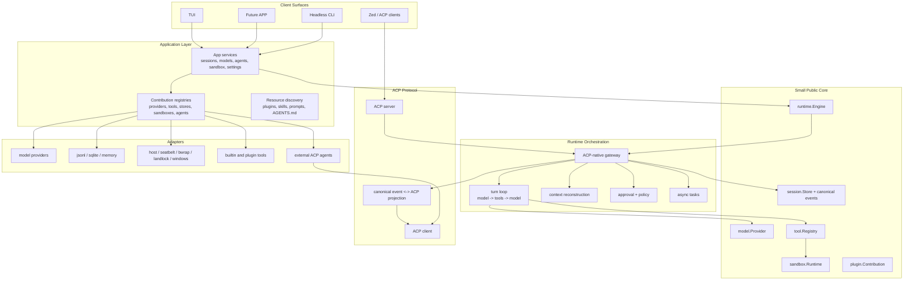

# Caelis Reimplementation Architecture Roadmap

Status: long-term reference and refactor roadmap
Last updated: 2026-05-30
Scope: conceptual redesign, package layout, dependency rules, and migration path

## Purpose

This document records the target architecture for a clean Caelis reimplementation
or deep refactor. It is intentionally written from a near-greenfield viewpoint:
reuse high-cohesion assets from the current repository, but do not preserve
compatibility layers, legacy replay guesses, or stacked adapter logic simply
because they exist today.

The goal is to reduce over-design and package sprawl while preserving the core
product idea: Caelis is an ACP-native agent runtime and gateway. It should be
able to orchestrate external ACP agents, expose itself as an ACP server to
clients such as Zed, and share one kernel and extension ecosystem across the
terminal UI and a future peer APP surface.

## Current Findings

The current codebase already points in the right direction with `kernel`,
`ports`, `impl`, `protocol`, `surfaces`, and `app/gatewayapp`. The problem is
that those layers have grown into mirrored contracts and broad glue packages.

Key issues:

- `kernel/` is mostly a public alias facade over `internal/kernel`, which makes
  the public contract inherit the internal implementation shape.
- `ports/*` is split by many nouns, producing many global interfaces that are
  hard to keep minimal and local to their actual consumers.
- `app/gatewayapp` has become a second kernel: config, model registry, sandbox
  routing, prompt assembly, runtime rebuild, ACP agent management, and app
  services all live together.
- `impl/agent/local` directly knows ACP controller and subagent concrete
  implementations, which weakens the idea that built-in agents and external ACP
  agents meet only at the gateway/runtime boundary.
- `surfaces/tui/app` and `surfaces/tui/gatewaydriver` are large enough that UI
  state, driver API, rendering, and product commands are difficult to evolve
  independently.
- `session.Event`, `kernel.Event`, and ACP updates currently form overlapping
  semantic surfaces. The target design should have one canonical event model and
  deterministic projections.

## Pi Agent Research Notes

Pi Agent is useful as a design reference because its core is deliberately small.
Its documented direction is a lightweight harness plus a resource and extension
system, with behavior added through extensions, packages, skills, templates, or
external tools instead of being built into the core runtime.

Relevant official references:

- [Pi documentation](https://pi.dev/docs/latest)
- [Pi usage and design principles](https://pi.dev/docs/latest/usage)
- [Pi extensions](https://pi.dev/docs/latest/extensions)
- [Pi SDK](https://pi.dev/docs/latest/sdk)

The relevant ideas to borrow:

- Keep the core small and focused.
- Treat extensibility as resource contribution and composition, not as special
  cases inside the runtime loop.
- Prefer explicit packages, extensions, and templates over hidden hard-coded
  workflow features.
- Keep optional workflows outside the core when they can be modeled as tools,
  commands, extensions, or external processes.

The important difference:

- Pi can keep MCP, sub-agents, permission workflows, and plan modes outside its
  core. Caelis cannot keep ACP outside the core contract because ACP-native
  operation is the product identity.

Therefore the Caelis target is not "Pi with ACP as a plugin". The target is:

> small ACP-native core runtime + stable public contracts + plugin and adapter
> ecosystem.

## Product Identity

Caelis should be designed around these first principles:

- ACP is a first-class protocol boundary, not an incidental adapter.
- Canonical session events are the durable source of truth.
- ACP updates are projections from canonical events, except for external ACP
  ingress where ACP input is normalized before storage.
- Built-in model-backed agents and external ACP agents are peers at the runtime
  boundary.
- Model providers, sandbox backends, stores, tools, prompts, skills, and UI
  renderers are replaceable contributions.
- TUI and the future APP are peer surfaces. They share kernel contracts, app
  services, event streams, command definitions, plugin registries, and resource
  discovery, but not presentation implementation.

## Non-Goals

- Do not add compatibility branches for every old event or storage shape.
- Do not make UI transcript cache the source of model replay.
- Do not let TUI-specific metadata become model-critical data.
- Do not make every concept a top-level public `ports/*` package.
- Do not require Go `plugin` dynamic loading; it is not portable enough for this
  product. Prefer manifests, registries, bundled contributions, and subprocess
  or RPC-backed extensions.
- Do not share TUI widgets with a future APP surface. Share app services and
  view-model contracts instead.

## Target Layering



## Target Package Layout

The exact package names can evolve, but the ownership boundaries should remain
stable.

```text
cmd/caelis/
  main.go

core/
  runtime/      # Engine, Turn, EventEnvelope, cancellation, active turn contracts
  session/      # Session, Event, Store, Cursor, Snapshot, state patches
  model/        # Provider, Request, StreamEvent, Message, ToolCall, usage
  tool/         # Tool, Registry, Definition, Call, Result, display metadata
  sandbox/      # Runtime, Backend, FS, Exec, Constraints, setup status
  plugin/       # Manifest, Contribution, Registry, resource descriptors
  config/       # typed config contracts, no file/env side effects

protocol/acp/
  schema/
  jsonrpc/
  transport/
  client/
  server/
  projector/    # canonical event <-> ACP session/update + request_permission

internal/engine/
  gateway/      # sessions, turns, replay, ACP ingress/egress, active runs
  loop/         # model/tool turn execution
  context/      # prompt and model-context reconstruction
  approval/
  compaction/
  tasks/
  control/      # controller, participant, subagent orchestration contracts

internal/app/
  local/        # default composition root
  services/     # service facade consumed by TUI, APP, CLI, ACP server
  settings/     # env/file config loading
  resources/    # plugin, skill, prompt, AGENTS.md discovery
  registry/     # model/tool/sandbox/store/agent registries

internal/adapters/
  model/
    openai/
    anthropic/
    gemini/
    openrouter/
    ollama/
    codefree/
    volcengine/
  store/
    jsonl/
    sqlite/
    memory/
  sandbox/
    host/
    seatbelt/
    bwrap/
    landlock/
    windows/
  tools/
    filesystem/
    shell/
    plan/
    task/
    spawn/
  acpagent/
    external/   # external ACP process as controller, participant, or subagent

internal/surface/
  tui/
    app/
    driver/
    render/
    viewmodel/
    widgets/
  app/
    api/        # future APP-specific adapter over internal/app/services
    viewmodel/
  headless/
  acpserver/

plugins/
  builtin/      # bundled manifests/resources; no hidden engine logic

eval/
scripts/
npm/
docs/
```

## Dependency Rules

- `core/*` must not import `internal/*`, `protocol/*`, `cmd/*`, or UI packages.
- `protocol/acp/schema`, `jsonrpc`, `transport`, `client`, and `server` should
  stay protocol-only. They should not know the local runtime.
- `protocol/acp/projector` may depend on `core/session` and ACP schema.
- `internal/engine/*` depends on `core/*` and local engine sibling packages. It
  must not import concrete model providers, concrete sandbox backends, concrete
  stores, or UI packages.
- `internal/app/*` is allowed to import adapters and wire them together.
- `internal/adapters/*` implements `core/*` contracts. Adapters must not import
  surfaces.
- `internal/surface/*` depends on `internal/app/services`, `core/*`, and
  protocol clients where needed. Surfaces must not import concrete adapters.
- TUI and future APP are peers. Any shared behavior between them belongs in
  `internal/app/services` or shared view-model contracts, not in TUI packages.

## Core Contracts

The public core should be small enough that it is hard to misuse.

### Runtime

```go
type Engine interface {
    StartSession(context.Context, session.StartRequest) (session.Session, error)
    LoadSession(context.Context, session.Ref) (session.Snapshot, error)
    BeginTurn(context.Context, TurnRequest) (Turn, error)
    Interrupt(context.Context, session.Ref) error
    Replay(context.Context, ReplayRequest) (<-chan EventEnvelope, error)
}
```

The engine owns orchestration. It does not own concrete providers, stores,
sandboxes, tools, or UI rendering.

### Session Store

```go
type Store interface {
    Create(context.Context, StartRequest) (Session, error)
    Load(context.Context, Ref) (Snapshot, error)
    Append(context.Context, Ref, []Event) (Cursor, error)
    Events(context.Context, EventQuery) (EventPage, error)
    UpdateState(context.Context, Ref, StatePatch) error
}
```

JSONL and SQLite should both implement this contract. Runtime logic should not
know which one is in use.

### Model Provider

```go
type Provider interface {
    ID() string
    Models(context.Context) ([]ModelInfo, error)
    Stream(context.Context, Request) (Stream, error)
}
```

Provider-specific request details belong in provider config and metadata, not
in the runtime loop.

### Plugin Contribution

```go
type Contribution interface {
    Manifest() Manifest
    Register(context.Context, Registry) error
}
```

Plugins should contribute resources and implementations:

- model providers
- tools
- sandbox backends
- session stores
- ACP agent descriptors
- prompt fragments
- skills
- UI renderer hints

Plugins should not bypass the engine, session store, approval flow, or ACP
projection contract.

## Canonical Event Model

Caelis should keep one durable event model:

- user content
- assistant text and reasoning
- tool calls and tool results
- provider replay metadata
- approval requests and decisions
- compaction checkpoints
- controller and participant lifecycle events
- task lifecycle anchors
- ACP ingress metadata when external ACP agents participate

ACP updates should be deterministic projections from these canonical events.
External ACP input should be normalized into canonical events before persistence.

Rules:

- Model-visible state must live in canonical event fields, not only `_meta`.
- ACP `_meta` may carry display hints and UI-only details.
- `VisibilityUIOnly` stream chunks are transient and not required for replay.
- Replay must rebuild the same semantic model context produced during live
  execution.
- Store round-trip tests are required for any persistence change.

## ACP-Native Runtime Model

Caelis has two ACP directions:

1. Serve ACP: expose Caelis as an ACP server for clients such as Zed.
2. Consume ACP: run external ACP agents as controllers, participants, or
   subagents.

The target architecture should make both directions first-class:

- ACP server ingress turns client requests into engine requests.
- Engine events are projected into standard ACP `session/update` and
  `request_permission`.
- External ACP agent output is normalized into canonical events.
- Built-in agents and external ACP agents use the same session, approval,
  replay, and task contracts.
- Controller handoff, sidecar participants, and delegated subagents are runtime
  concepts, not TUI-only commands.

## Plugin And Ecosystem Model

The ecosystem should look closer to resource assembly than inheritance.

Recommended plugin shape:

```text
plugin.json
prompts/
skills/
tools/
agents/
models/
sandbox/
renderers/
```

Example contribution classes:

- `model.provider`: registers a provider factory.
- `tool.builtin`: registers a local Go tool or subprocess tool descriptor.
- `sandbox.backend`: registers backend selection and runtime factory.
- `store.backend`: registers `jsonl`, `sqlite`, or remote store implementations.
- `acp.agent`: declares an external ACP command and capabilities.
- `prompt.fragment`: contributes prompt text with explicit priority and scope.
- `skill`: contributes discovered skill metadata.
- `ui.renderer`: contributes optional rendering hints for known tool/event
  kinds. These hints must never be the only durable semantic data.

Plugin loading should be deterministic:

1. read manifests
2. validate schema and declared capabilities
3. register contributions
4. compose runtime registries
5. build engine

## TUI And Future APP

The future APP should be a peer to the TUI, not a wrapper around it.

Shared:

- `internal/app/services`
- command definitions and command handlers
- canonical events
- replay and live event subscriptions
- model/provider registry
- sandbox status and setup workflows
- ACP agent registry
- settings and profiles
- view-model contracts for status, transcript, approvals, task panels, model
  selection, and agent management

Separate:

- rendering
- layout
- input handling
- platform-specific notifications
- local persistence for surface-only preferences

Suggested boundary:

```text
internal/app/services
  SessionService
  TurnService
  ModelService
  AgentService
  SandboxService
  SettingsService
  PluginService

internal/surface/tui
  Bubble Tea implementation

internal/surface/app
  Future APP adapter and view models
```

The common service layer should speak in stable DTOs and event streams. It
should not expose Bubble Tea types, terminal color concepts, or desktop UI
types.

## Reuse Versus Rewrite

Good reuse candidates:

- ACP schema, JSON-RPC, client, server, and projection ideas from
  `protocol/acp`.
- Provider implementation details from `impl/model/providers`.
- Sandbox backend implementation details from `impl/sandbox/*`.
- Built-in tool behavior from `impl/tool/builtin/*`.
- Canonical message and event ideas from `ports/model` and `ports/session`.
- Store round-trip tests and replay validation tests.
- TUI rendering components that are already cohesive, after moving them behind
  surface-local boundaries.

Rewrite or heavily reshape:

- `kernel/` and `internal/kernel` mirrored public/internal split.
- `app/gatewayapp` as a giant composition root.
- Global `ports/*` package taxonomy.
- `impl/agent/local` directly coupling to concrete ACP controller/subagent
  implementations.
- `surfaces/tui/gatewaydriver` as a duplicated product API layer.
- Legacy event compatibility fallbacks and heuristic replay reconstruction.

## Migration Strategy

This can be implemented incrementally, but the target should remain a clean
reimplementation.

### Phase 1: Contract Freeze

- Define `core/session`, `core/model`, `core/tool`, `core/sandbox`,
  `core/runtime`, and `core/plugin`.
- Write architecture lint rules for target dependencies.
- Add store round-trip tests for canonical model context reconstruction.
- Add ACP projection tests from canonical events.

### Phase 2: New Engine Skeleton

- Implement `internal/engine/gateway` against the new core contracts.
- Implement a minimal turn loop with one model provider and one tool registry.
- Implement replay from canonical store only.
- Implement approval and permission flow as engine contracts.

### Phase 3: Adapter Migration

- Move model providers behind `core/model.Provider`.
- Move sandbox backends behind `core/sandbox.Runtime`.
- Move JSONL store behind `core/session.Store`.
- Add SQLite store as a parallel adapter without runtime changes.
- Move built-in tools behind `core/tool.Registry`.

### Phase 4: ACP First-Class Runtime

- Rebuild ACP server surface over the new engine.
- Rebuild external ACP controller, participant, and subagent adapters.
- Normalize ACP ingress into canonical events before storage.
- Ensure TUI, APP, CLI, and ACP clients consume the same event stream.

### Phase 5: Surface Split

- Build `internal/app/services` as the only product API consumed by surfaces.
- Port TUI to the service facade.
- Define future APP view-model contracts next to the service facade.
- Remove any TUI-specific assumptions from runtime and app services.

### Phase 6: Remove Old Stack

- Remove the `kernel` alias facade and old `internal/kernel` stack once the new
  engine is feature-complete.
- Remove compatibility replay guesses.
- Retire duplicated gateway-driver APIs.
- Update README and developer docs to the new layout.

## Current Implementation Checkpoint

The first baseline of this roadmap is now represented by new packages that sit
alongside the old stack without importing it:

- `core/*`: stable contracts for runtime, session, model, tool, sandbox, plugin,
  and config.
- `internal/engine/gateway`, `internal/engine/loop`,
  `internal/engine/approval`, and
  `internal/engine/context`: session lifecycle, canonical event append/replay,
  approval/permission policy, model-context reconstruction from durable events,
  and a minimal model/tool turn loop.
- `internal/engine/control`: external participant runner that invokes an ACP
  agent and appends normalized events into the canonical session store.
- `internal/app/services`: shared service facade for TUI, future APP, CLI, and
  protocol surfaces.
- `internal/app/resources`: deterministic discovery baseline for enabled
  `plugin.json` manifests, plugin prompt/skill/ACP-agent/renderer descriptors,
  workspace/global `AGENTS.md`, and skill metadata. Plugin-declared ACP agents
  are normalized with plugin-relative working directories and command paths.
  Manifests can also declare provider/store/sandbox/tool factory aliases using
  `name -> uses` bindings.
- `internal/app/registry`: deterministic `core/plugin.Registry`
  implementation for model provider, store, sandbox, tool, ACP agent, prompt,
  skill, and renderer contributions. The local composition root now resolves
  built-in provider/store/sandbox/tool implementations through this registry
  instead of hard-coded construction switches, and applies manifest-declared
  factory aliases before composing the stack.
- `internal/app/prompt`: app-layer prompt assembler that renders discovered
  prompt fragments, `AGENTS.md`, and skill metadata into provider
  instructions without moving filesystem discovery into the engine.
- `internal/app/viewmodel`: surface-neutral session transcript, pending
  approval, and participant DTOs shared by the TUI and future APP.
- `internal/app/local`: local composition root for core provider, store, tools,
  sandbox runtime, and engine wiring. It can now build a configured local stack
  from `core/config` without importing the old `ports` or `kernel` packages.
  It also wires plugin-declared ACP agents into the shared `AgentService`.
- `internal/adapters/model/openai`: core-native OpenAI-compatible Chat
  Completions provider with tool-call, usage, structured-output, reasoning,
  and provider-profile mapping. It now backs OpenAI-compatible, DeepSeek, and
  OpenRouter factories in the app registry.
- `internal/adapters/model/ollama`: core-native Ollama `/api/chat`
  provider with model listing, tool-call mapping, reasoning text, JSON output
  mode, and usage mapping.
- `internal/adapters/store/memory`, `internal/adapters/store/jsonl`, and
  `internal/adapters/store/sqlite`: swappable `core/session.Store` adapters
  for ephemeral and durable local composition.
- `internal/adapters/tools/registry`: deterministic in-memory
  `core/tool.Registry`.
- `internal/adapters/sandbox/host`: core-native host sandbox runtime with async
  command session start/open/read/write/wait/cancel support.
- `internal/adapters/tools/shell`: core-native `run_command` tool using
  `core/sandbox.Runtime`.
- `internal/adapters/tools/task`: core-native wait/write/cancel control for
  yielded sandbox sessions.
- `internal/adapters/acpagent/external`: core-native external ACP client that
  normalizes ACP `session/update` and `session/request_permission` traffic into
  canonical `core/session.Event` values.
- `internal/app/services.AgentService`: shared TUI/APP-facing descriptor surface
  for external ACP agents contributed by local composition.
- `internal/app/services.ResourceService`: shared TUI/APP-facing catalog
  surface for discovered plugins, prompt fragments, skills, ACP agents,
  renderer hints, and `AGENTS.md` prompt resources.
- `internal/app/services.ViewService`: shared TUI/APP-facing projection from
  canonical session snapshots to surface-neutral transcript, approval, and
  participant view models.
- `protocol/acp/projector/core`: canonical session event projection to ACP
  updates and permission requests.
- `internal/surface/acpserver`: ACP JSON-RPC server over the new runtime engine.
- `internal/e2e`: new-architecture end-to-end harness that exercises local
  composition, ACP stdio serving, plugin resource loading, registry aliases,
  OpenAI-compatible model requests, host-sandboxed shell tools, SQLite
  persistence, canonical reload, and shared view-model projection.

The current verification path covers:

- local stack -> shared services -> engine -> canonical memory store
- configured local stack -> OpenAI-compatible provider -> JSONL store
- configured local stack -> DeepSeek/OpenRouter provider profiles -> JSONL
  store
- configured local stack -> native Ollama provider -> JSONL store
- configured local stack -> SQLite store -> persisted canonical events after
  reload
- model tool call -> shell tool -> host sandbox -> tool result -> model
  continuation
- configured local stack -> built-in shell tool -> host sandbox -> model
  continuation
- approval-aware tool execution -> canonical pending/decision events ->
  `Turn.Submit` resume
- ACP server -> `session/request_permission` -> permission response -> runtime
  approval submission
- external ACP client -> `session/update` notifications -> canonical user,
  assistant, tool, plan, and approval events
- external ACP client -> ACP `session/request_permission` request -> local
  permission handler -> canonical pending/decision approval events
- local stack -> shared `AgentService.Invoke` -> external ACP process ->
  participant runner -> canonical session events
- enabled plugin manifest `acp_agents` -> shared `AgentService` descriptor and
  invoker -> external ACP subprocess -> canonical participant events
- local stack -> enabled plugin manifest + workspace `AGENTS.md` ->
  shared `ResourceService` catalog
- resource discovery -> home/workspace skills + plugin descriptors ->
  deterministic app resource catalog
- resource catalog -> app prompt assembler -> loop instructions -> provider
  request
- app registry -> provider/store/sandbox/tool factories -> local stack
  composition
- Go `plugin.Contribution` -> app registry -> contributed store factory ->
  local stack composition
- enabled plugin manifest factory alias -> app registry -> local stack
  provider/store/sandbox/tool selection
- canonical session snapshot -> shared view model -> transcript, pending
  approvals, and participants for TUI/future APP
- JSONL store round-trip -> canonical events -> rebuilt model context
- SQLite store round-trip -> canonical events -> rebuilt model context
- local stack -> ACP server -> JSON-RPC `session/new` and `session/prompt` ->
  ACP `session/update` notifications -> canonical stored events
- new architecture e2e -> enabled plugin manifest prompt + store alias ->
  SQLite store -> ACP server -> OpenAI-compatible mock provider ->
  `run_command` through host sandbox -> canonical event reload -> shared
  TUI/APP view model
- architecture lint for the new dependency boundaries

## Migration Status Review

Review date: 2026-05-30
Stage: new architecture skeleton is in place; product behavior migration is not
complete.

### Review Outcome

The implemented skeleton is aligned with the target direction:

- New `core/*`, `internal/engine/*`, `internal/app/*`, `internal/adapters/*`,
  `internal/surface/acpserver`, `protocol/acp/projector/core`, and
  `internal/e2e` packages do not import the old `ports/*`, `kernel/*`,
  `impl/*`, `surfaces/*`, or `app/gatewayapp` stack.
- Runtime orchestration is expressed through small contracts and concrete
  adapters. Model provider, store, sandbox, tool, plugin resource, ACP agent,
  and surface concerns are not piled into one package.
- Canonical session events are the durable replay source for the new stack.
  ACP updates are projected from those events, and external ACP ingress is
  normalized into canonical events before persistence.
- TUI and the future APP are represented as peer consumers of shared app
  services and surface-neutral view models, not as wrappers around each other.
- The new e2e path proves the skeleton can run an ACP-native turn through plugin
  resources, registry aliases, SQLite, model/tool continuation, host sandbox
  execution, canonical reload, and shared view projection.

The important constraint:

> This checkpoint is an architecture baseline, not a product replacement.
> Single-shot headless CLI and ACP stdio now enter the new stack, but
> interactive TUI, doctor/config/sandbox commands, rich provider catalog,
> sandbox policy, compaction, durable task runtime, and most agent workflows
> still run on the old stack.

### Target State

The migration is complete only when:

- `cmd/caelis` enters the new `internal/app/services` stack for interactive TUI,
  headless CLI, doctor/status/config flows, and ACP stdio serving.
- TUI and the future APP consume the same service facade, command handlers,
  event streams, settings/profile APIs, and view-model contracts.
- Built-in agents and external ACP agents meet only at the gateway/runtime
  boundary, with canonical event storage for all model-visible state.
- Model providers, sandbox backends, stores, tools, prompts, skills, renderer
  hints, and ACP agents are selected through registries or plugin manifests.
- Reloaded model input is rebuilt from canonical durable events and validated
  against live runtime context for normal turns, tool turns, approvals,
  compaction, subagents, and ACP participants.
- The old `kernel`, `ports`, `impl`, `app/gatewayapp`, and old `surfaces/*`
  runtime paths can be deleted rather than bridged by compatibility layers.

### Completed In This Checkpoint

The completed work is intentionally limited to the reusable skeleton:

- Public core contracts: runtime, session, model, tool, sandbox, plugin, and
  typed config.
- Canonical session stores: memory, JSONL, and SQLite.
- Runtime engine skeleton: session start/load/replay, turn execution,
  cancellation, record-events ingress, approval wait/resume, and model/tool
  continuation.
- Model context reconstruction from canonical events.
- OpenAI-compatible provider adapter sufficient for Chat Completions, tool
  calls, structured output, reasoning content, DeepSeek reasoning defaults, and
  OpenRouter attribution headers.
- Native Ollama provider adapter sufficient for `/api/chat`, model listing,
  tool calls, reasoning text, JSON output mode, and usage mapping.
- Host sandbox adapter, core-native async command sessions, core-native
  `run_command` tool, core-native `task` wait/write/cancel control, and
  core-native filesystem tools: `read_file`, `list_directory`, `glob_files`,
  `search_files`, `write_file`, and `patch_file`.
- Core-native `update_plan` tool with runtime conversion into canonical
  `session.EventPlan` events.
- App composition root, registry, plugin manifest discovery, prompt assembly,
  resource catalog, external ACP agent descriptors, and shared services.
- App settings and model-selection baseline: clean `internal/app/settings`
  document/store/manager, token redaction by default, provider profiles,
  generated model aliases/ids, default model selection, model delete, session
  model override state, runtime model-profile projection, and request-time model
  routing through app registries.
- Headless surface baseline: `internal/surface/headless` runs one-shot prompts
  over shared app services, starts or resumes canonical sessions through the
  engine, resolves approvals with explicit policy hooks, renders text/JSON
  results, and is covered by a new local-stack e2e path using settings model
  routing, the OpenAI-compatible adapter, host sandbox tools, and canonical
  persistence.
- Production CLI baseline for headless and ACP stdio: `internal/cli` now routes
  single-shot prompts and the `caelis acp` subcommand through the new
  `internal/app/local` service stack and core-native surfaces.
- Shared TUI/APP view-model projection for transcript, current plan, pending
  approvals, and participants.
- Core-native ACP server for initialize, session/new, session/prompt, cancel,
  `session/update`, and permission request bridging.
- Core-native external ACP process adapter for participant-style invocation and
  normalized canonical event recording.
- Architecture lint rules for the new package boundaries.
- End-to-end skeleton test covering plugin resources, SQLite, ACP server,
  OpenAI-compatible provider mock, shell tool execution, canonical reload, and
  shared view projection.

### Not Yet Migrated

These are product capabilities still owned by the old implementation and must
be migrated before retiring the old stack:

1. CLI and process entrypoints
   - Migrated baseline: single-shot headless prompts and `caelis acp` now build
     the new `internal/app/local` stack directly and use core-native headless
     and ACP server surfaces.
   - Still pending: interactive TUI, doctor, sandbox setup/fix/reset/clean,
     default home layout, full config hydration, setup diagnostics, and command
     dispatch still depend on `app/gatewayapp` and `kernel.Service`.

2. TUI surface
   - `surfaces/tui/app`, `surfaces/tui/gatewaydriver`, command registry,
     completion, connect wizard, status bar, renderer, transcript reducer,
     tool panels, approval UI, theme system, and attachment handling are not
     ported to `internal/app/services`.
   - Slash commands such as `/connect`, `/model`, `/agent`, `/approval`,
     `/status`, `/doctor`, `/new`, `/resume`, and `/compact` still depend on the
     old driver/app contracts.

3. Future APP surface
   - Only common DTOs exist. Status panels, task panels, settings, model
     selection, agent management, approvals, transcript actions, and live event
     subscriptions still need APP-ready service/view-model contracts.

4. Headless CLI and ACP serving
   - Migrated baseline: a new service-native `internal/surface/headless`
     one-shot runner exists with text/JSON output and approval policy hooks.
   - Migrated baseline: production single-shot CLI execution and `caelis acp`
     stdio serving now enter the new local service stack instead of old
     `surfaces/headless` or `surfaces/acpserver`.
   - Still pending: old package cleanup after remaining entrypoints move,
     production settings/config parity, and richer ACP surface behavior.
   - The new ACP server is minimal and does not yet expose load-session,
     terminal integration, client mode/config flows, session resume, or the full
     behavior covered by current public ACP e2e tests.

5. Settings, config, and model catalog
   - Migrated baseline: new app settings store, token redaction by default,
     provider profile/model config normalization, generated aliases/ids, model
     connect/delete/default/use service methods, session model override state,
     context window/output token fields, reasoning effort fields, auth/header
     fields, and request-time model router.
   - Still pending: production CLI flag mapping, default home-dir bootstrapping,
     connect wizard persistence, TUI command integration, provider discovery
     UI data, and removal of the old `app/gatewayapp` config/model services
     once entrypoints move to the new stack.

6. Model providers
   - Migrated baseline: OpenAI-compatible Chat Completions, DeepSeek,
     OpenRouter, and native Ollama `/api/chat` now implement
     `core/model.Provider` and can be selected by the new local stack and
     headless CLI.
   - DeepSeek now has a core-native provider profile with default endpoint,
     token lookup, structured JSON output, reasoning content parsing, and
     thinking-mode request defaults for current reasoning models.
   - OpenRouter now has a core-native provider profile with default endpoint,
     token lookup, structured JSON-schema output, reasoning parsing, and Caelis
     attribution headers.
   - Still pending: Anthropic, Gemini, CodeFree, Volcengine, Mimo, MiniMax,
     broader model discovery, detailed error mapping, SSE streaming,
     provider-specific tool/argument behavior beyond the migrated profiles, and
     removal of the corresponding old `impl/model/providers` code once no
     old-stack entrypoint requires it.

7. Sandbox backends and policy
   - The new stack only has a host sandbox adapter.
   - macOS seatbelt, Linux bubblewrap/Landlock, Windows sandbox/helper/ACL
     repair, sandbox setup/fix/reset/clean, network policy, writable/readable
     root policy, skill sandbox roots, route diagnostics, and doctor reporting
     remain old-stack capabilities.

8. Built-in tools
   - Migrated baseline: `run_command`, `task`, filesystem tools `read_file`,
     `list_directory`, `glob_files`, `search_files`, `write_file`,
     `patch_file`, and `update_plan` now implement `core/tool.Tool` directly
     and are registered as builtin local stack tools through the new app
     registry.
   - `write_file` and `patch_file` are intentionally small exact-text tools
     built on the `core/sandbox.FileSystem` contract, so future sandbox
     backends can replace host execution without changing tool semantics.
   - `run_command` can now yield an async sandbox session through the
     `core/sandbox.Runtime.Start/Open` contract, and `task` can wait, write
     stdin, or cancel that yielded session without importing old task/runtime
     code.
   - Plan updates are no longer only display metadata in the new runtime:
     `update_plan` results are converted into canonical `session.EventPlan`
     records for ACP/TUI/APP projection.
   - Still pending: rich diff rendering metadata, spawn tool, durable task
     storage, task listing/tails, subagent task association, and display
     metadata for compact/rich tool panels still need core-native adapters.

9. Approval and permission policy
   - The new approval path supports allow/deny/ask, ACP permission response
     bridging, and a default local-stack ask policy for mutating filesystem
     tools.
   - Manual surface controls, model-backed auto-review, policy presets,
     sandbox-aware permission escalation, allow-always/reject-always persistence,
     approval review transcript context, and richer denial metadata are not
     migrated.

10. Agents, subagents, and controller handoff
    - The new external ACP path covers basic participant invocation.
    - Built-in ACP agent registry/install/update, self-agent spawning, Claude
      and OpenCode-family built-ins, dynamic slash commands, sidecar
      participants, main-controller handoff, delegated subagent tasks, remote
      session resume/new semantics, and terminal previews remain old-stack.

11. Task runtime and async work
    - Migrated baseline: host async command sessions now implement the
      `core/sandbox.Session` contract, and the core-native `task` tool can
      wait, write stdin, and cancel yielded shell work.
    - Still pending: durable task storage, task listing, output tail cursors
      across process restarts, SPAWN/subagent task association, terminal
      previews, and production surface controls still live in old paths.

12. Compaction and replay validation
    - Canonical context reconstruction exists for normal message/tool events.
    - Automatic/manual compaction, summary events, usage accounting after
      compaction, compaction prompt policy, and full runtime-vs-reload semantic
      round-trip tests remain to be migrated.

13. Prompt, skills, and resources
    - The new discovery path reads plugin prompts, `AGENTS.md`, and skill
      metadata.
    - Built-in system prompt parity, session `-system-prompt`, skill content
      expansion, skill sandbox roots, prompt policy controls, and prompt budget
      handling still need migration.

14. Rendering and display semantics
    - The new view model is intentionally small.
    - Rich transcript rendering, reasoning/narrative smoothing, ACP tool
      content formatting, diff panels, mutation panels, exploration compaction,
      status/usage display, and UI-only live chunk handling remain surface-local
      old-stack work.

15. Session listing and resume workflows
    - New stores can create/load/append events, but product session list,
      resume filters, workspace-aware indexes, titles, metadata search, and
      migration from current on-disk session layout are not implemented.

### Next Migration Milestones

Recommended sequence:

1. Finish wiring settings/model services into product entrypoints and TUI
   commands.
2. Port provider catalog and at least the current configured providers behind
   `core/model.Provider`.
3. Port sandbox router/backends and permission policy before moving mutating
   tools.
4. Port spawn and durable task runtime behavior behind `core/tool.Registry`
   and `internal/engine/tasks`.
5. Port TUI driver commands to `internal/app/services`, preserving existing
   rendering as surface-local code.
6. Expand shared APP view models for status, settings, agents, models,
   approvals, tasks, and live transcript actions.
7. Migrate compaction, task runtime, subagent lifecycle, and controller handoff
   to canonical events.
8. Add full store round-trip and ACP projection parity tests for product flows.
9. Delete the old runtime stack once the new entrypoints satisfy current CLI,
    TUI, ACP, and eval behavior.

## Validation Gates

Every phase should keep these gates:

- `go test` for affected packages.
- Architecture lint for dependency direction.
- Store round-trip tests comparing rebuilt model context with runtime-produced
  context.
- ACP replay projection tests.
- TUI and future APP contract tests against the same app service fixtures.
- `git diff --check`.

## Decision Summary

The long-term target is:

> Caelis as a small ACP-native runtime kernel with stable core contracts,
> deterministic canonical events, and a plugin/adapter ecosystem that can swap
> model providers, stores, sandbox backends, tools, external ACP agents, and
> surfaces without rewriting the orchestration layer.

This keeps the spirit of Pi Agent's small core and flexible extensions, while
making the necessary Caelis-specific choice: ACP is not just an extension. ACP is
the native protocol boundary around which the runtime and ecosystem are built.
