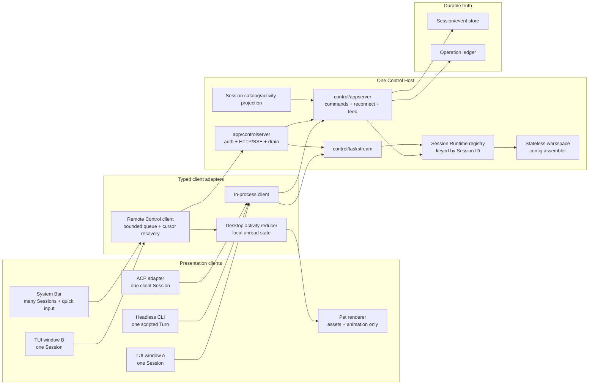
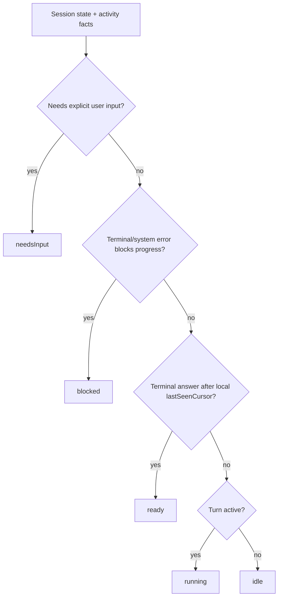
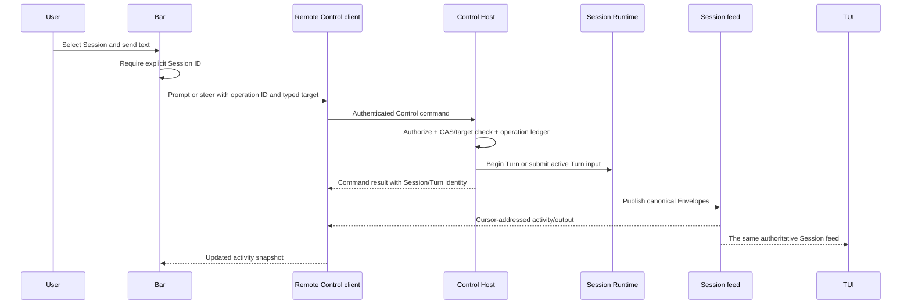

# Control Host, Bar, and Pet

- Status: active target contract
- Research baseline: 2026-07-30
- Caelis baseline: `7caf5f3347d082687526f659a3e8233e5ba2d340`
- Codex baseline: `f2bee854a73666e1c3e922a853dda591b1a25fcf`

This document defines the host and client architecture required for a small
desktop Bar and an independent Pet to observe and control multiple Caelis
Sessions. It is a future-direction contract, not an implementation roadmap or
a second presentation API.

## Decision

The missing foundation is not a traditional GUI. It is one long-lived,
authoritative **Control Host** that every presentation client uses:

- one TUI window attaches to exactly one Session;
- the Bar observes many Sessions and sends a prompt, steer, cancel, or approval
  decision to one explicitly selected Session;
- the Pet renders an activity snapshot produced by the Bar-side reducer;
- neither the TUI, Bar, nor Pet owns Runtime, model, tool, sandbox, policy,
  persistence, replay, approval, or lifecycle semantics;
- Session ID is identity; workspace and CWD are grouping and policy inputs;
- the Pet renderer and asset packages remain independent of the Control Host
  and can be replaced without changing Session behavior.

The app-server is not a Surface beside TUI, Headless, or ACP. It is the
versioned network adapter and process lifecycle around Control. An in-process
client binds a trusted principal directly to the same Control service; a
remote client reaches it through the Host's HTTP/SSE adapter. No presentation
client owns that adapter's server lifecycle.

The existing `control/appserver` contract, durable Session store, Envelope cursor,
feed/replay implementation, operation ledger, process-local exact-operation
gates, durable domain receipts, Session producer leases, and Task stream remain
the semantic foundation. The design does not replace them with Codex
JSON-RPC types or create a second state machine.

## Host Process Model

The product topology has exactly one live Control Host per store. Default local
launches converge on an independent long-lived process; no presentation process
owns that Host's lifetime:

| Mode | Entry | Live authority | Clients |
| --- | --- | --- | --- |
| Managed local service | Bare `caelis`, `caelis -p …`, or `caelis acp` performs idempotent service start and attaches | Product Host ownership guard taken at process entry before shared state opens; owns Gateway, feed, approvals, operation ledger, Task streams, and Session Runtimes | Any number of TUI, headless, product ACP, and future GUI clients for that store |
| Explicit Control Host | `caelis serve` | Same Host authority; publishes discovery only for the protected default credential and a loopback listener | Local managed clients or explicit URL clients |
| Embedded Host | `caelis --embedded`, or a bare launch after a missing managed Host cannot start | Same Host implementation and ownership guard inside one presentation process | Tests, deliberate single-client launches, and environments that cannot start the loopback service |
| Explicit presentation client | `caelis --control-url …`, `caelis -p --control-url …`, `caelis acp --control-url …` | None. Complete `AppServerClients` aggregate only | Caller-selected external Host |

Rules:

- **Start.** `caelis serve` acquires the product Host ownership guard for the
  selected store directory, constructs one Stack, recovers abandoned approvals,
  and binds HTTP/SSE. Ownership is process entry machinery; it is not part of
  `NewLocalStack` or generic Runtime assembly.
- **Default local launch.** Without a Control URL, TUI, Headless, and product
  ACP execute the same idempotent service-start convergence used by `caelis
  service start`, then read the user-private discovery record, validate the
  protected token, liveness/readiness identity, Surface-owned compatibility
  policy, and required capabilities before attaching focused HTTP/SSE clients.
  A short-lived lifecycle lock serializes concurrent start and replacement;
  the full-lifetime Host ownership guard still admits exactly one authority.
  If the initial lifecycle probe proves the Host is missing and service start
  fails, the presentation falls back to the embedded Host for that process.
  It never bypasses a Ready or Unreachable Host, so ownership, compatibility,
  authentication, and Store failures cannot create a second authority.
- **Attach.** An explicit `--control-url` / `CAELIS_CONTROL_URL` uses the same
  focused HTTP contracts and never receives Runtime or Kernel handles. Attach
  failure returns a clear error and never silently falls back to local mode.
- **Embedded.** `--embedded` is an explicit in-process selection and the
  missing-service fallback described above is its bounded automatic entry. It
  is not a
  second product authority when a managed or explicit Host already owns the
  store directory. The presentation stays in-process; a private authenticated
  loopback AppServer exposes that same Host only so built-in ACP children can
  attach without constructing another authority. If the environment denies
  that listener, the focused in-process presentation clients still run, but
  cross-process built-in children cannot connect and the CLI reports that
  limitation.
- **Exit.** Host shutdown quiesces producers and releases ownership. Client exit
  never cancels accepted Host work and never stops a managed local Host. The
  shared Host deliberately does not infer liveness from HTTP connection count:
  TUI, ACP, and GUI transports reconnect, and accepted background work may have
  no attached presentation. A Session reconnect subscription is only a
  process-local reference to that Session's in-memory Runtime; closing it may
  release an idle Runtime, but never stops the Host or cancels running work.
  `caelis service status` reports the discovered instance; `caelis service
  stop` authenticates against that exact instance, requests quiesce, and waits
  for instance-owned discovery removal. `start` and `restart` use the same
  version-selection rules as implicit product startup. `svc` and `gateway` are
  compatibility aliases for `service`. There is no Host attachment lease or
  hidden last-client timer.
- **Restart.** After the previous Host releases ownership, a new Host may start.
  Clients reconnect with Initialize + cursor reconnect. Shared state directories
  are durable truth only and never substitute for live Host authority.
- **Discovery security.** The atomic store-local discovery file contains no
  credential. It is current-user-only metadata for one loopback origin and Host
  instance; the bearer token remains in the separately protected token file.
  Insecure, malformed, incompatible, or identity-mismatched records fail closed.

### Build selection and local data

Protocol compatibility and process replacement are separate decisions:

- each Surface declares the protocol, Envelope, API, and capability versions
  it supports; distribution version and BuildID never make an otherwise
  incompatible protocol acceptable;
- official release candidates compare the full `caelis` distribution SemVer;
  a newer release replaces an older one, while an older caller cannot
  downgrade or restart over the selected newer binary;
- development candidates use exact BuildID equality instead of time or SemVer,
  so switching branches or rebuilding the same source version replaces the
  development service on the next start;
- unstamped builds are development builds. Official release automation must
  stamp `build_kind=release` explicitly. When build metadata cannot provide a
  stable clean-VCS identity, BuildID is the complete executable content digest.

Release builds default to `~/.caelis`; development builds default to
`~/.caelis-dev/default`. An explicit `--store-dir` or `CAELIS_STORE_DIR`
overrides either default. This isolates configuration migrations, Runtime
state, discovery, credentials, and locks while retaining one implementation.

The Store contains durable product data plus `runtime/service` coordination
state and `logs/service.log`; it does not contain executable code. A service
start copies the complete full `caelis` binary to the platform application-data
directory keyed by canonical Store identity and retains only the current and
previous staged builds. One canonical discovery record, credential, lifecycle
lock, and full-lifetime authority lock live under `runtime/service`; there is no
parallel root-level discovery or lifecycle protocol.
Ordinary Surfaces report only whether Caelis can start, connect, or requires an
update; build selection, process identity, and lifecycle diagnostics stay in
the private service log and explicit administrative commands.

The current version implements that Host/client topology for TUI, Headless, and
product ACP. The discovery and focused client boundary is shared with the future
GUI; GUI presentation, catalog activity, Bar, and Pet remain later work.

## Product Shape

```text
┌──────────────────────────────────────────────────────────────────────┐
│  Session Bar                                                         │
│  ● waiting approval  caelis · task-output-observation       [Open]   │
│    Allow workspace write?                           [Allow] [Deny]    │
│  ◐ running           cmpctl · patent-materials              [Stop]   │
│    Rendering disclosure diagrams…                             42s    │
│  ○ ready             caelis.dev · homepage                   [Open]   │
│    Final response ready                                              │
│                                                                      │
│  Send to: caelis · task-output-observation                           │
│  > Add a focused regression for reconnect                           │
└──────────────────────────────────────────────────────────────────────┘
                                         Pet: one visual aggregate state
```

The Bar is a compact system surface, not a transcript editor. It shows the
minimum information needed to choose a Session and act:

- stable Session title, workspace label, current activity, and elapsed time;
- an explicit selected Session before input is accepted;
- prompt when idle, steer when the active Turn accepts input, and a clear
  disabled reason otherwise;
- approval and cancel controls only when their typed Control targets are
  present;
- Open returns to the TUI window attached to the Session, or starts a new TUI
  client attached to it.

## Codex App-server Research

The current [Codex App Server documentation](https://learn.chatgpt.com/docs/app-server)
describes a multi-client JSON-RPC service for authentication, conversation
history, approvals, and streamed events. The current
[Codex Pets documentation](https://learn.chatgpt.com/docs/pets) describes a
desktop Pet that tracks activity across chats and prioritizes needs-input,
blocked, ready, and running states.

The local Codex source confirms five useful design patterns:

1. **Presentation is an ordinary client.** The TUI selects an embedded,
   local-daemon, or remote app-server target through the same client facade
   (`codex-rs/tui/src/lib.rs:268-303`).
2. **Subscription ownership is per connection.** The server maps connections
   to subscribed threads and routes thread events only to those subscribers
   (`codex-rs/app-server/src/thread_state.rs:306-328, 474-535`).
3. **Slow clients are isolated.** A full outbound queue disconnects the slow
   disconnect-capable connection instead of blocking the server
   (`codex-rs/app-server/src/transport.rs:140-170`).
4. **Loaded lifetime is separate from connection lifetime.** A thread with no
   subscribers remains loaded until it has also been inactive for 30 minutes
   (`codex-rs/app-server/src/request_processors/thread_lifecycle.rs:5-38,
   350-380`).
5. **Activity is a small typed read model.** Thread status is `notLoaded`,
   `idle`, `systemError`, or `active`, with active flags for approval and user
   input (`codex-rs/app-server-protocol/src/protocol/v2/thread.rs:1374-1391`).

Caelis should adopt those ownership and lifecycle patterns, but not copy the
implementation mechanically:

- Caelis already has a stronger durable continuation contract: signed Envelope
  cursors, feed boundaries, explicit resume mode, and transient-gap recovery.
  These should remain the sole Session continuation model.
- Codex's current remote client drains server events into an unbounded channel
  (`codex-rs/app-server-client/src/remote.rs:212-214`). A Caelis client must use
  bounded queues and reconnect from its last accepted cursor.
- Pet `ready` is not Runtime truth. It is a client-local unread/read
  projection and must not become durable Session state.

## Non-interactive Client Contract

The relevant comparison is behavioral rather than flag spelling. Codex
documents its non-interactive entry as `codex exec`; Grok exposes `grok -p`;
Caelis exposes `caelis -p`.

| Capability | Codex non-interactive | Grok `-p` | Caelis Headless |
| --- | --- | --- | --- |
| Human default | Final agent message on stdout; progress on stderr | Final response on stdout | Final response on stdout |
| Single machine-readable result | Last-message file output | `json` summary with Session, usage, model, and cost data | `json` result with schema version, Session/Turn target, lifecycle, cursor, output, and available usage |
| Structured stream | `--json` JSONL lifecycle and item events | `streaming-json` text, thought, end, and error records | `jsonl` exact versioned ACP Envelope records followed by one terminal result or error record |
| Resume | Resume by Session or last Session | Resume or continue by Session | `-session` resumes the durable Session |
| Constrained final shape | `--output-schema` | `--json-schema` | Not yet supported |

The Codex behavior is defined by the current
[non-interactive mode documentation](https://learn.chatgpt.com/docs/non-interactive-mode).
The Grok comparison is against `grok 0.2.114 --help` and its installed
Headless Mode guide. Both products keep stdout script-safe and send diagnostics
to stderr.

Caelis therefore does not treat plain final-only output as the integration
contract. Plain text remains the human-friendly default, while:

- after successful CLI flag parsing, `json` emits exactly one
  `caelis.headless/v1` result or error object, including configuration and Host
  bootstrap failures;
- `jsonl` emits target-filtered `envelope` objects using the maintained
  `control/appserver/wirev1` Envelope codec, then exactly one `result` or `error`;
- each successful result includes durable Session identity, exact Handle/Run/
  Turn identity, terminal lifecycle, last accepted cursor, final assistant
  output, and the available typed usage snapshot;
- a streaming writer failure explicitly cancels the addressed Turn and drains
  toward its terminal producer boundary for a bounded interval; a missing
  terminal detaches only observation while Control retains the accepted Turn
  lifetime.

Output-schema validation, model-by-model cost reporting, structured flag-parser
errors, and precise signal-specific exit codes remain product gaps. They do not
require another Runtime or protocol path.

## Current Caelis Foundation

The infrastructure is substantially closer than the current process topology
suggests.

| Existing capability | Evidence | Keep |
| --- | --- | --- |
| Transport-neutral product client | `control/appserver/service.go`, `client.go` | Yes; all presentation clients should consume it |
| Atomic reconnect state plus feed splice | `control/appserver/reconnect_bootstrap.go` | Yes; use for TUI and Bar attachment |
| Durable cursor, replay, bounded subscriber handling, gap recovery | `control/appserver/feed.go`, `feed_broker.go` | Yes; this is the authoritative Session stream |
| Focused typed clients for prompt, lifecycle, Agent-message delivery, status, configuration, Agent, participant, completion/skill, plugin, presentation, and terminal operations | `control/appserver`, `app/gatewayapp/controladapter/local` | Yes for embedded and HTTP AppServer clients; slash text is parsed by the client and never becomes a generic server command |
| Durable idempotency operation ledger and CAS/lease checks | `control/appserver/operation_store.go`, `app/gatewayapp/control_client_backend.go` | Yes; every remote write supplies operation and target identity |
| Authenticated HTTP/SSE Host adapter with TLS and host policy | `app/controlserver`, `control/appserver/wirev1` | Yes; it is infrastructure around Control, not a Surface |
| Host-owned accepted main-Turn lifetime | `internal/kernel/gateway_turns.go`, `app/gatewayapp/stack.go` | Yes; HTTP request cancellation must not cancel accepted work |
| Principal-bound embedded and HTTP AppServer clients | `control/appserver`, `control/appserver/httpclient` | Yes; all focused capabilities share one facade |
| Headless typed Turn and structured output | `control/appserver/session_turn.go`, `surfaces/headless`, `internal/cli/headless_output.go` | Yes; Headless uses the focused AppServer Session client and exposes text, JSON, and versioned JSONL without a private Gateway ingress |
| ACP typed lifecycle, replay, main/participant Turns, presentation, terminal RPC, slash capabilities, and Task observation | `app/gatewayapp/acpagent`, `internal/acpagentbridge` | Yes; product assembly receives clients only |
| Session-fixed participant command discovery | `control/appserver/participant_client.go`, `app/gatewayapp/control_client_participants.go` | Yes; an active Runtime exposes its frozen bound handles, while an idle Session reads current configuration without activation |
| Session-routed workspace Runtime ownership | `app/gatewayapp/session_runtime_registry.go`, `workspace_config_assembler.go` | Yes for the bounded Session-client slice: workspace composition is loaded on demand, Session ID selects it, and UserID is not a Runtime key |
| Independent Task observation | `control/taskstream`, `protocol/acp/taskstream`, `app/controlserver/task_stream.go` | Yes; the principal-bound in-process client and authenticated AppServer list/read/subscribe routes address Task output by Session ID without folding it into the Session control stream |

## Infrastructure Gaps

### G1 — Single live lifecycle authority

**Evidence.** Product clients open one complete `AppServerClients` aggregate
through `internal/cli`. A bare local launch discovers or starts one independent Host and
uses HTTP/SSE, falling back to the embedded path only after proving the Host was
missing and service start failed; an explicit Control URL uses the same
transport. `caelis serve`, explicit `--embedded`, and the bounded embedded
fallback take a product Host ownership guard at process entry
before opening shared Host state (`internal/cli/host_ownership*.go`).
HTTP clients include independently delivered Task observation in that aggregate
(`control/appserver/httpclient`). The feed registry and live approval maps remain
process-local on that one Host. `NewLocalStack` does not own Host selection.

**Failure mode addressed.** Presentation processes no longer construct a silent
second product Host for the same store. A client attached to `caelis serve`
observes the same live feed, approvals, Task streams, and operation ledger as
every other attached client. Shared store directories remain durable truth only.

**Bounded repair status.** Done for the product CLI topology with managed local
start-or-attach, explicit URL attach, explicit embedded mode, and a missing-
service-only embedded fallback. Desktop
reconnect after an already attached Host is replaced remains presentation work.

**Acceptance.** `TestControlHostTwoClientsTwoSessionsInjectedTransport` runs one
Host, two HTTP clients, and two concurrent Sessions over an injected transport;
both clients observe both Sessions, writes keep explicit Session/operation
targets, and Host restart restores durable Session identity.

### G2 — The server lifecycle publishes readiness

**Evidence.** The server path receives a SIGINT/SIGTERM-aware root context,
waits for mandatory approval recovery before binding, and delegates shutdown
to `Stack.Quiesce`. Quiesce closes write admission, makes Gateway Turn
admission fail with `host_closing`, cancels active producers, waits for their
handles to drain, and only then permits resource closure
(`app/controlserver/server.go`, `app/gatewayapp/stack.go`,
`internal/kernel/gateway_active.go`). `GET /healthz` exposes process identity;
`GET /readyz` becomes externally reachable only after mandatory recovery and
listener bind, and returns the same instance ID as authenticated Initialize.

**Failure mode addressed.** A launcher no longer guesses readiness by probing a
Session operation or treats a bound port from another instance as authority.

**Bounded repair status.** Done for managed local HTTP/SSE. Crash/restart uses
the retained ownership inode plus instance-owned discovery removal; stale
network endpoints are retryable, while live identity mismatch fails closed.

**Acceptance.** Handler and listener lifecycle tests assert one instance across
health, readiness, Initialize, and listener publication. Managed-client tests
cover stale discovery recovery and concurrent clients converging on one ready
instance without binding a host loopback port.

### G3 — AppServer capability parity is complete; product process selection lands

**Evidence.** `control/appserver.AppServerClients` is the complete aggregate client
set for Session lifecycle and Turns, Agent-message delivery and Turn
observation, participant Turns, status, configuration, Agent operations,
completion/skill, plugin operations, ACP presentation, terminal RPC, and Task
observation. Task delivery remains an independent typed side channel inside
the aggregate. Both the principal-bound
embedded implementation and authenticated HTTP implementation cover these
contracts and share the maintained wire codec and generated protocol checks.
HTTP Task observation is implemented by `control/appserver/httpclient.TaskClient`.

TUI, Headless, and product ACP bind clients only. Their prompt and slash routers
contain no `Stack`, Runtime, Session store, local mode/config provider, or
terminal controller. Product process selection uses managed local HTTP clients
by default, uses embedded clients explicitly or when a proven-missing local
service cannot start, or attaches when an explicit Control URL is present. Slash parsing stays
client-side; only classified typed operations cross AppServer. The generic
direct Runtime ACP bridge remains a lower-level conformance API and is not
selectable by product `GatewayAgentConfig`.

**Current boundary.** This version implements store-local discovery,
readiness/liveness, managed Host auto-start, and zero-configuration CLI attach.
It does not add GUI catalog/activity or automatic reconnect presentation.
Task events remain separate from the Session
feed so slow Task observers cannot affect parent Turn delivery.

**Acceptance.** The same TUI/ACP suites pass against embedded and HTTP clients,
including cursor reconnect, Side ACP overlays, Shell output, and Subagent
output. GUI work must select the same focused contracts rather than add another
surface API.

### G4 — Session Runtime lifetime follows observation and work

**Evidence.** The app-scoped Session Runtime registry now routes Control-client
execution by durable Session ID. A stateless workspace configuration assembler
reads current `AppConfig` and workspace files on the first execution after no
live activation and builds an independent Gateway, execution engine, sandbox,
prompt/skill catalog, MCP manager, model lookup, placement snapshot, and Agent
assembly for that Session (`app/gatewayapp/session_runtime_registry.go`,
`app/gatewayapp/workspace_config_assembler.go`). Two Sessions in the same
workspace have separate execution Runtimes but the same canonical workspace
identity. `UserID` remains in authorization and persistence for compatibility
and does not partition workspace identity.

An assembled Session Runtime is detached from later app configuration writes.
Every later prompt in that activation reuses the same prefix and composition;
new Sessions allocate only durable state and assemble current configuration on
their first execution. Released Sessions reactivated later do the same. Host
restart naturally drops all activations, so an old durable Session uses current
configuration on its next execution. No configuration generation is persisted
or cached by workspace. Durable Sessions store only workspace key/CWD. Inspect
reads durable and already-live state without assembling or retaining
execution state. Explicit reconnect also does not assemble a Runtime, but its
continuation owns one process-local observation reference. Multiple clients may
attach to the same Session independently. New product Sessions use the
canonical CWD-derived key. Pre-v0.42 Sessions may retain multiple historical
keys for that same CWD: listing and exact resume keep those aliases readable,
while a key bound to another CWD still fails before Session creation. This
compatibility reader remains until the minimum supported upgrade source is
v0.42 or newer.

Session assembly reads one complete `AppConfig` snapshot and does not acquire a
Host-wide or cross-process assembly lock. The configuration store's atomic
compare-and-save is the only writer coordination boundary, so an activation
observes either the document before a concurrent write or the document after
it, never a partially written configuration. Existing Session Runtimes remain
fixed, including during an active Turn. Host Quiesce closes activation
admission, cancels and drains in-flight assembly and Runtime release, quiesces
all Session Gateways and child producers, waits for durable terminal
publication and Runtime work references, then closes resources. Release
first marks a Runtime unavailable to routing, so a new activation waits for
cleanup and then assembles a fresh Runtime instead of entering resources being
quiesced. Runtime release also waits for every routed synchronous Control
mutation that already acquired the Runtime. Failed sandbox or MCP closure
retains the resource owner so Host shutdown can retry cleanup. Session close
releases its Runtime.

Headless, TUI, and product ACP lifecycle/replay/main-Turn operations are
Session-directed. TUI and product ACP prompt routers also address status,
configuration, Agent, participant, completion/skill, and plugin operations by
Session through focused clients; Task observation stays independent. Runtime
lifetime is a reference-count rule, not another lease or lifecycle protocol:
an open reconnect continuation retains the Session Runtime, as does an accepted
Turn producer; a durable running Task also keeps it resident when no
presentation is attached. When the Session is idle and the last observation
reference closes, the Runtime is released immediately. TUI Session switch,
reset, and exit close the TUI's observation reference without cancelling Host
work. The next work-bearing activation naturally rebuilds from current App
configuration and workspace content. There is no timeout, generation persisted
with the Session, client-visible reload command, or Session-level exclusion;
Turn execution keeps its existing lease and observation remains multi-client.

Headless, TUI, ACP, and maintained e2e fixtures bind typed AppServer clients.
The production Headless package has no private `RunOnce` entry, the broad local
Adapter and compatibility constructors are absent, and
the Session Runtime registry has no default-Stack ownership marker or routing
exception. Side ACP remains a separate participant Turn with its own
target-filtered Session-feed events; it must not leak into the main-Turn client
or Task stream. Gatewayapp and e2e fixtures create Sessions through the same
typed Control client used by embedded AppServer consumers; no test-only Stack
lifecycle wrapper is retained.

**Failure mode.** The AppServer Session path can operate concurrently across
local workspaces without mixing prompt, skills, sandbox CWD, Gateway, or engine.
Adding a direct surface-to-Stack shortcut would recreate the retired second
authority.

**Boundary.** Session remains the public unit. Reconnect subscriptions carry
only observation ownership; Runtime handles, counters, and cleanup stay inside
Control. Surfaces must not expose a reload action, use workspace/UserID as
Session identity, or turn observation into execution exclusion.

**Acceptance.** Run Sessions from two workspaces concurrently and prove that
their CWD, write roots, skills, MCP endpoints, external Agent launch CWD, model
profile selection, and active configuration snapshots do not cross. Change
configuration during an active Turn, prove that Turn keeps its prefix, then
prove the Runtime stays pinned while one of several observers remains, releases
after the last observer detaches while idle, and uses current configuration on
the next activation. Detach every observer during a running Turn or Task and
prove the work completes before release. Restart the Host and reproduce
workspace bindings from durable Session state.

### G5 — Host discovery and compatibility are bounded

**Evidence.** The production listener exposes versioned Session routes over TCP
HTTP/SSE (`app/controlserver`) and authenticates them fail-closed.
It exposes unauthenticated credential-free liveness/readiness identity and an
authenticated initialization handshake with protocol/envelope/API versions,
distribution version, BuildID, build kind, instance identity, required
capabilities, and supported transports. The
managed launcher consumes an atomic user-private discovery record and a
separate protected bearer-token file.

**Failure mode addressed.** Product clients do not port-probe or infer authority
from a shared directory. They attach only after record, ready endpoint, and
Initialize agree on one compatible instance.

**Bounded contract.** The host-level contract is:

- `GET /healthz`: process and event-loop liveness;
- `GET /readyz`: recovery, store, Runtime registry, and listener readiness;
- `/api/control/v1/initialize` reports server identity, distribution identity,
  capabilities, instance ID, and supported transports; each Surface applies
  its own supported compatibility policy;
- an atomic user-private discovery file containing only app/principal scope,
  endpoint, process, version, capability, transport, and instance metadata;
  credentials remain in the existing protected token file;
- protected loopback HTTP/SSE on an OS-selected port for the managed default.
  Unix socket or named-pipe transport may be added later without changing the
  discovery or focused client contracts.

**Acceptance.** The launcher distinguishes absent, unavailable, incompatible,
and ready Hosts without opening a Session. Discovery artifacts reject
wrong-user access, stale or mismatched instance IDs, insecure permissions, and
origin/host confusion.

### G6 — Multi-Session activity and unread state are not yet a contract

**Evidence.** Session listing is paginated but snapshot-only
(`control/appserver/client.go:29-41`). Live `RunState` exposes active and
waiting-approval facts, while there is no typed waiting-on-user-input or
system-error field (`control/appserver/state.go:28-62`). The HTTP surface offers
one atomic reconnect stream per Session and no catalog/activity stream
(`app/controlserver/handler.go`).

**Failure mode.** A Bar must poll the catalog, open N Session streams, infer
some activity from display events, and invent unread semantics. That works for
a prototype but does not provide a stable, efficient desktop contract.

**Bounded repair.**

- Add a Control-owned, read-only Session activity projection derived from
  authoritative live state and canonical Envelope lifecycle facts.
- Add a catalog/activity subscription that announces Session added, changed,
  closed, and activity-summary updates. Its continuation must use the existing
  cursor/sequence principles and bounded delivery.
- Keep `lastSeenCursor` client-local by default. Persist it only as an optional
  per-principal presentation preference, never as Runtime or Session truth.
- Keep the Pet reducer in the desktop client. The server publishes facts, not
  pet poses, animations, or visual priority.

**Acceptance.** Observe at least 100 Sessions with bounded memory and no
per-Session polling loop. Disconnect, resume the activity stream, and reach the
same summaries. Marking one Session read in the Bar changes only that client's
ready state and never mutates model-visible history.

## Target Architecture



The dependency direction remains:

```text
TUI / Headless / ACP / Bar / Pet adapter
          |
          v
typed Control client adapter
          |
          v
Control Host -> Agent Runtime / SDK
```

The Host is not a new semantic layer beside Control. It is the process and
transport lifecycle around existing Control ownership.

## Activity Projection

The desktop reducer consumes typed host facts and its own read cursor:



Aggregate Pet priority is:

```text
needsInput > blocked > ready > running > idle
```

Within the same state, choose the most recent authoritative occurrence. The
Bar may group by workspace for display, but it always routes actions by Session
ID plus the current typed Turn or approval target.

The reducer must not derive identity, approval targets, resume positions, or
terminal truth from `_meta`, generated activity prose, title text, or workspace
path.

## Quick-message Sequence



If the command result is lost, the client retries with the same operation ID.
If the connection is lost, it reconnects from the last accepted cursor. It
never retries a lease conflict through an unfenced path.

## Current Version Boundary

The current AppServer slice includes:

- one permanent Host shutdown gate closes writes, rejects new Turns, cancels
  active producers, waits for handle release, and then closes resources;
- one principal-bound `SessionClient` contract has in-process and HTTP/SSE
  implementations;
- the public HTTP v1 protocol and generated clients cover initialize, Session
  lifecycle/state/reconnect, prompt/steer/cancel/approval, compact, status,
  participant, configuration, Agent, completion/skill, plugin, presentation,
  terminal, and independent Task operations;
- reconnect is the sole atomic state/replay/live attachment operation;
- generated wire clients and conformance tests share
  `control/appserver/wirev1`.
- the app-scoped Runtime registry permits multiple local workspace
  compositions, but every client mutation and observation is still addressed
  by Session ID; create, inspect, and reconnect allocate no execution Runtime,
  reconnect continuations retain an activation once work creates it, durable
  Sessions retain only workspace identity, and the stateless assembler owns no
  workspace configuration cache;
- Headless uses the same typed Session Turn from focused AppServer clients, with
  plain final output plus versioned JSON and JSONL contracts suitable for
  scripts and program integration;
- the TUI uses the aggregate's focused typed clients for every
  `internal/controlprompt.Service` capability and its independently delivered
  Task observation capability; its
  production facade owns no Stack, Runtime, or compatibility Adapter;
- product ACP uses the same AppServer aggregate for prompt, presentation,
  terminal, and Task capabilities; its product configuration accepts no
  Runtime, Stack, Session store,
  Assembly, or SurfaceBuilder;
- product clients default to discovery/start/attach of one independent local
  Host and use a caller-selected remote transport only for an explicit Control
  URL; `--embedded` is the explicit single-client selection and a failed start
  may select it automatically only after a missing-Host probe; product Host
  ownership is taken only at Host process entry before shared state opens;
- the local server implementation exposes narrow status, configuration, Agent,
  completion, and plugin assemblers; the broad Adapter is not a production API;
- Headless has one typed Session-Turn production entry, and all Session routing
  uses the Session Runtime registry without a default-Stack exception.

This version explicitly does **not** implement automatic reconnection after an
attached Host instance is replaced, catalog activity, GUI presentation, Bar,
or Pet. Those later features must select or extend the existing discovery and
focused contracts;
they must not reintroduce a generic slash endpoint, a Surface-private authority,
or a `Stack` dependency in presentation code.

## Quality Gates

- Host and client lifecycle tests cover start, recover, disconnect, resume,
  slow consumer, incompatible version, SIGTERM, drain, and restart.
- Remote and in-process clients rebuild equivalent typed state and transcript
  from the same durable boundary.
- Multi-workspace tests verify sandbox, skill, MCP, Agent, CWD, and
  reconfiguration isolation.
- Race tests cover host registry, feed subscription, client reconnect, quick
  message versus completion, cancel, and approval resolution.
- A slow Bar or Pet can lose only explicitly best-effort presentation updates;
  it cannot block Runtime production or lose canonical terminal output without
  receiving a recoverable gap.
- The Pet package imports no Runtime, `gatewayapp`, persistence, model, tool,
  sandbox, or policy package.
