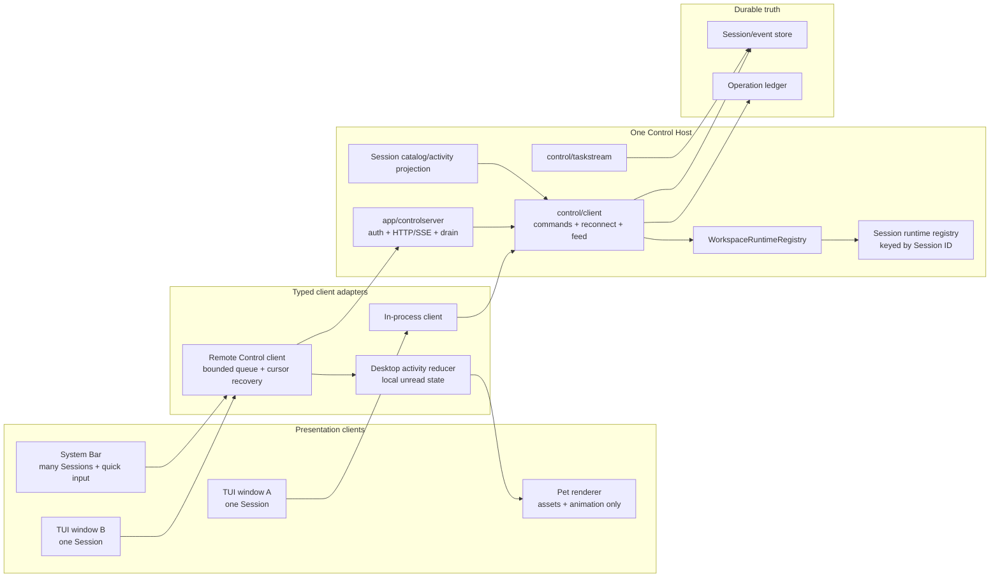
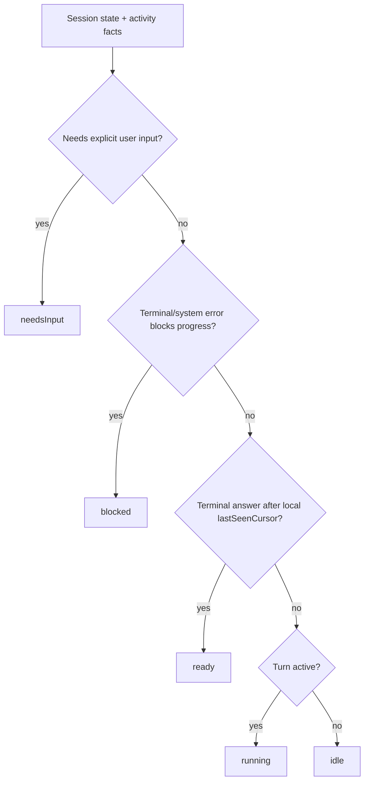
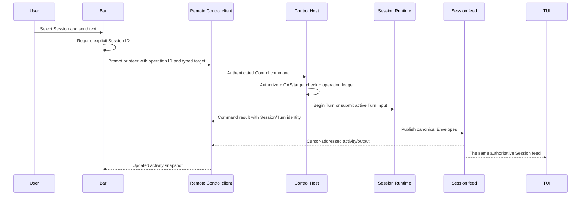

# Control Host, Bar, and Pet

- Status: active target contract
- Research baseline: 2026-07-30
- Caelis baseline: `7caf5f3347d082687526f659a3e8233e5ba2d340`
- Codex baseline: `f2bee854a73666e1c3e922a853dda591b1a25fcf`

This document defines the host and client architecture required for a small
desktop Bar and an independent Pet to observe and control multiple Caelis
Sessions. It is a future-direction contract, not an implementation roadmap or
a second presentation API.

## Decision

The missing foundation is not a traditional GUI. It is one long-lived,
authoritative **Control Host** that every presentation client uses:

- one TUI window attaches to exactly one Session;
- the Bar observes many Sessions and sends a prompt, steer, cancel, or approval
  decision to one explicitly selected Session;
- the Pet renders an activity snapshot produced by the Bar-side reducer;
- neither the TUI, Bar, nor Pet owns Runtime, model, tool, sandbox, policy,
  persistence, replay, approval, or lifecycle semantics;
- Session ID is identity; workspace and CWD are grouping and policy inputs;
- the Pet renderer and asset packages remain independent of the Control Host
  and can be replaced without changing Session behavior.

The app-server is not a Surface beside TUI, Headless, or ACP. It is the
versioned network adapter and process lifecycle around Control. An in-process
client binds a trusted principal directly to the same Control service; a
remote client reaches it through the Host's HTTP/SSE adapter. No presentation
client owns that adapter's server lifecycle.

The existing `control/client` contract, durable Session store, Envelope cursor,
feed/replay implementation, operation ledger, execution leases, and Task stream
remain the semantic foundation. The design does not replace them with Codex
JSON-RPC types or create a second state machine.

## Product Shape

```text
┌──────────────────────────────────────────────────────────────────────┐
│  Session Bar                                                         │
│  ● waiting approval  caelis · task-output-observation       [Open]   │
│    Allow workspace write?                           [Allow] [Deny]    │
│  ◐ running           cmpctl · patent-materials              [Stop]   │
│    Rendering disclosure diagrams…                             42s    │
│  ○ ready             caelis.dev · homepage                   [Open]   │
│    Final response ready                                              │
│                                                                      │
│  Send to: caelis · task-output-observation                           │
│  > Add a focused regression for reconnect                           │
└──────────────────────────────────────────────────────────────────────┘
                                         Pet: one visual aggregate state
```

The Bar is a compact system surface, not a transcript editor. It shows the
minimum information needed to choose a Session and act:

- stable Session title, workspace label, current activity, and elapsed time;
- an explicit selected Session before input is accepted;
- prompt when idle, steer when the active Turn accepts input, and a clear
  disabled reason otherwise;
- approval and cancel controls only when their typed Control targets are
  present;
- Open returns to the TUI window attached to the Session, or starts a new TUI
  client attached to it.

## Codex App-server Research

The current [Codex App Server documentation](https://learn.chatgpt.com/docs/app-server)
describes a multi-client JSON-RPC service for authentication, conversation
history, approvals, and streamed events. The current
[Codex Pets documentation](https://learn.chatgpt.com/docs/pets) describes a
desktop Pet that tracks activity across chats and prioritizes needs-input,
blocked, ready, and running states.

The local Codex source confirms five useful design patterns:

1. **Presentation is an ordinary client.** The TUI selects an embedded,
   local-daemon, or remote app-server target through the same client facade
   (`codex-rs/tui/src/lib.rs:268-303`).
2. **Subscription ownership is per connection.** The server maps connections
   to subscribed threads and routes thread events only to those subscribers
   (`codex-rs/app-server/src/thread_state.rs:306-328, 474-535`).
3. **Slow clients are isolated.** A full outbound queue disconnects the slow
   disconnect-capable connection instead of blocking the server
   (`codex-rs/app-server/src/transport.rs:140-170`).
4. **Loaded lifetime is separate from connection lifetime.** A thread with no
   subscribers remains loaded until it has also been inactive for 30 minutes
   (`codex-rs/app-server/src/request_processors/thread_lifecycle.rs:5-38,
   350-380`).
5. **Activity is a small typed read model.** Thread status is `notLoaded`,
   `idle`, `systemError`, or `active`, with active flags for approval and user
   input (`codex-rs/app-server-protocol/src/protocol/v2/thread.rs:1374-1391`).

Caelis should adopt those ownership and lifecycle patterns, but not copy the
implementation mechanically:

- Caelis already has a stronger durable continuation contract: signed Envelope
  cursors, feed boundaries, explicit resume mode, and transient-gap recovery.
  These should remain the sole Session continuation model.
- Codex's current remote client drains server events into an unbounded channel
  (`codex-rs/app-server-client/src/remote.rs:212-214`). A Caelis client must use
  bounded queues and reconnect from its last accepted cursor.
- Pet `ready` is not Runtime truth. It is a client-local unread/read
  projection and must not become durable Session state.

## Current Caelis Foundation

The infrastructure is substantially closer than the current process topology
suggests.

| Existing capability | Evidence | Keep |
| --- | --- | --- |
| Transport-neutral product client | `control/client/service.go`, `client.go` | Yes; all presentation clients should consume it |
| Atomic reconnect state plus feed splice | `control/client/reconnect_bootstrap.go` | Yes; use for TUI and Bar attachment |
| Durable cursor, replay, bounded subscriber handling, gap recovery | `control/client/feed.go`, `feed_broker.go` | Yes; this is the authoritative Session stream |
| Typed prompt, steer, cancel, approval, participant, and handoff commands | `control/client/command.go`, `app/gatewayapp/control_client_backend.go` | Yes; the MVP client exposes the main-Turn subset without inventing Bar-specific mutations |
| Durable idempotency operation ledger and CAS/lease checks | `control/client/operation_store.go`, `app/gatewayapp/control_client_backend.go` | Yes; every remote write supplies operation and target identity |
| Authenticated HTTP/SSE Host adapter with TLS and host policy | `app/controlserver`, `control/client/wirev1` | Yes; it is infrastructure around Control, not a Surface |
| Host-owned accepted main-Turn lifetime | `internal/kernel/gateway_turns.go`, `app/gatewayapp/stack.go` | Yes; HTTP request cancellation must not cancel accepted work |
| Principal-bound local and remote Session clients | `control/client/session_client.go`, `control/client/httpclient` | Yes; extend the common facade only as parity requires |
| Session-routed workspace Runtime ownership | `app/gatewayapp/workspace_runtime_registry.go` | Yes for the bounded Session-client slice: workspace composition is loaded on demand, Session ID selects it, and UserID is not a Runtime key |
| Independent Task observation | `control/taskstream`, `protocol/acp/taskstream` | Yes; Task output must not be folded into the Session control stream |

## Infrastructure Gaps

### G1 — There is no single live lifecycle authority

**Evidence.** The ordinary CLI constructs a new `gatewayapp.Stack` for each
process (`internal/cli/cli.go:194-228`). The TUI receives that Stack and uses an
in-process adapter (`internal/cli/tui.go:25-55`). `caelis serve` exposes the
Control service from its own separately constructed Stack. The feed registry
is explicitly process-local (`control/client/feed_broker.go:1317-1365`), and
live handle and approval state comes from the current process's Gateway maps
(`internal/kernel/control_client_state.go:14-44`).

**Failure mode.** A Bar connected to `caelis serve` can list durable Sessions,
but it cannot reliably observe or steer a Turn owned by a different TUI
process. It sees the server process's live registry, not the TUI process's
handle, approval FIFO, or live feed. Leases prevent unsafe duplicate execution,
but they do not turn two Stacks into one live host.

**Bounded repair.** Make a long-lived Control Host the only owner of the live
Gateway, feed registry, approval recovery, operation ledger, Task streams, and
workspace runtimes. TUI, Bar, Pet adapter, headless commands, and future
surfaces connect to it as clients. An optional embedded mode may start the same
host implementation in-process, but it must preserve identical client
semantics.

**Acceptance.** Start two TUI clients and one Bar client against one host. Run
two Sessions concurrently. All three clients observe the correct state for
both Sessions; a Bar steer reaches only its selected active Turn; closing any
client does not cancel or orphan either Turn.

### G2 — The server lifecycle still lacks readiness

**Evidence.** The server path receives a SIGINT/SIGTERM-aware root context,
waits for mandatory approval recovery before binding, and delegates shutdown
to `Stack.Quiesce`. Quiesce closes write admission, makes Gateway Turn
admission fail with `host_closing`, cancels active producers, waits for their
handles to drain, and only then permits resource closure
(`app/controlserver/server.go`, `app/gatewayapp/stack.go`,
`internal/kernel/gateway_active.go`). The remaining host contract has no
readiness/liveness route.

**Failure mode.** A supervisor or Bar still cannot distinguish recovery from
readiness without attempting an authenticated client operation.

**Bounded repair.** Keep the current single host runner and add only the
remaining lifecycle facts:

1. report not-ready until recovery and transport bind succeed;
2. expose liveness independently from readiness;
3. prove crash recovery and a clean restart without stale locks.

**Acceptance.** Crash/restart and SIGTERM integration tests prove that
abandoned approvals are recovered before a new Turn starts, readiness changes
at the correct boundaries, and a second clean start succeeds without stale
locks.

### G3 — The typed remote client does not yet prove full TUI parity

**Evidence.** `control/client.BindSessionClient` and
`control/client/httpclient.Client` implement the same principal-bound
`control/client.SessionClient` slice for initialize, list, create, close,
inspect, atomic reconnect, and main-Turn writes. Remote SSE delivery is bounded
and reports a cursor-addressed gap. The production TUI still uses
`controladapter/local.NewLocalAdapter` and directly receives
`*gatewayapp.Stack` (`internal/cli/tui.go:25-31`). Participant administration,
handoff, attachments, automatic reconnect policy, and the TUI's other private
Control services are not part of the common slice. The public HTTP protocol
intentionally omits participant, handoff, Task, and standalone events/stream
routes until their owner and parity requirement are proven.
The broader in-process `control/client.Service` still exposes participant
commands whose Runtime context is request-scoped; that interface is not the
MVP client facade, and the Host-owned lifetime claim applies only to accepted
main Turns in `SessionClient`.

**Failure mode.** Switching the TUI now would either remove working features or
force presentation code to reach around the typed client.

**Bounded repair.** Extend the client only when a parity test identifies a
missing TUI capability:

- keep initialization, list/inspect, atomic cursor reconnect, and main-Turn
  writes as the stable core;
- add bounded retry with jitter and explicit disconnected, reconnecting,
  incompatible, and gap states;
- add attachments, participant, handoff, model/profile, and other services
  through their existing semantic owners rather than a TUI aggregate;
- run the same integration suite against in-process and remote clients before
  changing TUI composition.

Keep the Control-domain-bound HTTP wire DTOs and codec in
`control/client/wirev1`, and listener policy in `app/controlserver`. The TUI
must not depend on JSON, SSE framing, bearer-token files, or
`gatewayapp.Stack`.

**Acceptance.** The same TUI integration suite runs against in-process and
remote clients. Disconnect during a Turn, restart the client, reconnect from
the last accepted cursor, and compare the rebuilt transcript and typed state
with an uninterrupted client.

### G4 — Workspace Runtime ownership is only partially converged

**Evidence.** The app-scoped registry now canonicalizes workspace identity,
loads an independent Gateway, execution engine, sandbox, prompt/skill catalog,
MCP manager, and Agent assembly on demand, and resolves each durable Session ID
to the current Runtime for exactly one workspace without retaining a second
process-local Session binding map
(`app/gatewayapp/workspace_runtime_registry.go`). This fixes workspace identity,
not the workspace configuration generation.
Control-client create, mutation, inspect, and reconnect paths route by Session;
ambiguous key/CWD aliases fail before Session creation. The registry is rebuilt
from durable Session workspace facts after Host restart. `UserID` remains in
authorization and persistence for compatibility but does not partition
Runtime. Workspace composition construction runs outside the registry lock but
shares the Host generation lock with live reconfiguration. App-wide Runtime
mutation therefore rejects multi-Runtime state before changing memory or
durable configuration, and its active-Turn fence observes every loaded
workspace Gateway. Workspace load admission and in-flight builds are canceled
and drained by Host Quiesce before shared resources close. Closed and open
Sessions are both routed from durable workspace facts, so observing Session
history does not create retained process-local Session bindings.

The ordinary TUI and private prompt services still address the default
workspace Stack directly. Task stream lookup still uses the default Runtime
stream provider, and live global reconfiguration is rejected while more than
one workspace Runtime is loaded rather than attempting a partial update.
With only one loaded Runtime, reconfiguration still replaces that workspace
composition in place; after Host restart, a Session resolves the current
workspace configuration rather than the generation under which it was created.
Loaded workspace compositions currently remain resident until Host shutdown;
idle eviction is not part of this MVP lifecycle.

**Failure mode.** The bounded app-server Session path can operate across local
workspaces without mixing their prompt, skills, sandbox CWD, Gateway, or engine.
Moving TUI/private services or live configuration mutations prematurely would
still either bypass Session routing or produce incoherent generations.

**Bounded repair.** Keep Session as the public unit and extend Runtime lookup
only when a concrete Session capability requires it. Move Task lookup and the
remaining private services behind Session-directed owners, then define one
atomic workspace-runtime generation policy for app configuration changes.
Do not expose workspace Runtime handles to Surfaces or use workspace/UserID as
Session identity.

**Acceptance.** Run Sessions from two workspaces concurrently and prove that
their CWD, write roots, skills, MCP endpoints, external Agent launch CWD, model
profile selection, and reconfiguration fences do not cross. Restart the host
and reproduce the same bindings from durable state.

### G5 — Host discovery and compatibility are incomplete

**Evidence.** The production listener exposes versioned Session routes over TCP
HTTP/SSE (`app/controlserver`) and authenticates them fail-closed.
It now exposes a minimal authenticated initialization handshake with
protocol/envelope/API versions. It has no readiness/liveness route,
local-daemon discovery record, instance identity, Unix-socket or named-pipe
transport, or negotiated host capability set.

**Failure mode.** A desktop Bar cannot safely discover whether a compatible
host is installed, starting, recovering, ready, stale, or owned by another
user. Port probing is not a lifecycle protocol.

**Bounded repair.** Add a small host-level contract:

- `GET /healthz`: process and event-loop liveness;
- `GET /readyz`: recovery, store, Runtime registry, and listener readiness;
- extend `/api/control/v1/initialize` with server identity, capabilities,
  instance ID, and supported transports;
- a user-private discovery file containing only endpoint and instance
  metadata; credentials remain in the existing protected token file;
- local IPC support after the HTTP client is stable: Unix socket on Unix and
  named pipe or protected loopback transport on Windows.

**Acceptance.** The Bar distinguishes absent, starting, incompatible, ready,
and reconnecting hosts without opening a Session. Discovery artifacts reject
wrong-user access, stale instance IDs, insecure permissions, and origin/host
confusion.

### G6 — Multi-Session activity and unread state are not yet a contract

**Evidence.** Session listing is paginated but snapshot-only
(`control/client/client.go:29-41`). Live `RunState` exposes active and
waiting-approval facts, while there is no typed waiting-on-user-input or
system-error field (`control/client/state.go:28-62`). The HTTP surface offers
one atomic reconnect stream per Session and no catalog/activity stream
(`app/controlserver/handler.go`).

**Failure mode.** A Bar must poll the catalog, open N Session streams, infer
some activity from display events, and invent unread semantics. That works for
a prototype but does not provide a stable, efficient desktop contract.

**Bounded repair.**

- Add a Control-owned, read-only Session activity projection derived from
  authoritative live state and canonical Envelope lifecycle facts.
- Add a catalog/activity subscription that announces Session added, changed,
  closed, and activity-summary updates. Its continuation must use the existing
  cursor/sequence principles and bounded delivery.
- Keep `lastSeenCursor` client-local by default. Persist it only as an optional
  per-principal presentation preference, never as Runtime or Session truth.
- Keep the Pet reducer in the desktop client. The server publishes facts, not
  pet poses, animations, or visual priority.

**Acceptance.** Observe at least 100 Sessions with bounded memory and no
per-Session polling loop. Disconnect, resume the activity stream, and reach the
same summaries. Marking one Session read in the Bar changes only that client's
ready state and never mutates model-visible history.

## Target Architecture



The dependency direction remains:

```text
TUI / Bar / Pet adapter
          |
          v
typed Control client adapter
          |
          v
Control Host -> Agent Runtime / SDK
```

The Host is not a new semantic layer beside Control. It is the process and
transport lifecycle around existing Control ownership.

## Activity Projection

The desktop reducer consumes typed host facts and its own read cursor:



Aggregate Pet priority is:

```text
needsInput > blocked > ready > running > idle
```

Within the same state, choose the most recent authoritative occurrence. The
Bar may group by workspace for display, but it always routes actions by Session
ID plus the current typed Turn or approval target.

The reducer must not derive identity, approval targets, resume positions, or
terminal truth from `_meta`, generated activity prose, title text, or workspace
path.

## Quick-message Sequence



If the command result is lost, the client retries with the same operation ID.
If the connection is lost, it reconnects from the last accepted cursor. It
never retries a lease conflict through an unfenced path.

## MVP Boundary

The infrastructure MVP is intentionally smaller than a TUI migration:

- one permanent Host shutdown gate closes writes, rejects new Turns, cancels
  active producers, waits for handle release, and then closes resources;
- one principal-bound `SessionClient` contract has in-process and HTTP/SSE
  implementations;
- the public v1 protocol contains only initialize, Session
  list/create/close/state/reconnect, prompt/steer/cancel, and approval resolve;
- reconnect is the sole atomic state/replay/live attachment operation;
- generated wire clients and conformance tests share
  `control/client/wirev1`.
- the app-scoped Runtime registry permits multiple local workspace
  compositions, but every client mutation and observation is still addressed
  by Session ID; no process-local Session binding mirror is retained, while
  loaded workspace compositions retain Host lifetime.

TUI composition remains unchanged until the same integration suite proves the
in-process and remote clients can replace its current Session path. Readiness,
automatic retry policy, participant/handoff and Task remote clients,
cross-workspace live reconfiguration, catalog activity, Bar, and Pet are
deferred capabilities, not placeholders in the MVP protocol.

## Quality Gates

- Host and client lifecycle tests cover start, recover, disconnect, resume,
  slow consumer, incompatible version, SIGTERM, drain, and restart.
- Remote and in-process clients rebuild equivalent typed state and transcript
  from the same durable boundary.
- Multi-workspace tests verify sandbox, skill, MCP, Agent, CWD, and
  reconfiguration isolation.
- Race tests cover host registry, feed subscription, client reconnect, quick
  message versus completion, cancel, and approval resolution.
- A slow Bar or Pet can lose only explicitly best-effort presentation updates;
  it cannot block Runtime production or lose canonical terminal output without
  receiving a recoverable gap.
- The Pet package imports no Runtime, `gatewayapp`, persistence, model, tool,
  sandbox, or policy package.
