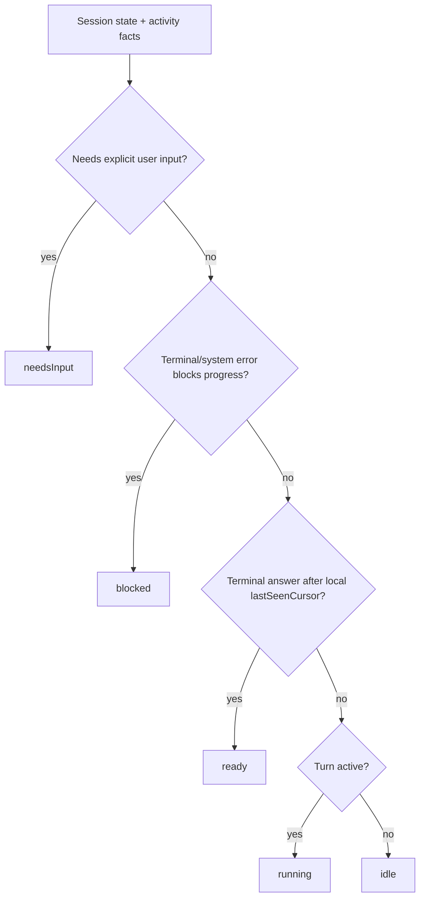
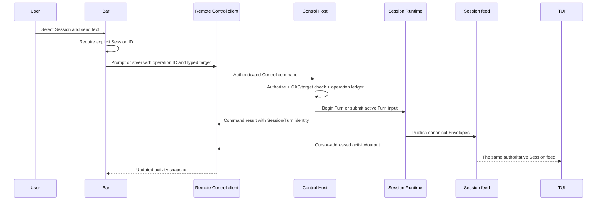

# Control Host, Bar, and Pet

- Status: active target contract
- Research baseline: 2026-07-30
- Caelis baseline: `7caf5f3347d082687526f659a3e8233e5ba2d340`
- Codex baseline: `f2bee854a73666e1c3e922a853dda591b1a25fcf`

This document defines the host and client architecture required for a small
desktop Bar and an independent Pet to observe and control multiple Caelis
Sessions. It is a future-direction contract, not an implementation roadmap or
a second presentation API.

## Decision

The missing foundation is not a traditional GUI. It is one long-lived,
authoritative **Control Host** that every presentation client uses:

- one TUI window attaches to exactly one Session;
- the Bar observes many Sessions and sends a prompt, steer, cancel, or approval
  decision to one explicitly selected Session;
- the Pet renders an activity snapshot produced by the Bar-side reducer;
- neither the TUI, Bar, nor Pet owns Runtime, model, tool, sandbox, policy,
  persistence, replay, approval, or lifecycle semantics;
- Session ID is identity; workspace and CWD are grouping and policy inputs;
- the Pet renderer and asset packages remain independent of the Control Host
  and can be replaced without changing Session behavior.

The app-server is not a Surface beside TUI, Headless, or ACP. It is the
versioned network adapter and process lifecycle around Control. An in-process
client binds a trusted principal directly to the same Control service; a
remote client reaches it through the Host's HTTP/SSE adapter. No presentation
client owns that adapter's server lifecycle.

The existing `control/client` contract, durable Session store, Envelope cursor,
feed/replay implementation, operation ledger, execution leases, and Task stream
remain the semantic foundation. The design does not replace them with Codex
JSON-RPC types or create a second state machine.

The current version stops at a complete AppServer slice: embedded and HTTP
transports implement the same focused contracts, while TUI, Headless, and
product ACP consume the embedded clients. Local-daemon discovery, readiness,
automatic remote connection, GUI, Bar, and Pet implementation are explicitly
outside this version.

## Product Shape

```text
┌──────────────────────────────────────────────────────────────────────┐
│  Session Bar                                                         │
│  ● waiting approval  caelis · task-output-observation       [Open]   │
│    Allow workspace write?                           [Allow] [Deny]    │
│  ◐ running           cmpctl · patent-materials              [Stop]   │
│    Rendering disclosure diagrams…                             42s    │
│  ○ ready             caelis.dev · homepage                   [Open]   │
│    Final response ready                                              │
│                                                                      │
│  Send to: caelis · task-output-observation                           │
│  > Add a focused regression for reconnect                           │
└──────────────────────────────────────────────────────────────────────┘
                                         Pet: one visual aggregate state
```

The Bar is a compact system surface, not a transcript editor. It shows the
minimum information needed to choose a Session and act:

- stable Session title, workspace label, current activity, and elapsed time;
- an explicit selected Session before input is accepted;
- prompt when idle, steer when the active Turn accepts input, and a clear
  disabled reason otherwise;
- approval and cancel controls only when their typed Control targets are
  present;
- Open returns to the TUI window attached to the Session, or starts a new TUI
  client attached to it.

## Codex App-server Research

The current [Codex App Server documentation](https://learn.chatgpt.com/docs/app-server)
describes a multi-client JSON-RPC service for authentication, conversation
history, approvals, and streamed events. The current
[Codex Pets documentation](https://learn.chatgpt.com/docs/pets) describes a
desktop Pet that tracks activity across chats and prioritizes needs-input,
blocked, ready, and running states.

The local Codex source confirms five useful design patterns:

1. **Presentation is an ordinary client.** The TUI selects an embedded,
   local-daemon, or remote app-server target through the same client facade
   (`codex-rs/tui/src/lib.rs:268-303`).
2. **Subscription ownership is per connection.** The server maps connections
   to subscribed threads and routes thread events only to those subscribers
   (`codex-rs/app-server/src/thread_state.rs:306-328, 474-535`).
3. **Slow clients are isolated.** A full outbound queue disconnects the slow
   disconnect-capable connection instead of blocking the server
   (`codex-rs/app-server/src/transport.rs:140-170`).
4. **Loaded lifetime is separate from connection lifetime.** A thread with no
   subscribers remains loaded until it has also been inactive for 30 minutes
   (`codex-rs/app-server/src/request_processors/thread_lifecycle.rs:5-38,
   350-380`).
5. **Activity is a small typed read model.** Thread status is `notLoaded`,
   `idle`, `systemError`, or `active`, with active flags for approval and user
   input (`codex-rs/app-server-protocol/src/protocol/v2/thread.rs:1374-1391`).

Caelis should adopt those ownership and lifecycle patterns, but not copy the
implementation mechanically:

- Caelis already has a stronger durable continuation contract: signed Envelope
  cursors, feed boundaries, explicit resume mode, and transient-gap recovery.
  These should remain the sole Session continuation model.
- Codex's current remote client drains server events into an unbounded channel
  (`codex-rs/app-server-client/src/remote.rs:212-214`). A Caelis client must use
  bounded queues and reconnect from its last accepted cursor.
- Pet `ready` is not Runtime truth. It is a client-local unread/read
  projection and must not become durable Session state.

## Non-interactive Client Contract

The relevant comparison is behavioral rather than flag spelling. Codex
documents its non-interactive entry as `codex exec`; Grok exposes `grok -p`;
Caelis exposes `caelis -p`.

| Capability | Codex non-interactive | Grok `-p` | Caelis Headless |
| --- | --- | --- | --- |
| Human default | Final agent message on stdout; progress on stderr | Final response on stdout | Final response on stdout |
| Single machine-readable result | Last-message file output | `json` summary with Session, usage, model, and cost data | `json` result with schema version, Session/Turn target, lifecycle, cursor, output, and available usage |
| Structured stream | `--json` JSONL lifecycle and item events | `streaming-json` text, thought, end, and error records | `jsonl` exact versioned ACP Envelope records followed by one terminal result or error record |
| Resume | Resume by Session or last Session | Resume or continue by Session | `-session` resumes the durable Session |
| Constrained final shape | `--output-schema` | `--json-schema` | Not yet supported |

The Codex behavior is defined by the current
[non-interactive mode documentation](https://learn.chatgpt.com/docs/non-interactive-mode).
The Grok comparison is against `grok 0.2.114 --help` and its installed
Headless Mode guide. Both products keep stdout script-safe and send diagnostics
to stderr.

Caelis therefore does not treat plain final-only output as the integration
contract. Plain text remains the human-friendly default, while:

- after successful CLI flag parsing, `json` emits exactly one
  `caelis.headless/v1` result or error object, including configuration and Host
  bootstrap failures;
- `jsonl` emits target-filtered `envelope` objects using the maintained
  `control/client/wirev1` Envelope codec, then exactly one `result` or `error`;
- each successful result includes durable Session identity, exact Handle/Run/
  Turn identity, terminal lifecycle, last accepted cursor, final assistant
  output, and the available typed usage snapshot;
- a streaming writer failure explicitly cancels the addressed Turn and drains
  toward its terminal producer boundary for a bounded interval; a missing
  terminal detaches only observation while Control retains the accepted Turn
  lifetime.

Output-schema validation, model-by-model cost reporting, structured flag-parser
errors, and precise signal-specific exit codes remain product gaps. They do not
require another Runtime or protocol path.

## Current Caelis Foundation

The infrastructure is substantially closer than the current process topology
suggests.

| Existing capability | Evidence | Keep |
| --- | --- | --- |
| Transport-neutral product client | `control/client/service.go`, `client.go` | Yes; all presentation clients should consume it |
| Atomic reconnect state plus feed splice | `control/client/reconnect_bootstrap.go` | Yes; use for TUI and Bar attachment |
| Durable cursor, replay, bounded subscriber handling, gap recovery | `control/client/feed.go`, `feed_broker.go` | Yes; this is the authoritative Session stream |
| Focused typed clients for prompt, lifecycle, status, configuration, Agent, participant, completion/skill, plugin, presentation, and terminal operations | `control/client`, `app/gatewayapp/controladapter/local` | Yes for embedded and HTTP AppServer clients; slash text is parsed by the client and never becomes a generic server command |
| Durable idempotency operation ledger and CAS/lease checks | `control/client/operation_store.go`, `app/gatewayapp/control_client_backend.go` | Yes; every remote write supplies operation and target identity |
| Authenticated HTTP/SSE Host adapter with TLS and host policy | `app/controlserver`, `control/client/wirev1` | Yes; it is infrastructure around Control, not a Surface |
| Host-owned accepted main-Turn lifetime | `internal/kernel/gateway_turns.go`, `app/gatewayapp/stack.go` | Yes; HTTP request cancellation must not cancel accepted work |
| Principal-bound embedded and HTTP AppServer clients | `control/client`, `control/client/httpclient` | Yes; all focused capabilities share one facade |
| Headless typed Turn and structured output | `control/client/session_turn.go`, `surfaces/headless`, `internal/cli/headless_output.go` | Yes; Headless uses the embedded AppServer's Session client and exposes text, JSON, and versioned JSONL without a private Gateway ingress |
| ACP typed lifecycle, replay, main/participant Turns, presentation, terminal RPC, slash capabilities, and Task observation | `app/gatewayapp/acpagent`, `internal/acpagentbridge` | Yes; product assembly receives clients only |
| Session-fixed participant command discovery | `control/client/participant_client.go`, `app/gatewayapp/control_client_participants.go` | Yes; an active Runtime exposes its frozen bound handles, while an idle Session reads current configuration without activation |
| Session-routed workspace Runtime ownership | `app/gatewayapp/session_runtime_registry.go`, `workspace_config_assembler.go` | Yes for the bounded Session-client slice: workspace composition is loaded on demand, Session ID selects it, and UserID is not a Runtime key |
| Independent Task observation | `control/taskstream`, `protocol/acp/taskstream`, `app/controlserver/task_stream.go` | Yes; the principal-bound in-process client and authenticated AppServer list/read/subscribe routes address Task output by Session ID without folding it into the Session control stream |

## Infrastructure Gaps

### G1 — There is no single live lifecycle authority

**Evidence.** The ordinary CLI constructs a new `gatewayapp.Stack` for each
process (`internal/cli/cli.go`). TUI and Headless bind typed clients from that
process's embedded AppServer, while `caelis serve` exposes clients backed by a
separately constructed Stack. The feed registry is explicitly process-local
(`control/client/feed_broker.go`), and live handle and approval state comes
from the current process's Gateway maps
(`internal/kernel/control_client_state.go`).

**Failure mode.** A Bar connected to `caelis serve` can list durable Sessions,
but it cannot reliably observe or steer a Turn owned by a different embedded
TUI process. It sees the server process's live registry, not the TUI process's
handle, approval FIFO, or live feed. Leases prevent unsafe duplicate execution,
but they do not turn two Stacks into one live host.

**Bounded repair.** Make a long-lived Control Host the only owner of the live
Gateway, feed registry, approval recovery, operation ledger, Task streams, and
workspace runtimes. TUI, Bar, Pet adapter, headless commands, and future
surfaces connect to it as clients. An optional embedded mode may start the same
host implementation in-process, but it must preserve identical client
semantics.

**Acceptance.** Start two TUI clients and one Bar client against one host. Run
two Sessions concurrently. All three clients observe the correct state for
both Sessions; a Bar steer reaches only its selected active Turn; closing any
client does not cancel or orphan either Turn.

### G2 — The server lifecycle still lacks readiness

**Evidence.** The server path receives a SIGINT/SIGTERM-aware root context,
waits for mandatory approval recovery before binding, and delegates shutdown
to `Stack.Quiesce`. Quiesce closes write admission, makes Gateway Turn
admission fail with `host_closing`, cancels active producers, waits for their
handles to drain, and only then permits resource closure
(`app/controlserver/server.go`, `app/gatewayapp/stack.go`,
`internal/kernel/gateway_active.go`). The remaining host contract has no
readiness/liveness route.

**Failure mode.** A supervisor or Bar still cannot distinguish recovery from
readiness without attempting an authenticated client operation.

**Bounded repair.** Keep the current single host runner and add only the
remaining lifecycle facts:

1. report not-ready until recovery and transport bind succeed;
2. expose liveness independently from readiness;
3. prove crash recovery and a clean restart without stale locks.

**Acceptance.** Crash/restart and SIGTERM integration tests prove that
abandoned approvals are recovered before a new Turn starts, readiness changes
at the correct boundaries, and a second clean start succeeds without stale
locks.

### G3 — AppServer capability parity is complete; process selection is deferred

**Evidence.** `control/client.AppServerClients` is the complete focused client
set for Session lifecycle and Turns, participant Turns, status, configuration,
Agent operations, completion/skill, plugin operations, ACP presentation, and
terminal RPC. Task observation remains an independent typed side channel owned
by the same embedded AppServer assembly. Both the principal-bound embedded
implementation and authenticated HTTP implementation cover these contracts and
share the maintained wire codec and generated protocol checks.

TUI and product ACP bind one embedded AppServer and receive clients only. Their
prompt and slash routers contain no `Stack`, Runtime, Session store, local
mode/config provider, or terminal controller. Headless uses the same typed
Session Turn. Slash parsing stays client-side; only classified typed operations
cross AppServer. The generic direct Runtime ACP bridge remains a lower-level
conformance API and is not selectable by product `GatewayAgentConfig`.

**Current boundary.** This version does not select or discover a daemon and
does not make TUI/ACP remote clients. The HTTP transport is protocol parity and
future extension capacity, not a claim that local-daemon lifecycle, automatic
reconnect policy, or remote product UX exists. Task events remain separate from
the Session feed so slow Task observers cannot affect parent Turn delivery.

**Later acceptance.** When daemon/remote mode is implemented, the same
TUI/ACP suites must pass against embedded and HTTP clients, including cursor
reconnect, Side ACP overlays, Shell output, and Subagent output. That later work
must select a transport for the existing contracts rather than add another
surface API.

### G4 — Session Runtime ownership is bounded but not fully converged

**Evidence.** The app-scoped Session Runtime registry now routes Control-client
execution by durable Session ID. A stateless workspace configuration assembler
reads current `AppConfig` and workspace files on the first execution after no
live activation and builds an independent Gateway, execution engine, sandbox,
prompt/skill catalog, MCP manager, model lookup, placement snapshot, and Agent
assembly for that Session (`app/gatewayapp/session_runtime_registry.go`,
`app/gatewayapp/workspace_config_assembler.go`). Two Sessions in the same
workspace have separate execution Runtimes but the same canonical workspace
identity. `UserID` remains in authorization and persistence for compatibility
and does not partition workspace identity.

An assembled Session Runtime is detached from later app configuration writes.
Every later prompt in that activation reuses the same prefix and composition;
new Sessions allocate only durable state and assemble current configuration on
their first execution. Released Sessions reactivated later do the same. Host
restart naturally drops all activations, so an old durable Session uses current
configuration on its next execution. No configuration generation is persisted
or cached by workspace. Durable Sessions store only workspace key/CWD. Inspect,
reconnect, and multiple feed observers read durable and already-live state
without assembling or retaining execution state. Ambiguous key/CWD aliases fail
before Session creation; accepted aliases remain a Host-lifetime identity fence
because their durable Sessions may reactivate later.

App configuration mutation and Session assembly share one Host lock, so a new
activation cannot observe a partial write. Existing Session Runtimes remain
fixed, including during an active Turn. Host Quiesce closes activation
admission, cancels and drains in-flight assembly and Runtime release, quiesces
all Session Gateways and the Host composition, then closes resources. Release
first marks a Runtime unavailable to routing, so concurrent prompts cannot
enter resources being quiesced; Runtime release also waits for every routed
synchronous Control mutation that already acquired the Runtime. Failed sandbox
or MCP closure retains the resource owner so Host shutdown can retry cleanup.
Session close releases its Runtime.

Headless, TUI, and product ACP lifecycle/replay/main-Turn operations are
Session-directed. TUI and product ACP prompt routers also address status,
configuration, Agent, participant, completion/skill, and plugin operations by
Session through focused clients; Task observation stays independent. There is
not yet a public client detach/release operation or idle
eviction policy, so an open idle Session activation remains resident until
Session close or Host shutdown; the registry's release primitive is currently
internal lifecycle machinery. Observation subscriptions deliberately do not
control Runtime lifetime.

Headless, TUI, ACP, and maintained e2e fixtures bind typed AppServer clients.
The production Headless package has no private `RunOnce` entry, the broad local
Adapter and compatibility constructors are absent, and
the Session Runtime registry has no default-Stack ownership marker or routing
exception. Side ACP remains a separate participant Turn with its own
target-filtered Session-feed events; it must not leak into the main-Turn client
or Task stream. Gatewayapp and e2e fixtures create Sessions through the same
typed Control client used by embedded AppServer consumers; no test-only Stack
lifecycle wrapper is retained.

**Failure mode.** The AppServer Session path can operate concurrently across
local workspaces without mixing prompt, skills, sandbox CWD, Gateway, or engine.
Adding a direct surface-to-Stack shortcut would recreate the retired second
authority.

**Bounded repair.** Keep Session as the public unit and extend Runtime routing
only when a concrete Session capability requires it. Add the smallest
client-visible activation release needed for daemon residency, and never
expose workspace Runtime handles
to Surfaces or use workspace/UserID as Session identity.

**Acceptance.** Run Sessions from two workspaces concurrently and prove that
their CWD, write roots, skills, MCP endpoints, external Agent launch CWD, model
profile selection, and active configuration snapshots do not cross. Change
configuration during an active Turn, prove that Turn keeps its prefix, then
prove a new or released-and-reactivated Session uses current configuration.
Restart the Host and reproduce workspace bindings from durable Session state.

### G5 — Host discovery and compatibility are incomplete

**Evidence.** The production listener exposes versioned Session routes over TCP
HTTP/SSE (`app/controlserver`) and authenticates them fail-closed.
It now exposes a minimal authenticated initialization handshake with
protocol/envelope/API versions. It has no readiness/liveness route,
local-daemon discovery record, instance identity, Unix-socket or named-pipe
transport, or negotiated host capability set.

**Failure mode.** A desktop Bar cannot safely discover whether a compatible
host is installed, starting, recovering, ready, stale, or owned by another
user. Port probing is not a lifecycle protocol.

**Bounded repair.** Add a small host-level contract:

- `GET /healthz`: process and event-loop liveness;
- `GET /readyz`: recovery, store, Runtime registry, and listener readiness;
- extend `/api/control/v1/initialize` with server identity, capabilities,
  instance ID, and supported transports;
- a user-private discovery file containing only endpoint and instance
  metadata; credentials remain in the existing protected token file;
- local IPC support after the HTTP client is stable: Unix socket on Unix and
  named pipe or protected loopback transport on Windows.

**Acceptance.** The Bar distinguishes absent, starting, incompatible, ready,
and reconnecting hosts without opening a Session. Discovery artifacts reject
wrong-user access, stale instance IDs, insecure permissions, and origin/host
confusion.

### G6 — Multi-Session activity and unread state are not yet a contract

**Evidence.** Session listing is paginated but snapshot-only
(`control/client/client.go:29-41`). Live `RunState` exposes active and
waiting-approval facts, while there is no typed waiting-on-user-input or
system-error field (`control/client/state.go:28-62`). The HTTP surface offers
one atomic reconnect stream per Session and no catalog/activity stream
(`app/controlserver/handler.go`).

**Failure mode.** A Bar must poll the catalog, open N Session streams, infer
some activity from display events, and invent unread semantics. That works for
a prototype but does not provide a stable, efficient desktop contract.

**Bounded repair.**

- Add a Control-owned, read-only Session activity projection derived from
  authoritative live state and canonical Envelope lifecycle facts.
- Add a catalog/activity subscription that announces Session added, changed,
  closed, and activity-summary updates. Its continuation must use the existing
  cursor/sequence principles and bounded delivery.
- Keep `lastSeenCursor` client-local by default. Persist it only as an optional
  per-principal presentation preference, never as Runtime or Session truth.
- Keep the Pet reducer in the desktop client. The server publishes facts, not
  pet poses, animations, or visual priority.

**Acceptance.** Observe at least 100 Sessions with bounded memory and no
per-Session polling loop. Disconnect, resume the activity stream, and reach the
same summaries. Marking one Session read in the Bar changes only that client's
ready state and never mutates model-visible history.

## Target Architecture


The dependency direction remains:

```text
TUI / Headless / ACP / Bar / Pet adapter
          |
          v
typed Control client adapter
          |
          v
Control Host -> Agent Runtime / SDK
```

The Host is not a new semantic layer beside Control. It is the process and
transport lifecycle around existing Control ownership.

## Activity Projection

The desktop reducer consumes typed host facts and its own read cursor:



Aggregate Pet priority is:

```text
needsInput > blocked > ready > running > idle
```

Within the same state, choose the most recent authoritative occurrence. The
Bar may group by workspace for display, but it always routes actions by Session
ID plus the current typed Turn or approval target.

The reducer must not derive identity, approval targets, resume positions, or
terminal truth from `_meta`, generated activity prose, title text, or workspace
path.

## Quick-message Sequence



If the command result is lost, the client retries with the same operation ID.
If the connection is lost, it reconnects from the last accepted cursor. It
never retries a lease conflict through an unfenced path.

## Current Version Boundary

The current AppServer slice includes:

- one permanent Host shutdown gate closes writes, rejects new Turns, cancels
  active producers, waits for handle release, and then closes resources;
- one principal-bound `SessionClient` contract has in-process and HTTP/SSE
  implementations;
- the public HTTP v1 protocol and generated clients cover initialize, Session
  lifecycle/state/reconnect, prompt/steer/cancel/approval, compact, status,
  participant, configuration, Agent, completion/skill, plugin, presentation,
  terminal, and independent Task operations;
- reconnect is the sole atomic state/replay/live attachment operation;
- generated wire clients and conformance tests share
  `control/client/wirev1`.
- the app-scoped Runtime registry permits multiple local workspace
  compositions, but every client mutation and observation is still addressed
  by Session ID; create and observers allocate no execution Runtime, durable
  Sessions retain only workspace identity, and the stateless assembler owns no
  workspace configuration cache;
- Headless uses the same typed Session Turn from the embedded AppServer, with
  plain final output plus versioned JSON and JSONL contracts suitable for
  scripts and program integration;
- the embedded TUI uses focused typed clients for every
  `internal/controlprompt.Service` capability and a separate Task client; its
  production facade owns no Stack, Runtime, or compatibility Adapter;
- product ACP uses the same typed prompt, presentation, terminal, and Task
  clients; its product configuration accepts no Runtime, Stack, Session store,
  Assembly, or SurfaceBuilder;
- the local server implementation exposes narrow status, configuration, Agent,
  completion, and plugin assemblers; the broad Adapter is not a production API;
- Headless has one typed Session-Turn production entry, and all Session routing
  uses the Session Runtime registry without a default-Stack exception.

This version explicitly does **not** implement local-daemon discovery,
readiness/liveness endpoints, automatic remote connection or reconnect UX,
client-visible Runtime release, catalog activity, GUI, Bar, or Pet. Those later
features must select or extend the existing focused contracts; they must not
reintroduce a generic slash endpoint, a Surface-private authority, or a `Stack`
dependency in presentation code.

## Quality Gates

- Host and client lifecycle tests cover start, recover, disconnect, resume,
  slow consumer, incompatible version, SIGTERM, drain, and restart.
- Remote and in-process clients rebuild equivalent typed state and transcript
  from the same durable boundary.
- Multi-workspace tests verify sandbox, skill, MCP, Agent, CWD, and
  reconfiguration isolation.
- Race tests cover host registry, feed subscription, client reconnect, quick
  message versus completion, cancel, and approval resolution.
- A slow Bar or Pet can lose only explicitly best-effort presentation updates;
  it cannot block Runtime production or lose canonical terminal output without
  receiving a recoverable gap.
- The Pet package imports no Runtime, `gatewayapp`, persistence, model, tool,
  sandbox, or policy package.
